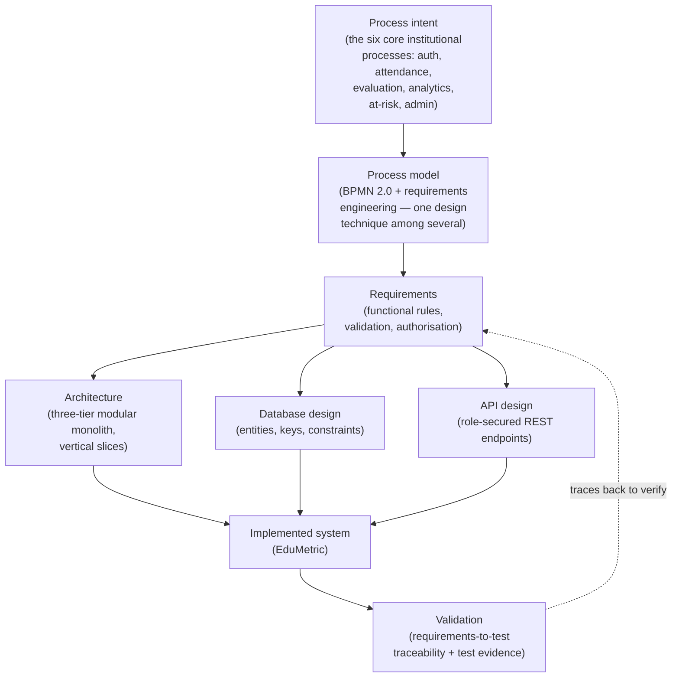

# Chapter 2 — Literature Review

*Addresses **LO1 — M1 | D1***

## 2.1 Introduction and Search Strategy

This chapter reviews the body of knowledge that positions **EduMetric** — a web-based,
multi-dimensional student performance analytics system — within the fields of learning analytics,
educational information systems and software engineering. Its purpose is to establish the theoretical
foundation for the design-and-build study reported in the remainder of the dissertation, to evidence
the limitations of current student-evaluation practice (RQ1), and to converge on the specific gap that
EduMetric is designed to fill. The review is deliberately **thematic** rather than author-by-author:
the literature is organised into six strands that together trace the path from a recognised problem in
student evaluation to a transparent, validated software artefact, followed by an industry perspective,
a reasoned statement of the gap, and the conceptual framework that the later chapters operationalise.

Sources were identified through Google Scholar, IEEE Xplore, the ACM Digital Library and
ScienceDirect, supplemented by foundational textbooks and the relevant technical standards. Search
terms combined *learning analytics*, *multi-dimensional assessment*, *student performance*,
*early-warning system* and *educational data mining* with software-engineering terms such as
*web-application architecture*, *modular monolith*, *REST API*, *relational database design*,
*role-based access control* and *process modelling*. Inclusion favoured peer-reviewed work, standards
documents and authoritative textbooks; where evidence on a transparent, multi-dimensional
composite-score model was comparatively thin — a risk recorded in the project's risk register as
**R01** — the search was broadened into the adjacent literature on educational data mining and
information-systems design. The synthesis returns a clear engineering implication at the end of each
strand, so that the review functions not as a catalogue of prior work but as the evidential basis for
the design decisions made in Chapter 4. Figure 2.1, introduced in §2.6, summarises how these strands
combine into the framework that governs the build.

## 2.2 Theoretical Framework

The study is framed by an overarching paradigm and two complementary evaluative lenses, summarised in
Table 2.1. The overarching frame is **design science** (Hevner *et al.*, 2004; Peffers *et al.*,
2007), which treats the construction and rigorous evaluation of an artefact — here, the EduMetric
system and its requirements-to-test traceability chain — as a legitimate mode of inquiry. Design
science supplies the evaluation logic this dissertation adopts: an artefact's contribution is
demonstrated by building it to defined requirements and assessing it against the problems it was meant
to solve, rather than through human-subject experimentation. Peffers *et al.* (2007) decompose this
into a repeatable sequence — problem identification, objective definition, design and development,
demonstration and evaluation — that maps directly onto the structure of Chapters 1, 4 and 5.

The two lenses provide criteria for judging whether the built system is *good* in use, not merely
*complete*. The first is the **Technology Acceptance Model** (Davis, 1989), which holds that adoption
of an information system is driven principally by its *perceived usefulness* and *perceived ease of
use*. For EduMetric this translates into testable design intent: a transparent composite score and a
single-screen dashboard are usefulness and ease-of-use features, respectively, that the evaluation in
Chapter 5 examines. The second is the **DeLone and McLean IS Success Model** (DeLone and McLean,
2003), which organises success into dimensions of system quality, information quality, use and net
benefits. These dimensions inform what the functional and user-acceptance testing in Chapter 5 must
demonstrate — that the system functions reliably (system quality), that the composite score and trend
are accurate and intelligible (information quality), and that the result is timely at-risk detection
(net benefit). Together the three frames justify the central move of the study: designing a system
against explicit requirements and evaluating it as an artefact.

**Table 2.1 — Theoretical frameworks and their role in the study.** *(Source: author.)*

| Framework | Source | Role in this dissertation |
|---|---|---|
| Design science (overarching paradigm) | Hevner *et al.* (2004); Peffers *et al.* (2007) | Justifies build-and-evaluate inquiry; structures problem → objectives → design → demonstration → evaluation. |
| Technology Acceptance Model | Davis (1989) | Lens for usefulness and ease of use of the composite score and dashboard. |
| IS Success Model | DeLone and McLean (2003) | Lens for system quality, information quality and net benefit in the Chapter 5 evaluation. |

## 2.3 Thematic Review

### 2.3.1 Theme 1 — From single-number GPA to multi-dimensional assessment of learning

A foundational strand argues that reducing a learner's progress to a single grade-point average
obscures the dimensions that matter for support and development. Siemens and Long (2011) frame the
shift "from data to insight" as a move beyond recording outcomes towards understanding the learning
process, while Ferguson (2012) traces how the field has broadened from final marks to attendance,
engagement and behaviour as legitimate signals of learning. The argument is that a single number
averages away precisely the variation an educator needs: a student strong in theory but weak in
practical work, or one whose attendance is quietly declining, appears unremarkable when collapsed to
one figure. The evidence supports a clear engineering conclusion: an evaluation system should retain
and surface *several* weighted dimensions rather than a single scalar — directly motivating EduMetric's
seven scored dimensions (grades, attendance, practical, behaviour, activity, growth bonus and
consistency bonus) and the transparent composite score that combines them.

### 2.3.2 Theme 2 — Learning analytics and educational data

A second strand concerns the use of academic data to understand and support students. Romero and
Ventura (2010) survey educational data mining and establish that institutions already hold rich,
under-exploited data on grades, attendance and activity that can be turned into actionable insight.
Ferguson (2012) positions learning analytics as the application-oriented sibling of this work, focused
on intervention rather than discovery. The literature is not uncritical: both authors caution that
analytics is only as trustworthy as the data quality and the integrity of the records feeding it, and
that poorly governed data can mislead as easily as inform. The reasoned conclusion taken forward is
that an analytics system must treat its underlying records as a first-class concern — enforcing
referential integrity, uniqueness and valid ranges at the database level — so that the metrics it
computes rest on sound data. This motivates EduMetric's relational schema with `ON DELETE RESTRICT`
foreign keys, uniqueness constraints on attendance and grade records, and the separation of the
denormalised `student_metrics` cache from the immutable history in `metric_snapshots`.

### 2.3.3 Theme 3 — Early-warning / at-risk detection systems

The third strand examines systems that flag at-risk students early enough for intervention to help.
Arnold and Pistilli's (2012) account of Course Signals at Purdue is the canonical example: an
early-warning system that combines performance, effort and prior academic history into a traffic-light
signal correlated with improved outcomes. Macfadyen and Dawson (2010) demonstrate, as a proof of
concept, that data already captured by a learning-management system can be mined to predict which
students are likely to fail, well before final results. Both works establish the central premise that
*continuous, multi-factor monitoring* detects decline that a single end-of-term GPA reveals only too
late. The literature also notes a recurring limitation — many such systems are bolted onto an LMS as
analytics afterthoughts, with detection logic that institutions cannot inspect or adjust. The
engineering conclusion is that at-risk detection should be a designed, rule-driven module with
configurable thresholds, which EduMetric implements through its `atrisk/` slice (`AtRiskRules`) feeding
`notifications`, rather than an opaque add-on.

### 2.3.4 Theme 4 — Transparency versus black-box prediction

The fourth strand weighs configurable, auditable scoring against opaque machine-learning prediction,
and is the principal source of the project's distinctive position. Slade and Prinsloo (2013) argue
that learning analytics carries genuine ethical weight: decisions taken about students on the basis of
an algorithm engage their right to understand and contest those decisions, which a black-box predictor
cannot satisfy. Where much educational data mining pursues predictive accuracy through models that are
inherently difficult to explain (Romero and Ventura, 2010), this strand counters that *explicability*
is itself a requirement when the subject of the decision is a person's academic standing. The reasoned
position adopted here is that, for a student-facing institution, a transparent and configurable formula
whose weights are visible and adjustable is preferable to a more accurate but unaccountable model. This
directly justifies EduMetric's deliberate rejection of ML scoring in favour of a linear composite
formula with administrator-editable weights held in `formula_config`, every recomputation of which is
written to `audit_log`.

### 2.3.5 Theme 5 — Architecture of educational web information systems

The fifth strand establishes how a web information system of this kind should be structured, and it is
here that process modelling enters as one design technique among several. The software-architecture
literature describes the trade-offs between architectural styles: Bass *et al.* (2012) and Richards and
Ford (2020) set out how quality attributes such as maintainability and deployability drive style
selection, while Newman (2015), writing in favour of microservices, makes the contrasting case that
clarifies why a single-team, single-deployment project is better served by a **modular monolith**.
Fowler (2002) supplies the enterprise patterns — layered separation of controller, service, repository
and entity — that EduMetric's vertical slices follow, and Fielding's (2000) account of REST, elaborated
for practitioners by Richardson and Amundsen (2013) and made machine-readable by the OpenAPI
Initiative (2021), frames the API as a set of resources and state transitions. Within this strand,
**requirements engineering** and **process modelling** are the techniques that bridge problem to
design: Sommerville (2016), Pohl (2010) and Wiegers and Beatty (2013) characterise requirements as the
highest-leverage, most error-prone phase, where visual representations expose gaps that prose conceals;
and Dumas *et al.* (2018), with the BPMN 2.0 standard (OMG, 2011), supply the notation chosen to model
EduMetric's six core processes so that exceptions and authorisation rules are made explicit before
they reach code. The engineering conclusion is that EduMetric should adopt a three-tier modular
monolith with layered slices and a REST API, designed through requirements analysis and process models
rather than improvised — exactly the method Chapter 4 follows.

### 2.3.6 Theme 6 — Security, privacy and access control for student data

The final strand addresses the protection of sensitive academic records (RQ4). Sandhu *et al.* (1996)
provide the foundational model of role-based access control (RBAC), in which permissions attach to
roles rather than individuals, reducing both administrative burden and the attack surface. The
argument from this work is that a multi-role system handling personal data must enforce authorisation
systematically rather than ad hoc. The data-protection literature reinforces this: the General Data
Protection Regulation (European Parliament and Council, 2016) establishes principles of data
minimisation, purpose limitation and accountability that any system holding student records should
honour even outside its legal jurisdiction, as a matter of good practice. A recognised difficulty,
noted across the security literature, is that role-level checks alone are insufficient in a multi-tenant
educational setting — a teacher must see only their own groups, a student only their own record — which
demands data-level authorisation in addition to coarse role gates. The engineering conclusion is that
EduMetric must combine an `ADMIN > TEACHER > STUDENT` role hierarchy and JWT-based stateless
authentication with service-layer query filters that scope data to the authenticated user, supported by
an immutable `audit_log` for accountability.

## 2.4 Industry / Practice Review

Beyond the academic literature, the practice of building educational systems offers a complementary
perspective. Commercial student-information systems (SIS) and learning-management systems dominate the
institutional market, and their gradebooks are mature and widely adopted; in practice, however, their
analytics typically report a single aggregate mark and present scoring as a fixed, vendor-defined
process that institutions cannot inspect or reconfigure. Industry experience reported in the
architecture literature (Richards and Ford, 2020; Bass *et al.*, 2012) converges on a pragmatic
finding relevant to a single-team project of this size: most systems do not need the operational
complexity of microservices (Newman, 2015), and a well-modularised monolith deployed as one unit
delivers maintainability without distributed-systems overhead. EduMetric's choice of a single
`docker-compose` deployment on one server, with Redis used only as a read-through cache for analytics
dashboards and never in the recompute path, reflects this lesson directly.

A second practitioner theme concerns the *level of formality* appropriate to design artefacts in a
project of this scale. The agile tradition (Beck *et al.*, 2001) cautions against documentation that
drifts from the code, and the maintenance literature identifies model–code divergence as a chronic
risk — recorded here as **R03** and **R07**. The practical lesson is that design artefacts such as
process models, the ERD and the API specification earn their keep only when they are tied to the
implementation through an explicit, version-controlled traceability matrix and kept deliberately lean,
rather than treated as exhaustive documentation. EduMetric adopts exactly this discipline, modelling
its six processes at a descriptive level sufficient to derive design decisions, and binding each back
to a requirement, module, entity, endpoint and test through the traceability matrices reproduced in
Chapter 4.

## 2.5 Identification of the Gap

Synthesising the six themes against the available alternatives makes the gap, and the distinction
EduMetric claims, explicit. **Single-number GPA** (Theme 1) is transparent and universally understood,
but discards the multi-dimensional detail and trajectory that early support requires. **Generic LMS
gradebooks** are mature and widely deployed, but typically expose only an aggregate mark, treat scoring
as a fixed process, and bolt analytics on as an afterthought rather than designing detection in from
the data model upward. **Commercial student-information systems** centralise records effectively but
are costly, closed and difficult to adapt to an institution's own weighting of practical work,
behaviour or growth — and rarely deployable cheaply by a small institution. **Black-box ML scoring**
(Themes 3–4) can achieve predictive accuracy, but at the cost of explicability and accountability,
which the ethics literature identifies as non-negotiable when the subject of the decision is a
student's standing (Slade and Prinsloo, 2013). Each alternative therefore captures part of what is
needed, and none combines all of it.

What is comparatively under-evidenced is a system that is simultaneously **multi-dimensional**
(retaining several weighted signals), **transparent and configurable** (an auditable formula whose
weights an administrator can see and adjust), **proactive** (rule-driven at-risk detection built into
the data model), **secure** (RBAC plus data-level scoping) and **cheaply deployable** (an open-source
modular monolith) — demonstrated end-to-end with requirements-to-test traceability in one
implemented system. This dissertation addresses that gap by designing, building and evaluating exactly
such a system. The composite-score formula's transparency answers the black-box critique; the
multi-dimensional model answers the GPA critique; the rule-driven `atrisk/` module answers the
afterthought critique of LMS gradebooks; and the open-source monolith answers the cost-and-closure
critique of commercial SIS. The conceptual framework that operationalises this convergence is given in
Figure 2.1.

## 2.6 Conceptual Framework

The synthesis above yields the conceptual framework that the methodology and analysis operationalise.
The framework reads the project as a chain of design activities: the recognised *process intent* behind
the six core institutional processes is captured first as a **process model** (drawn in BPMN 2.0,
alongside the other design techniques of Theme 5), which informs the **requirements**; the requirements
drive the **architecture**, the **database design** and the **API design**; these converge in the
**implemented system** (EduMetric); and the whole is confirmed by **validation** through the
traceability chain and test evidence, which traces back to verify that what was intended was in fact
built. Process modelling is one technique within this method, not its centre. The framework is shown in
Figure 2.1.

> 🟦 **[DIAGRAM — Figure 2.1: Conceptual framework — from process intent to a validated student-analytics system]**
> Render the Mermaid below; export to `_assets/figure-2-1.png` if a raster copy is needed for the .docx.

**Figure 2.1 — Conceptual framework: from process intent to a validated student-analytics system.** *(Source: author, synthesised from the literature in §2.3.)*

## 2.7 Summary of the Literature Review

The literature converges on the rationale for this project. Theme 1 establishes that a single GPA
hides the growth and multi-dimensional variation educators need, motivating EduMetric's weighted
composite score. Themes 2 and 3 show that institutions already hold the data, and that continuous,
multi-factor monitoring can detect at-risk students early enough to help. Theme 4 supplies the
project's distinctive ethical position — that transparent, configurable scoring is preferable to
accurate-but-opaque prediction when decisions affect students. Theme 5 grounds the system's
engineering in established architecture, REST and requirements-and-process-modelling practice, with
BPMN as one design technique rather than the subject of study; and Theme 6 sets the security and
data-protection requirements for handling sensitive student records. The three theoretical frames of
§2.2 — design science as the overarching paradigm, with the Technology Acceptance Model and the IS
Success Model as evaluative lenses — provide the logic by which the built artefact is judged. The
identified gap is the absence of a single implemented system that is at once multi-dimensional,
transparent, proactive, secure and cheaply deployable, demonstrated with full traceability; the
conceptual framework of Figure 2.1 specifies the structure that Chapters 3 and 4 use to fill it.
