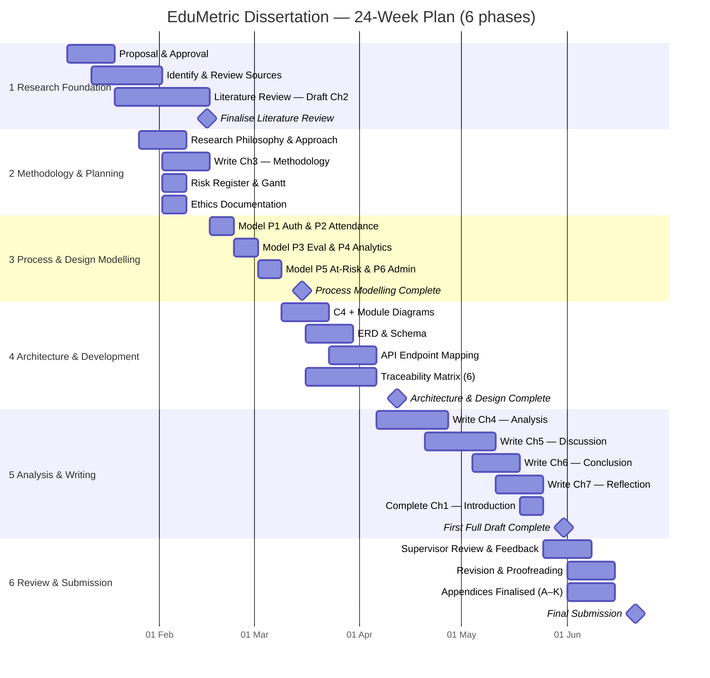

# Chapter 3 — Project Planning and Methodology

*Addresses **LO2 — P3, P4 | M2 | D2***

## 3.1 Research Philosophy and Approach

This project adopts a **pragmatist** research philosophy, the position within Saunders, Lewis and
Thornhill's (2019) "research onion" that judges knowledge claims by their usefulness in solving a
practical problem rather than by allegiance to a single epistemology. Pragmatism is appropriate here
because the central concern — whether a web-based, multi-dimensional analytics system can improve the
transparency, accuracy and accessibility of student evaluation — is answered most convincingly by
*designing, building and examining* such a system in working software, not by abstract argument alone.
The philosophy is operationalised through **design science** (Hevner *et al.*, 2004; Peffers *et al.*,
2007), in which a purposeful **artefact** — the EduMetric system together with its design models,
data schema, REST API and test evidence — is both the means and the object of inquiry, and its
evaluation against the requirements it was built to satisfy constitutes the research finding.

Design science is well matched to a software-engineering capstone because it frames research as the
construction and rigorous assessment of an artefact that solves a relevant problem (Hevner *et al.*,
2004). Peffers *et al.* (2007) structure that activity into six iterative steps — problem
identification, objective definition, design and development, demonstration, evaluation, and
communication — and this dissertation maps onto them directly: the problem and objectives are
established in Chapter 1, the artefact is designed and developed in Chapter 4, it is demonstrated
through its implemented interface (Appendix J), evaluated in Chapter 5, and communicated through the
report as a whole. The reasoning is **abductive**: properties observed in the built system are
explained by, and traced back to, the requirements and design models that informed them, so that the
relationship between intent, design and implementation is made explicit rather than assumed.

## 3.2 Methodological Choice

The methodological choice is **qualitative and artefact-driven** — a design-and-build study rather
than a survey-heavy empirical investigation. Instead of collecting numerical data from a sample of
respondents, the project treats software artefacts — the requirements specification, the architecture
and process models, the database schema, the REST API definition and the functional and
user-acceptance test cases — as its primary evidence, and analyses them through structured
**requirements-to-test traceability** (§4.2). Crucially, **no data are collected from human
subjects**: the study involves no surveys, interviews, observation or usability counts, and the
academic data used to demonstrate the analytics are synthetic and anonymised (§3.7).

This choice is justified over a survey-heavy or experimental design on three grounds, and the trade-off
is accepted explicitly (Oates, 2006; Bell and Waters, 2018). First, the research questions concern
*what should be built and how well it works* — the functional modules, the data model, and the
system's effect on transparency, accuracy and access — which are best answered by inspecting and
testing the artefact directly rather than by sampling opinion. Second, a survey of user perception
would measure *attitudes* towards a system that does not yet widely exist, whereas the locked aim
demands a *demonstrated* working system and verifiable behaviour; design science treats the
artefact's tested performance as the evidence (Hevner *et al.*, 2004). Third, confining evaluation to
synthetic data and functional/UAT testing keeps the project low-risk ethically and within the time and
resources of a single researcher (§3.5, §3.7). The accepted cost — reduced statistical
generalisability in exchange for depth, internal validity and a fully traceable engineering record —
is revisited critically in §5.6. Within this artefact-driven frame, process modelling in **BPMN 2.0**
(Object Management Group, 2011) is used as one design technique among several — alongside C4
architecture diagrams, an entity-relationship diagram, UML sequence diagrams and an OpenAPI-style REST
specification — to capture the six core processes; it is a means of designing the system, not the
object of study.

## 3.3 Project Management Methodology

The project was managed using an **Agile, iterative** approach (Beck *et al.*, 2001) adapted for a
single-researcher software-engineering capstone. Rather than deferring all output to the end, work
proceeded in short cycles aligned to the six core processes and the chapter structure, each cycle
producing a reviewable increment — a requirement set, a design model, a working module, a populated
traceability table or a chapter draft. The Agile values of *working software*, *responding to change*
and *iterative delivery* (Beck *et al.*, 2001) fit this project because its artefacts are
interdependent: designing a process model frequently surfaced a refinement to the architecture or
schema, and implementing a module occasionally revealed a requirement that needed restating. An
iterative method absorbs that feedback without a heavyweight change process.

A strictly sequential waterfall plan was rejected as too brittle for a body of work in which
understanding deepens as the artefacts accumulate; committing the full design before any code was
written would have locked in early misjudgements. Equally, a ceremony-heavy framework such as full
Scrum offers little value to a team of one. The project therefore took a lightweight, milestone-gated
iteration: design and build proceeded in cycles, but iteration is bounded by the milestone structure
of §3.4 so that flexibility does not become drift — a tension assessed critically in §3.10.

## 3.4 Project Plan

The plan decomposes the work into six phases over 24 weeks, presented below as a work breakdown
structure (§3.4.1), a Gantt timeline (§3.4.2) and a milestone/critical-path table (§3.4.3). The full
artefacts are reproduced at full resolution in Appendix B.

### 3.4.1 Work Breakdown Structure (WBS)

The work breakdown structure decomposes the project into the six phases and their constituent tasks,
as shown in Figure 3.1.

> 🟦 **[DIAGRAM — Figure 3.1: Work Breakdown Structure]** Render the Mermaid below.

```mermaid
flowchart TD
    P["EduMetric Dissertation"]
    P --> A["1 Research Foundation"]
    P --> B["2 Methodology & Planning"]
    P --> C["3 Process & Design Modelling"]
    P --> D["4 Architecture & Development"]
    P --> E["5 Analysis & Writing"]
    P --> F["6 Review & Submission"]

    A --> A1["Proposal & approval"]
    A --> A2["Identify & review sources"]
    A --> A3["Draft Chapter 2"]

    B --> B1["Research philosophy & approach"]
    B --> B2["Write Chapter 3"]
    B --> B3["Risk register & Gantt"]
    B --> B4["Ethics documentation"]

    C --> C1["Model P1 Auth & P2 Attendance"]
    C --> C2["Model P3 Evaluation & P4 Analytics"]
    C --> C3["Model P5 At-Risk & P6 Admin"]

    D --> D1["C4 + module diagrams"]
    D --> D2["ERD & schema"]
    D --> D3["API endpoint mapping"]
    D --> D4["Traceability matrix (6 processes)"]

    E --> E1["Write Chapters 4 & 5"]
    E --> E2["Write Chapters 6 & 7"]
    E --> E3["Complete Chapter 1"]

    F --> F1["Supervisor review"]
    F --> F2["Revision & proofreading"]
    F --> F3["Appendices A–K"]
```

**Figure 3.1 — Work Breakdown Structure.** *(Source: author.)*

### 3.4.2 Gantt Chart and Timeline

The 24-week schedule is shown in Figure 3.2, mirroring the project's planning workbook. Weeks are
mapped to a notional calendar beginning Week 1; the same data is reproduced at full resolution in
Appendix B. The middle phases — modelling the six processes (Phase 3) and translating them into the
architecture, schema, API and working code (Phase 4) — carry the bulk of the design-and-build effort.

> 🟦 **[CHART — Figure 3.2: Project Gantt chart (24 weeks, 6 phases)]** Render the Mermaid below;
> export to `_assets/figure-3-2.png` for the .docx. Mirrors `EduMetric_Dissertation_Artefacts.xlsx`.

**Figure 3.2 — Project Gantt chart (24 weeks, 6 phases).** *(Source: author, mirroring the project planning workbook.)*

### 3.4.3 Milestones and Critical Path

Six milestones gate the project; the critical path runs through the design-and-build phases (3 and 4),
since Chapter 4 cannot be completed until the process models, architecture, schema, API and
traceability matrix are in place. Table 3.1 lists the milestones.

**Table 3.1 — Milestones and critical path.** *(Source: author, derived from the Gantt workbook.)*

| Milestone | Target week | On critical path? |
|---|---|---|
| M0 — Project proposal approved | W2 | Yes |
| M1 — Literature review finalised | W6 | No (parallel to planning) |
| M2 — Process modelling complete | W10 | **Yes** |
| M3 — Architecture & design complete | W14 | **Yes** |
| M4 — First full draft complete | W21 | Yes |
| M5 — Final submission | W24 | Yes |

## 3.5 Resource Planning

The project is resourced by a single researcher using freely available or institution-provided tools,
keeping cost negligible and removing procurement as a schedule risk. Table 3.2 summarises the plan.

**Table 3.2 — Resource plan.** *(Source: author.)*

| Resource | Provision | Used for |
|---|---|---|
| Researcher time | ~12–15 hrs/week across 24 weeks | All phases |
| Supervisor | Scheduled review meetings (Appendix H) | Feedback at milestones M1, M2, M4 |
| Process-modelling tool | bpmn.io / draw.io (free) | The six BPMN process models |
| Diagramming | Mermaid (in-repo, free) | C4, ERD, sequence, WBS, Gantt |
| Development environment | Java 21+ / Spring Boot, Next.js/React/TypeScript, PostgreSQL | Building and testing the EduMetric prototype |
| Reference management | Zotero + Harvard style (free) | Citations, reference list |
| Writing & assembly | Markdown → Word (template) | Dissertation production |

## 3.6 Risk Register

Ten risks were identified, assessed on a 1–5 probability/impact scale (risk score = P × I) and
assigned mitigation and contingency strategies. The register is reproduced from the project workbook as
Table 3.3 and at full resolution in Appendix C; its probability/impact distribution is visualised in
Figure 3.3.

**Table 3.3 — Risk register (R01–R10).** *(Source: author's project workbook; owner = Researcher; status = Open at time of writing.)*

| ID | Risk | Cat. | P | I | Score | Severity | Mitigation | Contingency |
|---|---|---|---|---|---|---|---|---|
| R01 | Limited literature directly comparable to a transparent, multi-dimensional composite-score model | Academic | 2 | 3 | 6 | Medium | Supplement with broader learning-analytics, architecture and requirements literature; triangulate across themes | Expand search to IEEE Xplore and ACM Digital Library; cite adjacent transparency/early-warning work |
| R02 | Scope creep — the feature set expands beyond the core six modules / MVP | Scope | 3 | 4 | 12 | High | Lock the MVP to the six core processes in the master document; review every increment against the locked scope | Defer non-core modules to a "future work" backlog (§6.4); re-anchor to the six processes |
| R03 | Divergence between the design artefacts (architecture, ERD, process models) and the implemented code | Technical | 3 | 5 | 15 | Critical | Maintain a version-controlled requirements-to-test traceability matrix; map every activity to module, entity, endpoint and test | Re-derive the affected artefact from the design models and re-run the traceability check |
| R04 | Schedule delay from running academic writing and software development in parallel | Schedule | 3 | 4 | 12 | High | Milestone-based Gantt with buffer weeks; weekly progress review against the plan | Deprioritise lower-impact appendix content; protect Chapters 4–5 first |
| R05 | The composite-score formula behaves incorrectly on edge cases / small samples, eroding trust | Technical | 2 | 3 | 6 | Medium | Keep the metrics engine pure and 100% unit-testable; cover edge cases (empty data, single sample) with test cases | Add guard clauses and confidence flags; document known limits of the formula |
| R06 | EduMetric implementation incomplete at submission | Technical | 2 | 4 | 8 | Medium | Prioritise the six core modules; treat extension features as optional; partial implementation acceptable for evaluation | Clearly document the scope of completed implementation; evaluate what is built |
| R07 | Traceability links break when the architecture or database schema changes | Technical | 2 | 4 | 8 | Medium | Version-control the traceability matrix alongside the dissertation; propagate schema changes in a single pass | Flag affected chapters and update all references together |
| R08 | Academic sources unavailable through the university library | Academic | 2 | 3 | 6 | Medium | Use Google Scholar, ResearchGate and author pre-prints; cite DOI links | Use an alternative edition or closest available source |
| R09 | Reflective chapter lacks genuine critical depth (Ch 7) | Academic | 2 | 3 | 6 | Medium | Use Gibbs' Reflective Cycle with specific project examples; avoid generic statements | Add concrete examples from design modelling and implementation |
| R10 | Artefact inconsistency across chapters (module names, endpoint paths, terminology) | Quality | 3 | 4 | 12 | High | Lock terminology in the master document; enforce consistent module, entity and endpoint names | Full terminology and endpoint-path review pass before final submission |

> 🟦 **[CHART — Figure 3.3: Risk heat-map (Probability × Impact)]** Render as the grid below; export to
> `_assets/figure-3-3.png` for the .docx. Cells hold the risk IDs at each (P, I) coordinate.

| Impact ↓ \ Prob → | P1 | P2 | P3 | P4 | P5 |
|---|---|---|---|---|---|
| **I5** | | | **R03** | | |
| **I4** | | R06, R07 | R02, R04, R10 | | |
| **I3** | | R01, R05, R08, R09 | | | |
| **I2** | | | | | |
| **I1** | | | | | |

**Figure 3.3 — Risk heat-map (Probability × Impact, R01–R10).** *(Source: author, derived from Table 3.3.)*

The distribution shows the dominant exposure is **consistency between the design and the code**: the
single critical risk is design↔code divergence (R03), and the high-severity cluster — scope creep
(R02), parallel-track schedule pressure (R04) and cross-chapter artefact inconsistency (R10) — all
threaten the integrity of the engineering record. This is precisely why the project's central control
is a maintained, version-controlled requirements-to-test traceability matrix rather than any single
diagram: the matrix ties the design models to the implemented modules, entities, endpoints and tests,
so divergence is detected early and corrected in one pass.

## 3.7 Ethical Considerations

The project is **low-risk** with respect to research ethics. It collects **no data from human
participants**: its evidence is software artefacts and the system's own synthetic / anonymised academic
records. Because there are no participants, the usual safeguards of informed consent and the **right to
withdraw are not applicable** — there is no one to withdraw, and no personal data to be processed. The
academic data used to demonstrate the analytics (Appendix F) contain no real names or identifiers;
learners are represented by opaque codes, consistent with the data-minimisation principle and aligned
with the General Data Protection Regulation's requirements for the lawful, fair and minimal handling of
personal data (European Parliament and Council, 2016). No special-category data are processed.

Where the system would, in production, hold real student records, the design itself embeds the relevant
protections — role-based access control, audit logging and configurable retention — but these are
described as **design properties of the artefact**, not as live data-collection activities of the
research. The institutional ethics declaration and a low-risk self-assessment are provided in
Appendix D. ⟨STUDENT INPUT: ethics-form signature and date⟩.

## 3.8 Project Tracking and Documentation

Progress was tracked against the milestone structure of §3.4 using a lightweight task board and a
dated logbook, with the project's source artefacts version-controlled in the EduMetric repository so
that any change to the architecture or schema could be propagated to the traceability matrix in a
single pass (mitigating R03 and R07). A screenshot of the tracking tool is provided as Figure 3.4, and
the full logbook and supervisor-meeting records are given in Appendices G and H respectively.

> 📸 **[SCREENSHOT — Figure 3.4]**
> **Capture from:** the project-tracking tool used (e.g. the task board / project view)
> **Must show:** the six phases, task status, and milestone markers (M0–M5)
> **Save to:** `_assets/figure-3-4.png`
> **Caption:** *Figure 3.4 — Project-tracking tool, showing phase and milestone status*

## 3.9 Implementation of the Plan

The plan was executed broadly as scheduled, with the design-and-build phases (3 and 4) consuming the
greatest effort and the writing phase absorbing the minor slippage that the buffer weeks were reserved
for. Following the iterative method of §3.3, the six core processes were first modelled and then built
out incrementally into the running system: authentication and attendance, then the evaluation
(metrics-engine) and analytics modules, then at-risk detection and admin monitoring. Each increment was
checked against the requirements-to-test traceability matrix before the next was started, which kept
the implemented code aligned with the design models and held the critical design↔code divergence risk
(R03) in check.

During the implementation stage, the prototype of EduMetric was developed with its key screens,
including login, the student growth dashboard, teacher attendance and grading, admin formula
configuration, analytics and at-risk monitoring pages. The implementation evidence — the working
EduMetric interface that realises the modelled processes — is documented in Appendix J. Screenshots of
the implemented user interface are provided in Appendix J.

## 3.10 Critical Assessment of Project Management

*(D2)* Judged critically, the project-management approach was effective in the dimensions that mattered
most and weaker in one. Its principal strength was **risk-led control**: by identifying design↔code
divergence (R03) as the critical risk at the outset and adopting a version-controlled
requirements-to-test traceability matrix as the standing mitigation, the project converted its greatest
threat into its central method — an alignment of risk management and methodology that paid off directly
in the design-and-build work of Chapter 4. The milestone-gated iterative approach (§3.3) also handled
the inherent interdependence of the artefacts well, allowing refinements discovered during modelling
and coding to flow back into the architecture and schema without derailing the schedule, while the
locked MVP scope kept feature growth (R02) contained to the six core modules.

The principal weakness was the **optimism of the parallel-track schedule** (R04): running literature
and academic writing alongside the build assumed an even effort distribution that the artefact- and
code-intensive middle phases did not respect, and only the deliberately reserved buffer weeks kept the
first-draft milestone (M4) intact. A more defensive plan would have front-loaded a larger buffer before
Phase 4 and split the development work into finer increments to smooth the load. On balance, the
methodology was fit for a single-researcher design-science capstone: it was disciplined enough to
guarantee traceability between intent, design and code, yet flexible enough to absorb the iterative
nature of artefact construction, and its few shortcomings were contained rather than realised.
