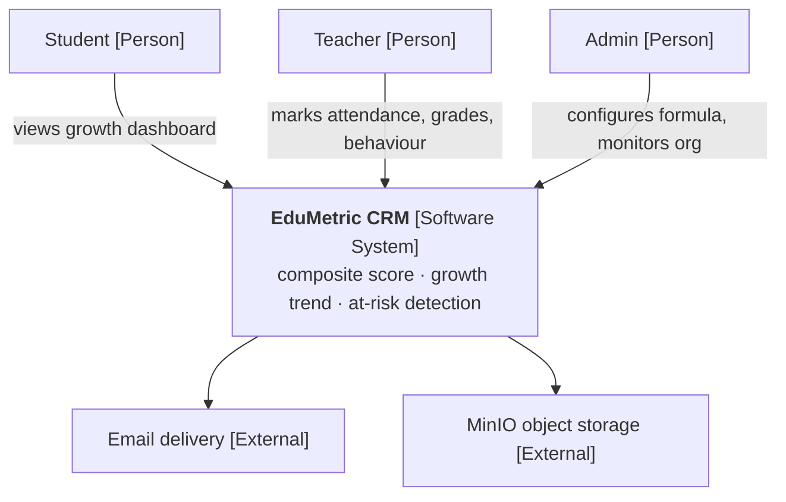
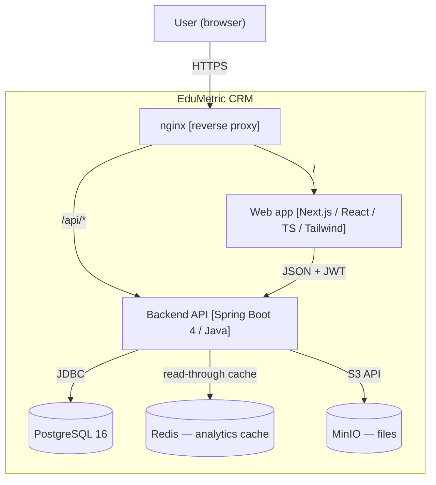
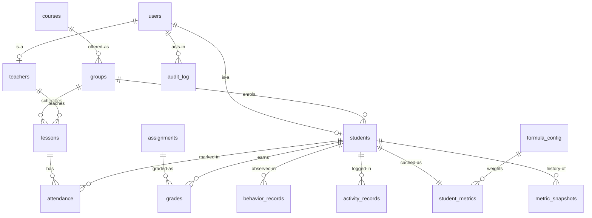
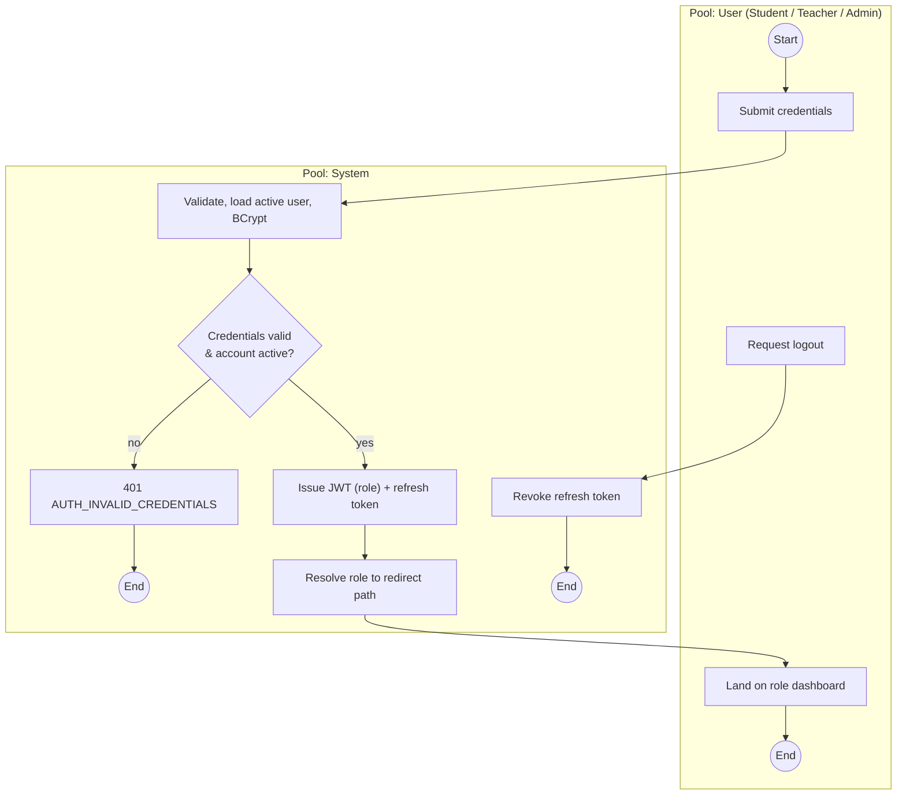
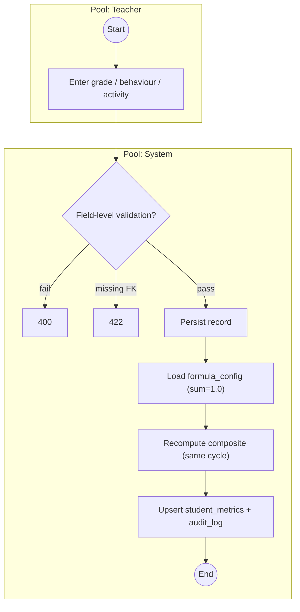
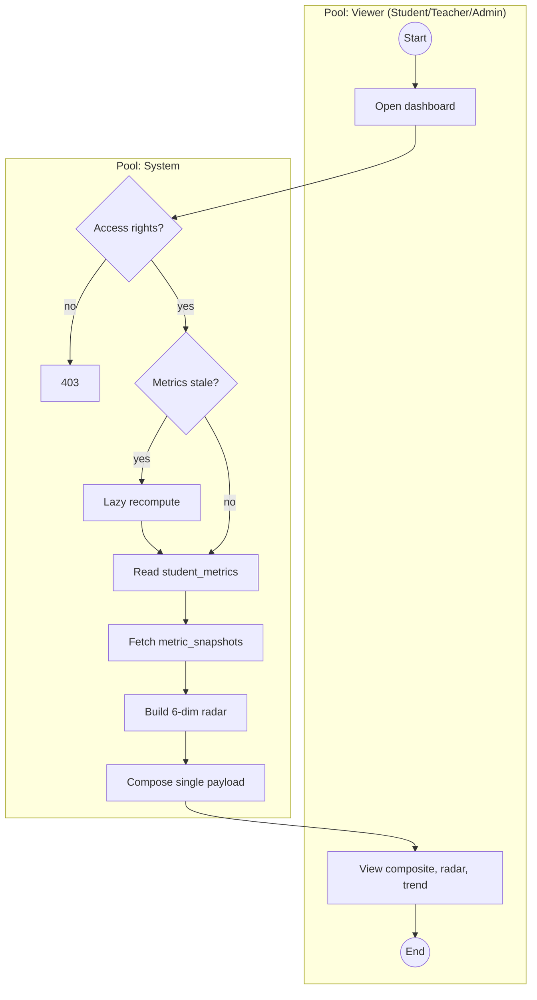
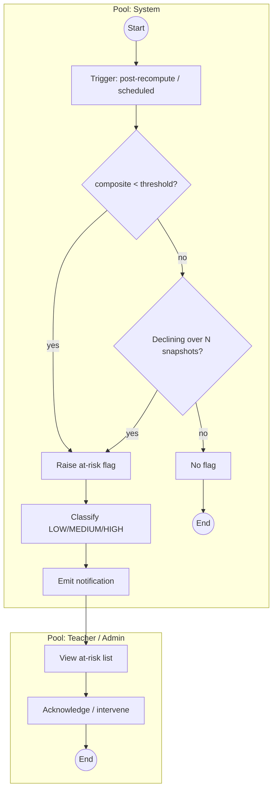
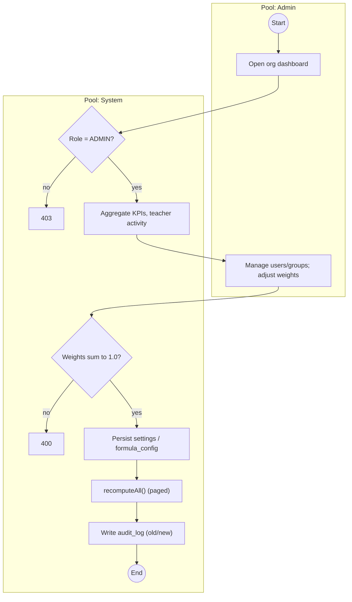
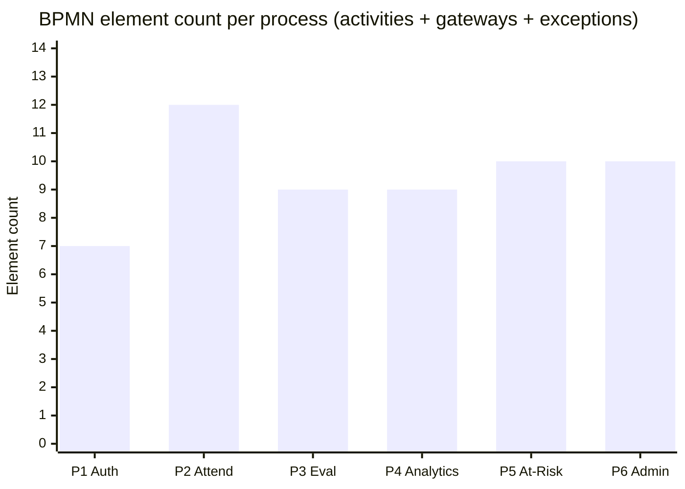
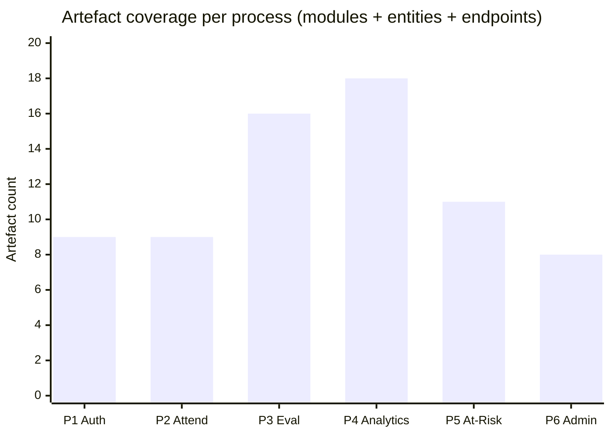

# Chapter 4 — System Analysis, Design and Implementation

*Addresses **LO3 — P5, M3, M4***

## 4.1 Method

This chapter specifies, designs and implements EduMetric, the web-based multi-dimensional student
performance analytics system that is the subject of this project. Following the design-science frame
adopted in Chapter 3 (Hevner *et al.*, 2004; Peffers *et al.*, 2007), the "data" analysed here are
not the opinions of human participants but the **engineering artefacts** that constitute the system:
its requirements, its architecture, its data model, its process models and its role-secured REST API,
together with the evidence that each requirement was realised in working, tested code. No surveys or
interviews were conducted; the system itself, and the chain that links a requirement to the code that
satisfies it, are the units of analysis. The analytical pathway applied consistently to each of the
six core processes is **requirement → design decision → architecture module → database entity → API
endpoint → validation evidence**, operationalised through the traceability matrices introduced in
§4.2 and evidenced in Appendix K.

### 4.1.1 Primary Artefacts

The primary artefacts are the built system and the design models that specify it. They comprise: the
working full-stack prototype itself — a Next.js/React/TypeScript frontend, a Java Spring Boot backend
and a PostgreSQL database; a set of **C4 architecture diagrams** describing the system at four levels
of abstraction; an **entity-relationship diagram (ERD)** for the relational schema, owned by Liquibase
changelogs (`backend/src/main/resources/db/changelog/`); **six process models (drawn in BPMN 2.0**;
OMG, 2011) describing the core workflows, prepared for export in bpmn.io and approximated as Mermaid
flowcharts in this chapter; **UML sequence diagrams** for the most important interactions; and the
**REST API specification**, grouped by bounded context. These were derived from the problem domain set
out in §1.2, the EduMetric product master document, and the implemented codebase, and were verified
against the shipped source so that what is reported matches what was built.

### 4.1.2 Secondary Sources

Secondary inputs are the supporting documentation against which the design was checked: the backend
`ARCHITECTURE.md` (architectural rules, layering, the metrics engine and the API conventions), the
Liquibase changelog (the authoritative source of the schema), and the literature reviewed in Chapter 2,
which supplied the design criteria — Bass, Clements and Kazman (2012) and Richards and Ford (2020) for
architecture, Connolly and Begg (2015) for database design, Richardson and Amundsen (2013) for REST,
and Sandhu *et al.* (1996) for access control. Comparison of the delivered system against these
expectations is carried forward to Chapter 5.

### 4.1.3 Rationale for the Six Core Processes (P5)

Six processes were selected for detailed modelling and traceability: **User Authentication, Attendance
Management, Student Evaluation, Student Analytics Generation, At-Risk Student Detection and Admin
Monitoring.** The selection rationale is that these six span the full range of software-engineering
contexts present in the system — a security boundary (P1), a high-frequency transactional write with a
synchronous side-effect (P2), a multi-input validation-and-scoring workflow (P3), a read-side
analytical composition (P4), an exception-driven analytical workflow (P5) and a governance/configuration
workflow (P6). Together they exercise authentication, transactional processing, analytical processing
and administrative governance, providing sufficient breadth to specify and verify the system without
modelling every one of the 48 packages, many of which are variations on these archetypes. The processes
also map directly onto the core modules named in objective 4 (§1.4): authentication, attendance,
evaluation (the metrics engine), student analytics, at-risk detection and admin monitoring.

## 4.2 Analytical Techniques (M3)

The principal technique is **requirements traceability**: each functional requirement is followed
forward through its design decision into a named architecture module, a database entity or field, an
API endpoint and a test case, using a structured matrix whose column order is fixed as **requirement →
architecture module → database entity/field → API endpoint → test evidence** (Wiegers and Beatty,
2013; Pohl, 2010). This is paired with **functional verification**: the traceability links were
checked against the shipped code rather than against early design notes, and the *implemented* value is
the one reported. Where an early endpoint name had since changed — for example, the dashboard endpoint
moved from a notional `/api/dashboard/student/{id}` to the implemented `GET /api/students/{id}/dashboard`,
and bulk attendance from a notional `POST /api/attendance` to the implemented `POST /api/attendance/bulk`
— the reconciliation is treated as evidence that traceability functioned as intended, surfacing
design–code drift so it could be corrected (risks R03, R07, R10). The process models, the C4 diagrams,
the ERD and the UML sequences are the design notations that feed this matrix; the BPMN 2.0 notation was
chosen specifically to model the six core workflows because it makes gateways and exception paths
explicit, which is where requirements are most often lost. The structured instruments used — the
modelling checklist, the traceability-matrix template and the test-case template — are provided in
Appendix E.

## 4.3 Findings

### 4.3.1 Requirements and Artefact Inventory

The system's functional requirements follow directly from the problems set out in §1.2: a transparent
multi-dimensional composite score in place of a single GPA (FR1); attendance capture with an immediate
effect on the score (FR2); recording of grades, behaviour and activity (FR3); per-student analytics —
composite, dimension breakdown, growth trend (FR4); configurable at-risk detection (FR5); and
role-secured administration and formula configuration (FR6). The non-functional requirements are
transparency and auditability of scoring (NFR1), role-based confidentiality of student data (NFR2),
responsiveness of analytical reads (NFR3) and maintainability through a modular structure (NFR4). These
requirements are realised across the implemented population profiled below: EduMetric is a modular
monolith of **48 vertical-slice packages**, **60 `@Entity` classes** and **52 `@RestController`
classes** (verified by inspection of the backend source). The system's structure is summarised in Table
4.0 and visualised at four levels of abstraction in Figures 4.1–4.4; its data model is given as the
entity-relationship diagram in Figure 4.5.

**Table 4.0 — Artefact inventory of EduMetric CRM.** *(Source: author, from `backend/` source inspection.)*

| Artefact class | Count | Evidence |
|---|---|---|
| Architecture packages (bounded contexts) | 48 | `com.edumetric.backend.*` |
| `@Entity` classes (DB-backed) | 60 | `grep @Entity` |
| `@RestController` classes | 52 | `grep @RestController` |
| Liquibase changelog domains | 4 (`v1-core`, `v2-domain`, `v3-metrics`, `v4-audit`) | `db/changelog/` |
| Composite-score dimensions | 7 (weights sum to 1.0) | `formula_config`, `ARCHITECTURE.md` §6 |

An anonymised extract of the analytics data used to validate the dimension scoring and at-risk logic is
provided in Appendix F.

### 4.3.2 System Architecture

EduMetric is structured as a **three-tier modular monolith**: a presentation tier (the Next.js client),
an application tier (the Spring Boot API, internally decomposed by bounded context) and a data tier
(PostgreSQL, with Redis as a read-through analytics cache and MinIO for files). This architectural
style was a deliberate design decision rather than a default. The alternative — a microservices
deployment — was considered and rejected: for a single-institution system with a team of one,
fine-grained services would add network, deployment and data-consistency overhead disproportionate to
the benefit (Newman, 2015), whereas a well-modularised monolith retains clear internal boundaries while
remaining simple to deploy and reason about (Richards and Ford, 2020; Fowler, 2002). The requirement
that drove the choice is maintainability (NFR4) under solo development; the design decision was a
modular monolith partitioned by feature; the consequence is that each of the 48 packages is an
independently understandable bounded context with a controller–service–repository–entity layering
(Bass *et al.*, 2012). The system is presented at four levels in line with the C4 convention: system
context in Figure 4.1, containers in Figure 4.2, the component/module map in Figure 4.3 and deployment
in Figure 4.4.

> 🟦 **[DIAGRAM — Figure 4.1: C4 Level 1 — System context]** *(render `_diagrams/fig-4-1-c4-context.mmd`)*



**Figure 4.1 — C4 Level 1: System context.** *(Source: author, derived from `ARCHITECTURE.md` §2.)*

> 🟦 **[DIAGRAM — Figure 4.2: C4 Level 2 — Container diagram]** *(render `_diagrams/fig-4-2-c4-container.mmd`)*



**Figure 4.2 — C4 Level 2: Container diagram.** *(Source: author, derived from `ARCHITECTURE.md` §2, §10.)*

> 🟦 **[DIAGRAM — Figure 4.3: Component / module map]** *(render `_diagrams/fig-4-3-component-map.mmd`; full source in `_diagrams/`)*

The component map groups the 48 packages into eight bounded contexts — Identity & Access, People &
Organisation, Academic Structure, Assessment & Records, Attendance, Analytics & Metrics, Communication
and Governance — with the data-flow spine running Assessment/Attendance → `metrics` → `analytics` →
`atrisk` → Communication.

**Figure 4.3 — Component / module map (bounded contexts).** *(Source: author.)*

> 🟦 **[DIAGRAM — Figure 4.4: Deployment diagram]** *(render `_diagrams/fig-4-4-deployment.mmd`)*

All runtimes — nginx, Next.js, Spring Boot, PostgreSQL, Redis and MinIO — run as containers from a
single `docker-compose.yml` on one VPS, with nginx routing `/` to Next.js and `/api/*` to Spring Boot.

**Figure 4.4 — Deployment diagram (single VPS / docker-compose).** *(Source: author, derived from `ARCHITECTURE.md` §2, §10.)*

### 4.3.3 Database Design

The relational schema realises the data requirements directly. It was designed following established
relational-modelling practice — normalisation to remove redundancy, foreign keys to enforce referential
integrity, and constraints to encode domain rules (Connolly and Begg, 2015; Teorey *et al.*, 2011) —
and is owned end-to-end by the Liquibase changelog, with Hibernate set to `ddl-auto: validate` so the
ORM never alters the schema. The core schema is shown clustered by sub-domain in Figure 4.5. Two design
decisions in the analytics layer are load-bearing and are explained here because they recur throughout
§4.3.4. First, a **denormalised `student_metrics` cache** holds one current row per student
(`UNIQUE (student_id)`) so that an analytical read need not recompute from raw tables, while a separate
**`metric_snapshots`** table holds the weekly history (`UNIQUE (student_id, snapshot_date)`) that feeds
the growth trend and growth bonus; separating the current read model from the immutable history keeps
fast reads independent of historical accumulation. Second, the integrity strategy is deliberately
split: mutable reference data (`users`, `students`, `teachers`, `groups`, `courses`) uses **soft-delete**
so that references and audit trails survive, whereas **immutable history** (`attendance`, `grades`,
`behavior_records`, `activity_records`) is **hard-deleted** when genuinely removed, because a soft-delete
flag on an append-only record adds no value and complicates the recompute query. `UNIQUE` constraints
on `(student_id, lesson_id)` and `(student_id, assignment_id)` prevent duplicate attendance and grades,
and `CHECK` constraints bound the enum-like and value-range columns.

> 🟦 **[DIAGRAM — Figure 4.5: ERD — core schema]** *(render `_diagrams/fig-4-5-erd.mmd`)*



**Figure 4.5 — Entity-Relationship Diagram (core schema, clustered by sub-domain).** *(Source: author, derived from the Liquibase changelog and `ARCHITECTURE.md` §7.)*

### 4.3.4 The Six Core Processes (P1–P6)

The six core workflows were modelled in BPMN 2.0 because the notation makes participants, gateways and
exception paths explicit, and each model is reported below with a short design narrative and its
traceability matrix. The decisive engineering decisions are stated as **requirement → design decision →
rationale** so the link between intent and code is auditable.

#### P1 — User Authentication

The User Authentication process models the login lifecycle from credential submission through JWT
issuance and role-based redirection, including failure handling and logout. It is foundational: every
other process depends on the authentication state established here, so its specification carries
disproportionate weight. Three design decisions follow from the requirement for a secure, role-aware
boundary. Separating the *user*, *authentication system* and *role-routing* responsibilities into
distinct lanes clarified that JWT issuance and role-based redirection are separate concerns, informing
the split between `AuthService` and a role-aware frontend router. The credential-validation gateway made
explicit that a failed login must return a **standardised** error — producing the rule that
`POST /api/auth/login` returns HTTP 401 with `AUTH_INVALID_CREDENTIALS` rather than a generic 500. And
the exception event for a deactivated account — routinely omitted from prose requirements — produced an
`is_active` check in the security layer. The login interaction is detailed as a sequence in Figure 4.12,
and the security boundary it establishes is shown in Figure 4.15.

> 🟦 **[BPMN DIAGRAM — Figure 4.6: User Authentication]**
> **Pools:** User (Student/Teacher/Admin) · System · **Happy path:** submit credentials → validate (load active user, BCrypt) → issue JWT + refresh token → resolve role → redirect → logout/revoke · **Gateways:** *credentials valid & account active?* · **Exceptions:** invalid/inactive → 401 · **Maps to:** `auth/`, `security/`, `config/SecurityConfig` — `users`, `refresh_tokens` — `POST /api/auth/login`, `GET /api/auth/me`, `POST /api/auth/logout`, `POST /api/auth/refresh` · **Draw in:** bpmn.io → `_assets/figure-4-6.png`



**Figure 4.6 — User Authentication (BPMN 2.0 approximation).** *(Source: author.)*

**Table 4.1 — Traceability matrix: User Authentication.** *(Source: author; endpoints verified against `auth/AuthController`. Test IDs map to Appendix K.)*

| BPMN activity | Functional requirement | Architecture module | Database entity/field | API endpoint | Test |
|---|---|---|---|---|---|
| Submit credentials | Accept email + password | `auth/` | `users (email, password_hash)` | `POST /api/auth/login` | TC-AUTH-01 |
| Validate credentials | Verify BCrypt hash; reject inactive | `auth/` → `security/` | `users (password_hash, active)` | `POST /api/auth/login` | TC-AUTH-02 |
| Issue JWT | Role-encoded HS256 token + refresh | `security/JwtTokenProvider` | `users (id, role)`, `refresh_tokens` | `POST /api/auth/login`, `/refresh` | TC-AUTH-03 |
| Redirect by role | Route to role-appropriate dashboard | `auth/` → frontend router | `users (role)` | `GET /api/auth/me` | TC-AUTH-04 |
| Failure handling | Standardised 401 on failed login | `auth/`, `GlobalExceptionHandler` | — (no write) | `POST /api/auth/login` | TC-AUTH-05 |
| Logout | Revoke refresh token; reject reuse | `auth/`, `RefreshTokenService` | `refresh_tokens` | `POST /api/auth/logout` | TC-AUTH-06 |

#### P2 — Attendance Management

Attendance Management is the system's highest-frequency transactional operation and one of the seven
composite-score dimensions, so its design influences both write performance and analytical consistency.
The decisive design decision was the **synchronous, in-transaction metrics recompute**. A textual
specification would likely describe attendance recording and metric updating as two unrelated
requirements, whereas modelling the process made the causal dependency explicit through a follow-on
task — driving the requirement that the dashboard reflect a new mark immediately (see Figure 4.13). The
rationale for keeping the recompute synchronous and inside the same request cycle (rather than queued)
is threefold: bulk attendance for roughly 24 students completes in about 200 ms in one transaction; the
live recompute is a visible demo feature (mark attendance, switch tab, the score has already changed);
and a single transaction guarantees one source of truth with no in-flight divergence between the write
and the cache. Two further consequences follow: the denormalised `student_metrics` cache separates
analytical reads from transactional writes, and the validation gateway surfaced a uniqueness rule absent
from the original scope — no duplicate attendance per student-and-lesson — realised as a
`UNIQUE (student_id, lesson_id)` constraint and a 409 response.

> 🟦 **[BPMN DIAGRAM — Figure 4.7: Attendance Management]**
> **Pools:** Teacher · System · **Happy path:** select own lesson → load students, default PRESENT → mark exceptions → save → upsert (unique) → synchronous recompute · **Gateways:** *own lesson?* · *valid status?* · *duplicate?* · **Exceptions:** 403 / 400 / 409 · **Maps to:** `attendance/`, `lessons/`, `metrics/` — `lessons`, `attendance` (UNIQUE), `student_metrics` — `GET /api/lessons`, `GET /api/lessons/{id}/attendance`, `POST /api/attendance/bulk` · **Draw in:** bpmn.io → `_assets/figure-4-7.png`

```mermaid
flowchart TB
    subgraph T["Pool: Teacher"]
        s((Start)) --> sel["Select lesson (own schedule)"]
        mark["Mark exceptions (absent/late)"] --> save["Save"]
    end
    subgraph S["Pool: System"]
        sel --> gwOwn{Lesson belongs to teacher?}
        gwOwn -->|no| f403["403 Forbidden"]
        gwOwn -->|yes| load["Load students, default PRESENT"] --> mark
        save --> gwStatus{Status valid?}
        gwStatus -->|no| f400["400"]
        gwStatus -->|yes| gwDup{Duplicate (student,lesson)?}
        gwDup -->|yes| f409["409 Conflict"]
        gwDup -->|no| persist["Upsert attendance"] --> recompute["Synchronous recompute (same tx)"] --> e((End))
    end
```

**Figure 4.7 — Attendance Management (BPMN 2.0 approximation).** *(Source: author.)*

**Table 4.2 — Traceability matrix: Attendance Management.** *(Source: author; verified against `attendance/AttendanceController`, `lessons/LessonController`.)*

| BPMN activity | Functional requirement | Architecture module | Database entity/field | API endpoint | Test |
|---|---|---|---|---|---|
| Select lesson | Teacher selects a lesson from own schedule | `attendance/` → `lessons/` | `lessons (id, teacher_id, scheduled_at)` | `GET /api/lessons` | TC-ATT-01 |
| Load student list | Retrieve enrolled students for the lesson | `attendance/` → `groups/` | `groups`, `students (group_id)` | `GET /api/lessons/{id}/attendance` | TC-ATT-02 |
| Mark exceptions | Mark each student PRESENT/ABSENT/LATE | `attendance/` | `attendance (status, marked_by_user_id)` | `POST /api/attendance/bulk` | TC-ATT-03 |
| Validate & save | Persist; prevent duplicate per lesson-student | `attendance/` → repository | `attendance` UNIQUE `(student_id, lesson_id)` | `POST /api/attendance/bulk` | TC-ATT-04 |
| Trigger recompute | Recompute attendance dimension after save | `attendance/` → `metrics/MetricsService` | `student_metrics (attendance_norm, computed_at)` | internal (synchronous, same tx) | TC-ATT-05 |

#### P3 — Student Evaluation

Student Evaluation records the assessed dimensions that, with attendance, form the composite score:
grades, behaviour, practical work and activity. Each dimension enters through a separate path but all
converge at a shared validation gateway before triggering composite recomputation. This convergence
justified a **single shared validation approach** in the evaluation slices rather than four separate
validators. The diversity of input shapes — grades carry a value and weight, behaviour a 1–5 score and
optional note, activity a type enum and score — supported the decision to use **separate tables**
(`grades`, `behavior_records`, `activity_records`) rather than one polymorphic table, preserving
targeted constraints. The central design decision, however, is the **transparent, configurable
composite formula**: each table feeds one dimension of `student_metrics`, the seven weights are stored
in `formula_config` rather than hardcoded, and they are required to sum to 1.0 (defaults
0.25 / 0.15 / 0.25 / 0.10 / 0.10 / 0.10 / 0.05 for grades / attendance / practical / behaviour /
activity / growth bonus / consistency bonus). The requirement was that decisions affecting a student's
standing must be explainable (NFR1; Slade and Prinsloo, 2013); the design decision was a stored,
weighted-sum formula computed by a pure `MetricsEngine` (no Spring, no JPA, fully unit-testable) and
orchestrated by a transactional `MetricsService`; the rationale is that a transparent weighted sum can
be audited and reconfigured by an administrator without code change, unlike an opaque predictive model.

> 🟦 **[BPMN DIAGRAM — Figure 4.8: Student Evaluation]**
> **Pools:** Teacher · System · **Happy path:** enter grade/behaviour/activity → validate → persist → load formula → recompute composite → upsert + audit · **Gateways:** *field-level validation?* · *FK satisfied?* · **Exceptions:** grade>100 → 400; behaviour∉1–5 → 400; unknown activity → 400; missing FK → 422 · **Maps to:** `grades/`, `behavior/`, `gradebook/`, `gradecategories/`, `rubrics/`, `metrics/` — `grades`, `behavior_records`, `activity_records`, `formula_config`, `student_metrics` — `POST /api/grades(/bulk)`, `POST /api/behavior`, `POST /api/activity` · **Draw in:** bpmn.io → `_assets/figure-4-8.png`



**Figure 4.8 — Student Evaluation (BPMN 2.0 approximation).** *(Source: author.)*

**Table 4.3 — Traceability matrix: Student Evaluation.** *(Source: author; verified against `grades/GradeController`, `behavior/BehaviorController`, `metrics/MetricsController`.)*

| BPMN activity | Functional requirement | Architecture module | Database entity/field | API endpoint | Test |
|---|---|---|---|---|---|
| Submit grade | Record numeric grade with weight | `grades/` | `grades (value, assignment_id)` | `POST /api/grades`, `/bulk` | TC-EVAL-01 |
| Submit behaviour | Record behaviour score (1–5) + note | `behavior/` | `behavior_records (value, comment)` | `POST /api/behavior` | TC-EVAL-02 |
| Record activity | Log activity type and score | `behavior/` | `activity_records (type, value)` | `POST /api/activity` | TC-EVAL-03 |
| Validate all inputs | Field-level validation before persist | `common/` `@Valid` + service | `grades`, `behavior_records`, `activity_records` | the three POSTs | TC-EVAL-04 |
| Trigger composite recompute | Recompute composite via formula weights | `metrics/MetricsEngine` + `MetricsService` | `student_metrics (composite_score)`, `formula_config` | internal (synchronous) | TC-EVAL-05 |

#### P4 — Student Analytics Generation

This read-side process transforms stored operational data into analytical outputs — composite score,
six-dimension radar, growth trend and at-risk status. The process model made visible the classic
analytics tension between query freshness and response performance: the dashboard must present
composite, all dimension scores, a radar and a trend simultaneously, which would be unacceptably slow if
derived from raw tables on every request. This justified **two distinct structures** — `student_metrics`
as a denormalised single-row cache for fast current reads, and `metric_snapshots` for historical trend
— and a **single composed endpoint**, `GET /api/students/{id}/dashboard`. The requirement was
responsive analytical reads (NFR3); the design decision was the "one screen, one endpoint" rule that
aggregates current metrics, trend, dimension breakdown and risk flag in a single call, with a
short-TTL Redis cache fronting cross-student dashboards; the rationale is that a chatty four-request
frontend would multiply latency and complicate the client, whereas a server-composed payload keeps the
read model fast and the contract simple (Fielding, 2000; Richardson and Amundsen, 2013). The composition
is detailed as a sequence in Figure 4.14.

> 🟦 **[BPMN DIAGRAM — Figure 4.9: Student Analytics Generation]**
> **Pools:** Viewer · System · **Happy path:** open dashboard → check access → read `student_metrics` → fetch snapshots → build radar → compose payload → render · **Gateways:** *access rights?* · *metrics stale?* · **Exceptions:** 403; lazy recompute if stale · **Maps to:** `students/StudentDashboardService`, `analytics/`, `metrics/` — `student_metrics`, `metric_snapshots` — `GET /api/students/{id}/dashboard`, `/metrics`, `/metrics/trend` · **Draw in:** bpmn.io → `_assets/figure-4-9.png`



**Figure 4.9 — Student Analytics Generation (BPMN 2.0 approximation).** *(Source: author.)*

**Table 4.4 — Traceability matrix: Student Analytics Generation.** *(Source: author; verified against `students/StudentController`, `metrics/MetricsController`.)*

| BPMN activity | Functional requirement | Architecture module | Database entity/field | API endpoint | Test |
|---|---|---|---|---|---|
| Retrieve cached metrics | Read current dimension scores | `metrics/` | `student_metrics (all *_norm, composite_score)` | `GET /api/students/{id}/metrics` | TC-ANA-01 |
| Retrieve growth snapshots | Return snapshots ordered by date | `analytics/`, `metrics/` | `metric_snapshots (snapshot_date, composite_score)` | `GET /api/students/{id}/metrics/trend` | TC-ANA-02 |
| Generate radar profile | Compute 6-dimension radar data | `students/StudentDashboardService` | `student_metrics (6 dimension norms)` | composed in dashboard payload | TC-ANA-03 |
| Compose dashboard payload | Aggregate composite + radar + trend + risk | `students/StudentDashboardService` | `student_metrics` + `metric_snapshots` + risk flag | `GET /api/students/{id}/dashboard` | TC-ANA-04 |

#### P5 — At-Risk Student Detection

This exception-driven analytical workflow identifies students whose trajectory meets configurable risk
criteria and surfaces alerts. It involves two independent evaluation paths — threshold comparison of
the current composite against a configurable threshold, and trend analysis of `metric_snapshots` for a
sustained decline — represented as separate gateways converging at a severity-classification task. The
most consequential design decision was **configurability**: the model made explicit that the threshold
is an *input* to the process, not a hardcoded rule, producing the `at_risk_rules` configuration
(managed via `/api/at-risk-rules`) and the institution-level threshold in `institution_settings`, both
editable by an admin without code change. The requirement was early, trustworthy at-risk identification
(FR5; Arnold and Pistilli, 2012); the design decision was rule-driven detection over rules an
administrator can tune; the rationale is that hardcoding a threshold would freeze a policy decision into
code and erode trust, whereas a configuration table keeps the policy in the hands of the institution.
Flagged students surface through `notifications`, and the role-scoped list is served by
`GET /api/analytics/at-risk`.

> 🟦 **[BPMN DIAGRAM — Figure 4.10: At-Risk Student Detection]**
> **Pools:** System · Teacher/Admin · **Happy path:** trigger → threshold check → decline check → flag → classify severity → notify → view list → acknowledge · **Gateways:** *below threshold?* · *declining over N snapshots?* · *severity?* · **Exceptions:** decline-only flag; no-flag end · **Maps to:** `atrisk/`, `analytics/`, `notifications/`, `reminders/` — `at_risk_rules`, `notifications`, `metric_snapshots`, `student_metrics` — `GET /api/analytics/at-risk`, `GET/PATCH /api/at-risk-rules` · **Draw in:** bpmn.io → `_assets/figure-4-10.png`



**Figure 4.10 — At-Risk Student Detection (BPMN 2.0 approximation).** *(Source: author.)*

**Table 4.5 — Traceability matrix: At-Risk Student Detection.** *(Source: author; verified against `atrisk/AtRiskRulesController`, `analytics/AnalyticsController`.)*

| BPMN activity | Functional requirement | Architecture module | Database entity/field | API endpoint | Test |
|---|---|---|---|---|---|
| Evaluate thresholds | Compare composite against configurable threshold | `atrisk/`, `analytics/` | `student_metrics (composite_score)`, `at_risk_rules`, `institution_settings (threshold)` | internal (post-recompute) | TC-RISK-01 |
| Detect growth decline | Identify sustained negative trend | `atrisk/` → risk rules | `metric_snapshots (composite_score, snapshot_date)` | internal (trend eval) | TC-RISK-02 |
| Classify risk level | Assign LOW/MEDIUM/HIGH | `atrisk/AtRiskRules` | `student_metrics`, `audit_log` | internal (classification) | TC-RISK-03 |
| Generate alert / notify | Create alert; surface to teacher | `notifications/`, `reminders/` | `notifications (acknowledged)` | served via dashboard / at-risk list | TC-RISK-04 |
| View at-risk list | Filterable list by role/group | `analytics/` | `students` + `student_metrics` + `notifications` | `GET /api/analytics/at-risk` | TC-RISK-05 |

#### P6 — Admin Monitoring

The Admin Monitoring process governs users, the scoring formula, teacher activity and system-wide
analytics, spanning both reads (dashboard, activity review) and writes (user management, formula
configuration). Its decisive sub-process is **configuration management**: changing formula weights must
first validate that they **sum to 1.0**, then trigger a **system-wide recompute**, then write an
**audit entry** — a cascade (config change → validate → bulk recompute → audit) not stated in the
original description. The requirement was governed, auditable configuration of the scoring policy (FR6,
NFR1); the design decision was to separate `formula_config` from `student_metrics`, validate the weight
sum at the boundary, run `recomputeAll()` (`POST /api/metrics/recompute-all`, paged 1000 students per
transaction) and write an `audit_log` record of old and new values on every admin write; the rationale
is that the formula is a slowly changing dimension whose every change must be reversible and explainable,
so it is stored apart from the cache it drives and never altered silently.

> 🟦 **[BPMN DIAGRAM — Figure 4.11: Admin Monitoring]**
> **Pools:** Admin · System · **Happy path:** open dashboard → aggregate KPIs → manage users/formula → validate → persist → cascade recompute → audit · **Gateways:** *role = ADMIN?* · *weights sum to 1.0?* · **Exceptions:** 403; 400; audit on every write · **Maps to:** `analytics/`, `organization/`, `settings/`, `audit/`, `users/`, `groups/`, `courses/` — `institution_settings`, `formula_config`, `audit_log`, `departments`, `academic_terms` — `GET /api/analytics/admin/dashboard`, `GET/PATCH /api/settings`, `PUT /api/metrics/formula`, `/api/users` CRUD · **Draw in:** bpmn.io → `_assets/figure-4-11.png`



**Figure 4.11 — Admin Monitoring (BPMN 2.0 approximation).** *(Source: author.)*

**Table 4.6 — Traceability matrix: Admin Monitoring.** *(Source: author; verified against `analytics/AnalyticsController`, `settings/SettingsController`, `metrics/MetricsController`, `users/UserController`.)*

| BPMN activity | Functional requirement | Architecture module | Database entity/field | API endpoint | Test |
|---|---|---|---|---|---|
| Access system dashboard | Aggregated system-wide analytics | `analytics/` | `student_metrics` (aggregated), `groups`, `courses` | `GET /api/analytics/admin/dashboard` | TC-ADMIN-01 |
| Manage users | Create/update/suspend accounts | `users/` | `users (email, role)` | `/api/users` (`GET/POST/PATCH`, `/{id}/suspend`) | TC-ADMIN-02 |
| Configure scoring formula | Adjust weights; validate sum = 1.0; recompute | `metrics/`, `settings/` | `formula_config (weight_*)` | `PUT /api/metrics/formula` | TC-ADMIN-03 |
| Log admin actions | Audit entry on every admin write | `audit/AuditLogService` | `audit_log (actor, action, payload)` | internal (on every write) | TC-ADMIN-04 |
| Review teacher activity | Per-teacher attendance/grade counts | `analytics/`, `reports/` | `attendance (marked_by)`, `grades (graded_by)` | `GET /api/analytics/admin/dashboard` | TC-ADMIN-05 |

### 4.3.5 Security Design

Security is a cross-cutting requirement (NFR2) realised as a layered access-control model implementing
role-based access control (RBAC; Sandhu *et al.*, 1996) over stateless JWT authentication. Every request
passes through the `JwtAuthenticationFilter` (a `OncePerRequestFilter`), which reads the bearer token
from the `Authorization` header or an httpOnly cookie, validates it through `JwtTokenProvider.validate()`
(HS256, signing key from the environment), loads the user via `CustomUserDetailsService` and populates
the `SecurityContextHolder`; the chain is shown in Figure 4.15. Three further design decisions support
the model. Passwords are hashed with **BCrypt (strength 10)**, never stored or compared in plaintext.
Coarse-grained role checks use method security (`@PreAuthorize("hasRole('ADMIN')")`) over a role
hierarchy `ADMIN > TEACHER > STUDENT`, while the harder **data-level authorisation** — a teacher seeing
only their own groups, a student seeing only themselves — lives deliberately in **service-layer query
filters** rather than in annotations, because it is the single hardest correctness concern in a
multi-role system and is best kept in one place per feature. Finally, the token model pairs a
short-lived access JWT with opaque, rotating refresh tokens stored SHA-256-hashed in the database;
`POST /api/auth/refresh` rotates them single-use, and reuse of a consumed token revokes the whole family
— a design decision taken to contain token theft. The public surface is limited to
`POST /api/auth/login`, `GET /api/health`, `/swagger-ui/**` and `/v3/api-docs/**`; CSRF is disabled
(the stateless JWT covers it) and CORS is restricted to the frontend origin.

> 🟦 **[DIAGRAM — Figure 4.15: Security filter chain]** *(render `_diagrams/fig-4-15-security.mmd`)*

**Figure 4.15 — Security filter chain.** *(Source: author, derived from `ARCHITECTURE.md` §5.)*

### 4.3.6 Key Interactions and the Process → Module Map

Across all six processes, each maps to one primary architecture module with secondary service
dependencies, summarised in Table 4.7. Three of the processes are detailed further as UML sequence
diagrams — login and JWT issuance (Figure 4.12), the bulk-attendance → synchronous-recompute path
(Figure 4.13) and the dashboard composition (Figure 4.14) — which make explicit the ordering and the
service collaborations that the process models abstract away.

**Table 4.7 — BPMN process → architecture module mapping.** *(Source: author, reconciled with the real package names.)*

| BPMN process | Primary module (package) | Secondary dependencies |
|---|---|---|
| User Authentication | `auth/` | `security/` (JWT, filter), `config/SecurityConfig`, frontend router |
| Attendance Management | `attendance/` | `lessons/`, `groups/`, `metrics/MetricsService` |
| Student Evaluation | `grades/`, `behavior/` | `gradebook/`, `gradecategories/`, `rubrics/`, `metrics/` (engine + formula) |
| Student Analytics Generation | `students/` (dashboard service) | `analytics/`, `metrics/`, snapshot store |
| At-Risk Student Detection | `atrisk/` | `analytics/`, `notifications/`, `reminders/`, `metrics/` |
| Admin Monitoring | `analytics/`, `settings/` | `users/`, `organization/`, `audit/`, `metrics/` |

> 🟦 **[DIAGRAMS — Figures 4.12–4.14]** *(render `_diagrams/fig-4-12…14`)* — login & JWT issuance (4.12),
> bulk attendance → synchronous recompute (4.13), dashboard composition (4.14).
> See the source files in `_diagrams/`; captions: *Figure 4.12 — Login & JWT issuance sequence*,
> *Figure 4.13 — Bulk attendance → synchronous recompute sequence*, *Figure 4.14 — Student dashboard
> composition sequence*. *(Source: author.)*

## 4.4 Comparison of Patterns (M4)

The six processes do not present equal design complexity, and comparing them reveals where the design
effort and the most consequential decisions were concentrated. Two comparisons are drawn: process
complexity (Figure 4.16) and requirement-to-artefact coverage (Figure 4.17).

> 🟦 **[CHART — Figure 4.16: BPMN element / process-complexity comparison]** *(export `_assets/figure-4-16.png`)*



**Figure 4.16 — Process-complexity comparison across the six core workflows.** *(Source: author.)* Breakdown:

| Process | Activities | Gateways | Exception paths | Total |
|---|---|---|---|---|
| P1 Authentication | 5 | 1 | 1 | 7 |
| P2 Attendance | 6 | 3 | 3 | 12 |
| P3 Evaluation | 5 | 2 | 2 | 9 |
| P4 Analytics | 6 | 2 | 1 | 9 |
| P5 At-Risk | 6 | 3 | 1 | 10 |
| P6 Admin | 6 | 2 | 2 | 10 |

> 🟦 **[CHART — Figure 4.17: Process → artefact coverage]** *(export `_assets/figure-4-17.png`)*



**Figure 4.17 — Requirement→artefact coverage per process.** *(Source: author.)* Breakdown:

| Process | Modules | Entities | Endpoints | Total |
|---|---|---|---|---|
| P1 Authentication | 3 | 2 | 4 | 9 |
| P2 Attendance | 3 | 3 | 3 | 9 |
| P3 Evaluation | 6 | 6 | 4 | 16 |
| P4 Analytics | 3 | 2 | 3 | 8 |
| P5 At-Risk | 4 | 4 | 3 | 11 |
| P6 Admin | 7 | 5 | 6 | 18 |

Three reasoned conclusions follow about which processes were most design-critical. First, the
**transactional processes with multiple input paths** (P2, P3) generate the highest density of gateways
and exception paths per activity, and P3 the highest entity count — confirming that the design effort
concentrates where conditional logic and exception handling are densest (Dumas *et al.*, 2018), which is
exactly where an implicit requirement most easily slips into a defect. Second, the **governance and
analytical processes** (P5, P6) are most consequential not by *volume* of artefacts but by *kind*: their
gateways encode configurable business rules (the weight-sum check, the risk threshold) rather than
simple data operations, and it is these processes that converted an implicit policy into a configuration
table and an audit obligation — the decisions with the longest-lived effect on trust and governance.
Third, several activities in P4 and P6 translate to **internal service calls rather than external
endpoints**, demonstrating that not every workflow step maps to an API surface — some map to intra-module
dependencies, which is itself a finding about how analytical composition is best located behind a single
read endpoint. Taken together, the most design-critical processes were those rich in **decisions and
exceptions** (P2, P3) and those whose decisions were **configurable rules** (P5, P6); the read-oriented
P4 demanded least at the requirements level but most at the *architectural* level, where it justified the
read-model/snapshot split that keeps analytical reads fast. These patterns are interpreted against the
research questions in Chapter 5.
