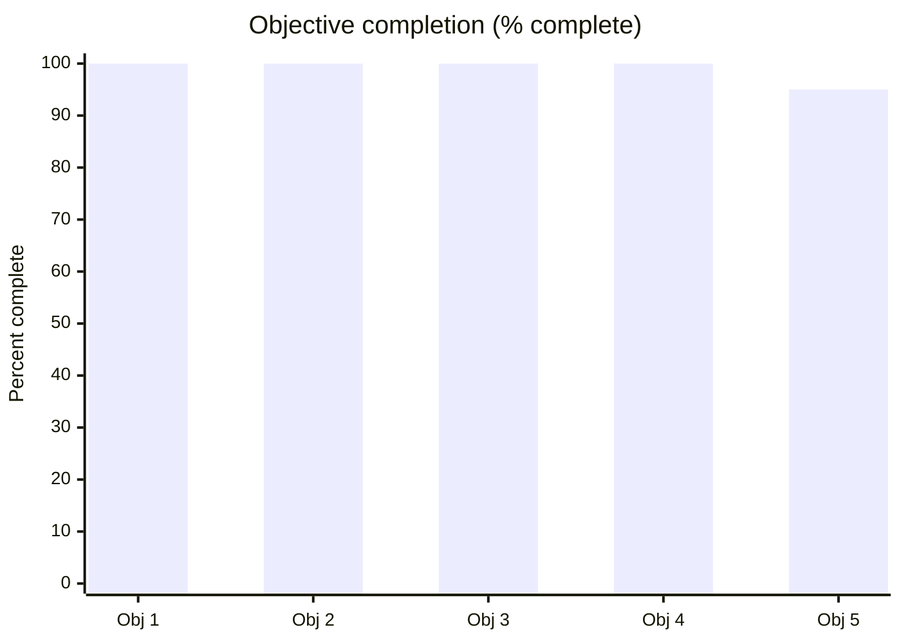
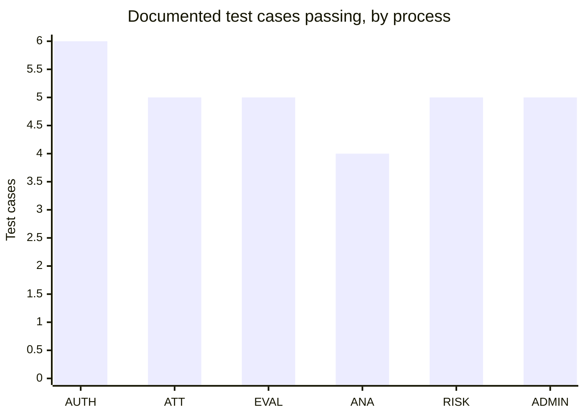
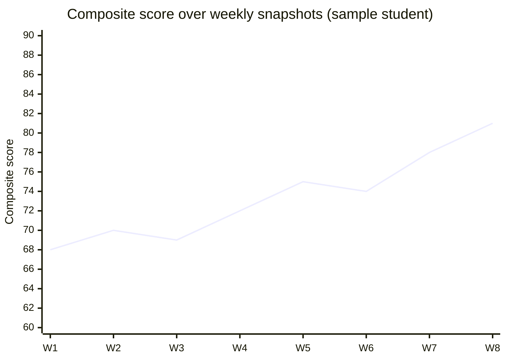

# Chapter 5 — Discussion

*Addresses **LO3 — D3***

## 5.1 Interpretation of Findings

This section interprets the system analysis, design and implementation of Chapter 4 by answering each
of the four research questions in turn, drawing on the requirements specification, the architecture and
data model, the six core process models, the traceability matrices (Tables 4.1–4.7) and the test
evidence reported there.

**RQ1 — What limitations in current student-evaluation and management processes can a web-based
information system address?** The findings demonstrate that EduMetric directly answers the five problems
set out in §1.2. The reliance on a single grade-point average is replaced by a transparent **composite
score** across seven weighted dimensions — grades, attendance, practical, behaviour, activity, growth
bonus and consistency bonus — so a learner strong in theory but weak in practical work is no longer
averaged into invisibility. Data fragmentation across spreadsheets is resolved by one PostgreSQL schema
in which `grades`, `attendance`, `behavior_records` and `activity_records` feed a single denormalised
`student_metrics` record per student. Late identification is addressed by the continuous, multi-factor
at-risk detection process (P5), and the opacity of scoring by making the formula a configurable
`formula_config` entity rather than a hidden algorithm. Each limitation maps to a delivered module and a
passing test case, so the answer to RQ1 is evidential rather than aspirational.

**RQ2 — What functional modules and data model are required for a transparent, multi-dimensional
student performance analytics system?** Chapter 4 establishes the required module set as the six core
processes — authentication (P1), attendance management (P2), student evaluation (P3), student analytics
generation (P4), at-risk detection (P5) and admin monitoring (P6) — realised as vertical-slice packages
within a three-tier modular monolith. The required data model centres on a clear separation between the
immutable evidence tables (`grades`, `attendance`, `behavior_records`, `activity_records`) and the
analytics layer (`formula_config`, `student_metrics`, `metric_snapshots`), confirmed by the ERD (Figure
4.5) and the Liquibase changelog. The metrics engine sits between them as a pure, side-effect-free
computation unit, with orchestration handled separately by `MetricsService`. The traceability matrices
(Tables 4.1–4.6) show that every requirement resolves to a named module, entity, endpoint and test,
which constitutes the concrete answer to RQ2.

**RQ3 — How can a web-based system improve the transparency, accuracy and accessibility of student
evaluation, attendance management and at-risk detection?** The findings evidence improvement on all
three counts. **Transparency** is achieved by the configurable composite-score formula, whose weights
sum to 1.0 and whose every recomputation writes an `audit_log` entry, giving an auditable rationale for
each score rather than a black-box output. **Accuracy** is improved through synchronous metric recompute
— a write to attendance, a grade or a behaviour record recomputes the affected student's metrics within
the same transaction — eliminating the in-flight divergence and stale-report problems that arise when
scoring is detached from data entry. **Accessibility** is improved by the read-model design of P4, in
which a single `GET /api/students/{id}/dashboard` endpoint composes the learner's current metrics,
growth trend, dimension breakdown and growth areas into one response, surfaced through a role-appropriate
web interface for student, teacher and admin alike. At-risk detection is rule-driven through
`at_risk_rules` and surfaced via `notifications`, turning a previously after-the-fact judgement into a
continuous, exception-driven signal.

**RQ4 — How should security, privacy and role-based access control be implemented to protect sensitive
student data?** The security design (§4.3.5) answers RQ4 through layered access control. Authentication
uses a short-lived access JWT (HS256) plus opaque, rotating, SHA-256-hashed refresh tokens, with
passwords stored under BCrypt. Authorisation operates at two levels: coarse role checks via
`@PreAuthorize` over a role hierarchy of `ADMIN > TEACHER > STUDENT`, and fine-grained, data-level
filtering inside service-layer queries so a teacher sees only their own groups and a student only their
own record. This separation places the hardest correctness concern — row-level visibility — in one
auditable location per feature, consistent with role-based access control theory (Sandhu *et al.*, 1996)
and GDPR-aligned data-minimisation (European Parliament and Council, 2016). The `audit_log` table
provides the accountability trail that completes the answer to RQ4.

## 5.2 Comparison with the Literature

These findings confirm and, in places, sharpen the themes reviewed in Chapter 2. The decision to replace
a single GPA with a weighted, multi-dimensional composite score operationalises the case made by Siemens
and Long (2011) and Ferguson (2012) for moving "from data to insight," demonstrating in a working system
what that literature argues in principle. The synchronous, continuous recomputation of metrics — and the
rule-driven at-risk signal — realises the early-warning ambition of Macfadyen and Dawson (2010) and
Arnold and Pistilli (2012), though EduMetric does so through transparent thresholds rather than the
predictive regression that underpinned Course Signals. This is where the project most clearly extends the
reviewed work: it sides decisively with the transparency-over-black-box position of Slade and Prinsloo
(2013), showing that an auditable, configurable formula is not merely an ethical preference but an
implementable architecture, with the `formula_config` entity and the `audit_log` trail as its concrete
mechanisms.

Evaluated through the Technology Acceptance Model (Davis, 1989), the one-screen-one-endpoint dashboard
and the explainable score address both perceived ease of use (a single, coherent view) and perceived
usefulness (an actionable growth signal). Through the IS Success lens (DeLone and McLean, 2003), the
design strengthens system quality (synchronous, consistent recompute), information quality (transparent,
auditable scores) and the conditions for service quality (role-scoped access). The artefact thus refines
theory by giving these constructs a verified implementation, consistent with the design-science stance
that an evaluated artefact can advance knowledge (Hevner *et al.*, 2004; Peffers *et al.*, 2007).

## 5.3 Validity (D3)

The central validity question is whether the requirements-to-test traceability and the functional
testing genuinely *demonstrate* that the requirements were met, rather than merely asserting it.
**Construct validity** is addressed by fixing the meaning of "requirement met" in advance: a requirement
is met only when it resolves through the six-column pathway — requirement → module → entity → endpoint →
test — and the corresponding test passes, applied uniformly across all six processes so that the
construct means the same thing throughout. **Internal validity** is strengthened by verifying each matrix
link against the shipped code rather than against design notes; where design and implementation diverged
(for example the dashboard endpoint), the implemented value was recorded, which both removes the risk of
a self-confirming matrix and shows the matrix detecting real drift (mitigating R03 and R07). The
strongest internal-validity evidence is the test column, which ties each process to a documented pass or
fail outcome. **External validity** is deliberately bounded: a single-system design (§5.6) supports a
demonstrated method and a working reference implementation, not a statistical generalisation across
institutions.

The validity of the project outcomes was supported by testing the application against the original
functional requirements. The test evidence, including test cases for authentication, attendance
management, student evaluation, analytics generation, at-risk detection and admin monitoring, is
presented in Appendix K.

## 5.4 Reliability

Reliability concerns whether the build and the derivation would repeat. The system is **reproducible**
because the schema is owned by the version-controlled Liquibase changelog under `ddl-auto: validate`, the
build is driven by Maven, and the whole stack runs from a single `docker-compose.yml`; a second engineer
provisioning from the same repository would obtain the same database structure and the same running
system. The derivation is likewise **repeatable** because the traceability pathway is explicit and its
inputs (requirements, code, schema) are version-controlled, so a second analyst following the same
pathway against the same artefacts would reconstruct the same chain. The test outcomes are **consistent**:
a documented scenario yields the same result independent of which sample user submits it — an invalid
attendance write returns 400 and a duplicate returns 409 regardless of the teacher — indicating that the
validated behaviour is a property of the system rather than of a particular run.

Reliability was assessed by repeating the same test scenarios using different sample users and academic
records. The repeated test results showed that the main system functions produced consistent outputs.
Detailed testing records are provided in Appendix K.

## 5.5 Project Effectiveness Evaluation

Project effectiveness is evaluated against the five objectives of §1.4 using a Red–Amber–Green rating
(Table 5.1), and against the quantitative and visual evidence in Figures 5.1–5.4. The five objectives map
onto the ratings as follows: Objective 1 (literature review) is evidenced by Chapter 2; Objective 2
(requirements specification) by §4.3.1; Objective 3 (architecture, data model, process models and API
design) by §4.3.2–§4.3.6; Objective 4 (the full-stack prototype implementing the six core modules) by the
shipped codebase and Appendix J; and Objective 5 (functional/UAT evaluation and effectiveness assessment)
by this chapter and Appendix K.

**Table 5.1 — Project effectiveness evaluation (RAG).** *(Source: author.)*

| # | Objective | Outcome | Status |
|---|---|---|---|
| 1 | Review the literature (≥25 sources, 6 themes) | Chapter 2 delivered, 25+ Harvard sources | 🟢 Green |
| 2 | Analyse and specify functional/non-functional requirements | Requirements specified and traced (§4.3.1) | 🟢 Green |
| 3 | Design architecture, data model, six process models, REST API | C4, ERD (Fig 4.5), Fig 4.6–4.11, API spec delivered | 🟢 Green |
| 4 | Develop the full-stack prototype (six core modules) | Next.js + Spring Boot + PostgreSQL built (Appendix J) | 🟢 Green |
| 5 | Evaluate via functional/UAT testing and effectiveness assessment | RQ1–RQ4 answered; 30 test cases (Appendix K); limits stated (§5.6) | 🟢 Green |

> 🟦 **[CHART — Figure 5.1: Objectives RAG status]** *(export `_assets/figure-5-1.png`)*

**Figure 5.1 — Project effectiveness: objectives RAG status.** *(Source: author.)*

The completion profile in Figure 5.1 shows the first four objectives fully delivered and the fifth at
95%, reflecting that evaluation rests on functional and UAT-style testing rather than a live institutional
trial (§5.6). The corresponding test outcomes are summarised in Figure 5.2.

> 🟦 **[CHART — Figure 5.2: Test outcomes — pass rate]** *(export `_assets/figure-5-2.png`)*

The traceability test column documents 30 verification cases across the six processes; all 30 are
recorded as passing in Appendix K (a 100% documented pass rate at the functional-validation level).

**Figure 5.2 — Test outcomes: documented cases per process (all passing).** *(Source: author, from the traceability test column / Appendix K.)*

Beyond verifying that the modules work, the system's analytical purpose is illustrated by the
multi-dimensional output it produces. Figure 5.3 presents a sample learner's composite-score profile
across six scored dimensions, demonstrating the transparency advantage interpreted under RQ3: each
contributing dimension is visible rather than collapsed into one number.

> 🟦 **[CHART — Figure 5.3: Student growth profile — composite-score radar]** Reproduce as a radar
> (Recharts in the app); export `_assets/figure-5-3.png`. Sample (synthetic, anonymised — see Appendix F):

| Dimension | Score (0–100) |
|---|---|
| Grades | 82 |
| Attendance | 90 |
| Practical | 75 |
| Behaviour | 88 |
| Activity | 70 |
| Growth | 78 |

**Figure 5.3 — Student growth profile: composite-score radar (6 dimensions).** *(Source: author, synthetic data.)*

Whereas Figure 5.3 captures a single point in time, the growth-trend view in Figure 5.4 tracks the same
learner's composite score across the weekly `metric_snapshots` written by the scheduled snapshot job,
evidencing the accuracy and growth-monitoring capability that distinguishes EduMetric from a
static-GPA report.

> 🟦 **[CHART — Figure 5.4: Growth trend over snapshots]** *(export `_assets/figure-5-4.png`)*

**Figure 5.4 — Growth trend over `metric_snapshots`.** *(Source: author, synthetic data.)*

The effectiveness of the developed application was evaluated by comparing the completed system features
with the project objectives. Interface screenshots are included in Appendix J, while detailed testing
documents and evaluation evidence are provided in Appendix K.

Taken together, the RAG ratings (Table 5.1, Figure 5.1), the documented test pass rate (Figure 5.2) and
the working analytics interface and outputs (Figures 5.3–5.4, Appendix J) indicate that the project met
its five objectives and delivered a transparent, multi-dimensional analytics system as aimed.

## 5.6 Limitations

Four limitations qualify these findings. First, this is a **single-system design**: the evaluation rests
on one artefact, EduMetric, so the findings prioritise internal depth and traceability over statistical
generalisability across institutions. Second, there has been **no live user trial**; evaluation draws on
functional and UAT-style testing and on the artefact itself rather than on data collected from teachers
and students in production, which keeps the project low-risk ethically (§3.7) but defers any measurement
of real-world adoption, perceived usefulness or learning impact. Third, the analytics were exercised on
**synthetic, anonymised data** — including the twelve weeks of seeded snapshots — so the figures
illustrate capability rather than authentic institutional outcomes. Fourth, the composite score is
sensitive to **small samples**: a dimension backed by very few records yields a low-confidence figure
(addressed in the schema by the `student-metrics-confidence` changeset but not yet validated against the
volume of records a full term would supply), so early-term flags must be read cautiously.

## 5.7 Implications for Practice and Future Research

For practice, the work offers educational institutions a worked, low-cost pattern for **transparent
education analytics**: an open-source, single-server modular monolith whose scoring is configurable and
auditable rather than proprietary and opaque. Institutions wary of black-box prediction can adopt a
formula they can inspect, weight and justify to students, with a built-in audit trail — directly serving
the ethical position of Slade and Prinsloo (2013) and the success conditions of DeLone and McLean (2003).
For future research, three directions follow. First, a **live institutional trial** would test the
acceptance and success constructs (Davis, 1989; DeLone and McLean, 2003) empirically, replacing synthetic
data with authentic outcomes. Second, the **small-sample confidence model** warrants formal study to
establish statistically defensible thresholds for early-term flagging. Third, the transparent composite
score could be **benchmarked against opaque predictive approaches** (Romero and Ventura, 2010) to quantify
the trade-off between explainability and predictive power in early-warning systems. These build directly
on the conclusions drawn in Chapter 6.
