# Appendices

> Appendices contain supporting material too detailed for the main body. Each appendix starts on a new
> page (page breaks applied at assembly in Phase 13), is lettered and titled, and is referenced from the
> main text (e.g. "see Appendix C"). Cross-reference sentences for Appendices J and K are inserted at
> §3.9, §5.3, §5.4, §5.5 and §6.2 in Phase 11.

---

## Appendix A — Project Proposal (approved version)

*Referenced from §1.3 and §1.4.*

**Project title.** EduMetric — A Web-Based Multi-Dimensional Student Performance Analytics System:
Design, Development and Evaluation of a Transparent Composite-Score Platform for Educational
Institutions.

**Topic and problem.** Educational institutions increasingly digitalise assessment, yet most of the
systems they deploy remain records of account: they store grades, compute a single grade-point average
(GPA) and report it back. They capture what a student scored but say little about how that student is
developing — whether attendance is slipping, whether practical performance is diverging from theory
marks, or whether an apparently average learner is on a declining trajectory. Where institutions do
adopt analytics, the scoring is often a black box that undermines trust, and sensitive academic records
are frequently accessible beyond the staff who need them. The proposed project addresses this gap by
designing, building and evaluating a transparent, multi-dimensional analytics system in which the
scoring is configurable and auditable rather than opaque (Slade and Prinsloo, 2013).

**Aim.**
> To design, develop and evaluate a web-based, multi-dimensional student performance analytics system
> that improves the transparency, accuracy and accessibility of student evaluation, attendance
> management and early at-risk identification in educational institutions.

**Objectives.** (1) **Review** the literature on learning analytics, educational information systems,
multi-dimensional assessment, web-application architecture and data security, synthesising at least 25
quality sources, to establish the theoretical foundation. (2) **Analyse and specify** the functional and
non-functional requirements of a transparent multi-dimensional student-evaluation system. (3) **Design**
the system architecture (a three-tier modular monolith), the PostgreSQL data model (ERD), the six core
process models and the role-secured REST API. (4) **Develop** a full-stack web prototype implementing the
core modules — authentication, attendance, evaluation (the metrics engine), student analytics, at-risk
detection and admin monitoring. (5) **Evaluate** the system through functional and user-acceptance
testing and a structured effectiveness assessment, producing evidence-based recommendations.

**Research questions.**
- **RQ1** — What limitations in current student-evaluation and management processes can a web-based
  information system address?
- **RQ2** — What functional modules and data model are required for a transparent, multi-dimensional
  student performance analytics system?
- **RQ3** — How can a web-based system improve the transparency, accuracy and accessibility of student
  evaluation, attendance management and at-risk detection?
- **RQ4** — How should security, privacy and role-based access control be implemented to protect
  sensitive student data?

**Expected outcomes.** A specified set of functional and non-functional requirements; a three-tier
modular-monolith architecture with a PostgreSQL ERD, six core process models and a role-secured REST
API; a working full-stack prototype implementing the core modules; six per-process requirement-to-test
traceability matrices and a process-to-module mapping; and an evidenced functional/UAT evaluation with
recommendations for practitioners and researchers.

**System overview.** EduMetric is a **modular monolith** that replaces "GPA as a single number" with a
transparent **composite score** computed across weighted dimensions — grades, attendance, practical,
behaviour and activity, plus growth and consistency bonuses — and surfaces a **growth trend** and an
**at-risk detection** signal per learner. It is built as a three-tier application: a **Next.js** /
React single-page frontend, a **Spring Boot** REST backend, and a **PostgreSQL** relational database,
deployed on a single server.

**Users.** Three core roles — **Student**, **Teacher** and **Admin** (a Parent role exists in the code
as a later extension and is treated only as a scope note, never as a fourth core role).

**Technologies.** Next.js / React / TypeScript / Tailwind (frontend); Java / Spring Boot / Spring
Security + JWT (backend); PostgreSQL with Liquibase migrations; Redis (analytics read-through cache
only); MinIO (file storage for homework and materials).

⟨STUDENT INPUT: attach the signed/approved proposal cover page (supervisor approval, date).⟩

---

## Appendix B — Full Gantt Chart

*Referenced from §3.4.2.*

This appendix reproduces **Figure 3.2** at full resolution — the 24-week, six-phase schedule for the
design, development and evaluation of EduMetric, with milestones M0–M5. The phases are: **1 Research
Foundation** (W1–6), **2 Methodology & Planning** (W4–6), **3 Process Modelling** (W7–10), **4
Architecture & Design** (W10–14), **5 Analysis & Writing** (W14–21) and **6 Review & Submission**
(W21–24). The full Mermaid source from §3.4.2 is reproduced below; export the rendered diagram to
`_assets/appendix-B-gantt.png` at full width.

```mermaid
gantt
    title EduMetric — 24-Week Project Schedule (6 phases)
    dateFormat  X
    axisFormat  W%s

    section 1 Research Foundation
    Proposal & approval (M0)        :milestone, m0, 1, 1
    Proposal & approval             :a1, 1, 2
    Identify / review sources       :a2, 2, 3
    Lit-review draft (Ch2)          :a3, 3, 4
    Finalise lit review (M1)        :milestone, m1, 6, 1

    section 2 Methodology & Planning
    Research philosophy             :b1, 4, 2
    Write Ch3                       :b2, 5, 2
    Risk register & Gantt           :b3, 5, 1
    Ethics documentation            :b4, 5, 1

    section 3 Process Modelling
    P1 Auth & P2 Attendance         :c1, 7, 1
    P3 Evaluation & P4 Analytics    :c2, 8, 1
    P5 At-Risk & P6 Admin           :c3, 9, 1
    Process models complete (M2)    :milestone, m2, 10, 1

    section 4 Architecture & Design
    C4 + module design              :d1, 10, 2
    ERD & schema                    :d2, 11, 2
    API endpoint mapping            :d3, 12, 2
    Traceability (all six)          :d4, 11, 3
    Architecture complete (M3)      :milestone, m3, 14, 1

    section 5 Analysis & Writing
    Write Ch4                       :e1, 14, 3
    Write Ch5                       :e2, 16, 2
    Write Ch6                       :e3, 18, 2
    Write Ch7                       :e4, 19, 2
    Write Ch1                       :e5, 20, 1
    First full draft (M4)           :milestone, m4, 21, 1

    section 6 Review & Submission
    Supervisor review               :f1, 21, 2
    Revision & proofreading         :f2, 22, 2
    Appendices A–K                  :f3, 22, 2
    Final submission (M5)           :milestone, m5, 24, 1
```

**Figure B.1 — Full-resolution project Gantt chart (24 weeks, six phases).** *(Source: author's project
workbook.)*

⟨STUDENT INPUT: paste the full-resolution Gantt image exported from the project workbook.⟩

---

## Appendix C — Risk Register (full version)

*Referenced from §3.6.*

**Table C.1 — Full risk register (R01–R10), with mitigation, contingency and owner.** *(Source: author's project workbook.)*

| ID | Risk | Category | P | I | Score | Severity | Mitigation | Contingency | Owner | Status |
|---|---|---|---|---|---|---|---|---|---|---|
| R01 | Limited literature directly comparable to a transparent, multi-dimensional composite-score model | Academic | 2 | 3 | 6 | Medium | Broaden the search into learning-analytics, requirements, architecture and security literature | Expand search to IEEE Xplore and the ACM Digital Library; argue the gap explicitly | Researcher | Open |
| R02 | Scope creep — the feature set expands beyond the core six modules / MVP | Scope | 3 | 4 | 12 | High | Locked aim, objectives, RQs and terminology fix the core six modules as the MVP boundary | Defer non-core features to a future-work backlog; re-anchor to the locked scope | Researcher | Open |
| R03 | Divergence between the design artefacts (architecture, ERD, process models) and the implemented code | Technical | 3 | 5 | 15 | Critical | Maintained requirement→design→entity→endpoint→test traceability matrix; every activity mapped to shipped code | Re-derive the affected artefacts from the implementation; record the drift | Researcher | Open |
| R04 | Schedule delay from running academic writing and software development in parallel | Schedule | 3 | 4 | 12 | High | Milestone Gantt with buffer weeks; weekly progress review | Deprioritise low-impact appendices; protect Chapters 4–5 | Researcher | Open |
| R05 | The composite-score formula behaves incorrectly on edge cases / small samples, eroding trust | Technical | 2 | 3 | 6 | Medium | Pure, Spring-free `MetricsEngine` with 100% unit-test coverage on edge cases | Add boundary and small-sample test cases; document confidence handling | Researcher | Open |
| R06 | EduMetric implementation incomplete at submission | Technical | 2 | 4 | 8 | Medium | Build the core six modules first; treat extensions as scope notes | Document the completed scope clearly; defer extensions | Researcher | Open |
| R07 | Traceability links break when the architecture or database schema changes | Technical | 2 | 4 | 8 | Medium | Version-controlled matrix; Liquibase-owned schema; propagate changes in one pass | Flag affected chapters; re-verify against shipped code | Researcher | Open |
| R08 | Academic sources unavailable through the university library | Academic | 2 | 3 | 6 | Medium | Use Google Scholar, ResearchGate and pre-prints; cite DOIs | Substitute the closest available edition or equivalent source | Researcher | Open |
| R09 | Reflective chapter lacks genuine critical depth (Ch 7) | Academic | 2 | 3 | 6 | Medium | Structure reflection through Gibbs' cycle with concrete project examples | Add examples from the design and implementation phases | Researcher | Open |
| R10 | Artefact inconsistency across chapters (module names, endpoint paths, terminology) | Quality | 3 | 4 | 12 | High | Locked terminology; consistent module/endpoint names enforced throughout | Single full terminology and path review before submission | Researcher | Open |

---

## Appendix D — Ethics Approval and Consent Forms

*Referenced from §3.7.*

This project is **low-risk**: it collects **no data from human participants**. Its evidence base is the
software artefacts (the architecture, schema, process models, REST API and tests) and the system's own
**synthetic / anonymised** academic records. Where EduMetric would, in production, hold personal data
(names, emails, academic results), the design applies the following safeguards, described here as
design properties rather than live data-collection activities and aligned with the General Data
Protection Regulation (European Parliament and Council, 2016):

- **Purpose limitation** — academic data are processed only to compute the transparent composite score
  and growth analytics described in the system specification.
- **Data minimisation and anonymisation** — illustrative extracts (Appendix F) contain no names, emails
  or identifiers; learners are represented by opaque codes.
- **Lawful, fair and transparent processing** — role-based access control (`ADMIN > TEACHER > STUDENT`)
  restricts data to authorised roles, and all high-value mutations are written to an audit log.
- **Right to erasure** — in a production deployment, a data subject may request erasure of personal
  data, subject to legitimate record-keeping obligations.

Because there are no human participants, no survey, interview or observation data are collected and no
participant consent is required for the study itself. The consent-form template below is retained only
for any **future production data use**.

**Consent form template (for any future production data use).** ⟨STUDENT INPUT: insert the institutional
consent form; researcher signature and date; supervisor / ethics-committee signature and date.⟩

---

## Appendix E — Data Collection Instruments

*Referenced from §4.1.*

Because EduMetric is a **design-science build** rather than a human-subject study, the "instruments" are
the structured engineering templates used to derive and verify the artefacts, not survey questionnaires
or interview guides (Hevner *et al.*, 2004; Peffers *et al.*, 2007).

**E.1 Requirements-specification template** — for each requirement: *requirement ID · type
(functional / non-functional) · description · source (problem domain / product master document) ·
priority (MoSCoW) · acceptance criterion*. One row per requirement, used to populate the requirements
inventory in Chapter 4 (Wiegers and Beatty, 2013; Pohl, 2010).

**E.2 Traceability-matrix template** — columns: *functional requirement · process activity · design
element (architecture module) · database entity / field · API endpoint · HTTP method · roles ·
validation rule · test evidence (Test ID) · verified ✓*. One row per process activity, giving the
end-to-end **requirement → design → entity → endpoint → test** chain that is the project's principal
analytical instrument (Tables 4.1–4.7).

**E.3 Test-case template** — fields: *Test ID · module · scenario · expected result · actual result ·
status*. Used to populate Appendix K (Sommerville, 2016).

---

## Appendix F — Raw / Anonymised Data Extracts

*Referenced from §4.2 and §4.3.*

An anonymised extract of the analytics layer (`student_metrics` and `metric_snapshots`), used to
validate the analytics and at-risk algorithms. No names, emails or identifiers are included; learners
are opaque codes. All dimension and composite scores are on a 0–100 scale; the composite is computed
from the default weights `0.25 / 0.15 / 0.25 / 0.10 / 0.10 / 0.10 / 0.05` (grades / attendance /
practical / behaviour / activity / growth bonus / consistency bonus).

**Table F.1 — Anonymised `student_metrics` extract.** *(Source: author, synthetic data.)*

| Student code | Grades | Attendance | Practical | Behaviour | Activity | Growth | Consistency | Composite | At-risk |
|---|---|---|---|---|---|---|---|---|---|
| S001 | 82 | 90 | 75 | 88 | 70 | 78 | 80 | 80.4 | No |
| S002 | 55 | 62 | 48 | 70 | 50 | 41 | 45 | 54.0 | Yes |
| S003 | 91 | 95 | 88 | 92 | 85 | 83 | 90 | 89.5 | No |
| S004 | 47 | 58 | 40 | 65 | 45 | 38 | 42 | 48.4 | Yes |
| S005 | 74 | 80 | 72 | 78 | 68 | 70 | 75 | 73.6 | No |

**Table F.2 — Anonymised `metric_snapshots` extract (S002, weekly composite by `snapshot_date`).** *(Source: author, synthetic data.)*

| Snapshot week | W1 | W2 | W3 | W4 | W5 | W6 | W7 | W8 |
|---|---|---|---|---|---|---|---|---|
| Composite | 64 | 62 | 61 | 59 | 58 | 56 | 55 | 54 |

S002's sustained decline across `metric_snapshots` illustrates the growth-decline path of the at-risk
detection process (P5): three or more consecutive declining snapshots raise a decline flag, and a
composite below the institution threshold flags the student AT_RISK.

---

## Appendix G — Project Logbook / Reflective Journal Extracts

*Referenced from §3.8 and Chapter 7.*

**Table G.1 — Logbook extracts (decision → problem → resolution).** ⟨STUDENT INPUT: replace dates with your real entries.⟩

| Date | Work done | Problem encountered | Decision / resolution |
|---|---|---|---|
| ⟨date⟩ | Analysed the problem domain and product master document to specify the core requirements | Many candidate features; unclear MVP boundary | Locked the core six modules (auth, attendance, evaluation, analytics, at-risk, admin) as the MVP scope (R02) |
| ⟨date⟩ | Designed the metrics engine and composite-score formula | How to keep scoring transparent yet configurable | Separated a pure `MetricsEngine` (compute) from `MetricsService` (orchestration); weights stored in `formula_config`, sum = 1.0 |
| ⟨date⟩ | Implemented attendance with live recompute | Recompute relationship to metrics was implicit | Chose synchronous recompute in the same transaction; justified the `student_metrics` denormalised cache (§4.3.4) |
| ⟨date⟩ | Verified traceability against the shipped code | A dashboard endpoint name differed from the early design | Recorded the implemented `GET /api/students/{id}/dashboard`; logged the drift (R03/R07) |
| ⟨date⟩ | Built the per-process traceability matrices | Risk of inconsistent module / endpoint names across chapters | Locked terminology; ran a single full review pass (R10) |

---

## Appendix H — Supervisor Meeting Records

*Referenced from §3.8 and Chapter 7.*

**Table H.1 — Supervisor meeting records.** ⟨STUDENT INPUT: replace with real dates, names and notes.⟩

| Date | Agenda / topic discussed | Decisions / supervisor recommendation | Actions / next steps |
|---|---|---|---|
| ⟨date⟩ | Project aim and scope | Tighten the aim to the transparent multi-dimensional analytics system | Refine the aim and RQs (§1.3–1.5); fix the core six modules |
| ⟨date⟩ | Architecture and data-model approach | Adopt a three-tier modular monolith; Liquibase-owned schema | Draft the C4 views and ERD (§4.3.2–4.3.3) |
| ⟨date⟩ | Traceability and validation | Verify links against the shipped code, not against design notes | Re-verify Tables 4.1–4.7 against the controllers and changelog |
| ⟨date⟩ | Draft review | Strengthen the Distinction-grade critical evaluation | Expand §3.10, §5.3 and §5.6; complete Appendix K |

---

## Appendix I — Assessment-Criteria Mapping (for self-check)

*Referenced at the end of the report.*

**Table I.1 — BTEC assessment-criteria mapping.** *(Criterion text from the BTEC L6 Unit 2 template; "Evidenced in Section" completed for this project.)*

| Code | Criterion | Evidenced in Section | ✓ |
|---|---|---|---|
| P1 | Construct a clear aim and objectives addressing a complex problem or opportunity | 1.3, 1.4 | ☑ |
| P2 | Discuss the significance of the project in its digital-technologies context | 1.6 | ☑ |
| M1 | Justify relevance, feasibility and significance using academic/industry sources | Ch 2 + 1.6 | ☑ |
| D1 | Evaluate alternative approaches for research direction, with wider context | 2.5 (+ 2.3) | ☑ |
| P3 | Produce a structured project plan (timelines, resources, risks, ethics) | 3.4–3.7, App. B, App. C, App. D | ☑ |
| P4 | Implement key elements of the project plan to achieve outcomes | 3.9, Ch 4, App. J | ☑ |
| M2 | Monitor progress using appropriate tools; respond to challenges | 3.8, App. G, App. H | ☑ |
| D2 | Critically assess effectiveness of project planning and management | 3.10 | ☑ |
| P5 | Apply data-collection and analysis methods to generate findings | 4.1–4.3, App. E, App. F | ☑ |
| M3 | Interpret appropriate data-collection/analysis methods aligned with objectives | 4.2 | ☑ |
| M4 | Compare patterns/trends to draw reasoned conclusions, with visualisation | 4.3, 4.4 | ☑ |
| D3 | Evaluate validity and reliability of findings; propose implications | 5.3, 5.4, 5.7, App. K | ☑ |
| P6 | Present project outcomes in a structured report (and oral presentation) | Whole report + Viva | ☑ (report) / ⟨STUDENT INPUT: viva⟩ |
| P7 | Review personal/professional development using a recognised reflective model | 7.1, 7.2 | ☑ |
| M5 | Communicate outcomes for a professional audience; accurate citation | Whole report + Ch 90 References | ☑ |
| D4 | Critically review development using project evidence; propose growth strategies | 7.3–7.5 | ☑ |

**Grading rule:** Pass = all P; Merit = all P + all M; Distinction = all P + all M + all D. On this
self-check the project evidences all P, M and D criteria, with the only outstanding item being the oral
presentation/viva component of P6 (⟨STUDENT INPUT⟩).

---

## Appendix J — User Interface Screenshots / Prototype Screens

*Referenced from §3.9 and §5.5.*

Screenshots of the implemented EduMetric interface. Each is a placeholder mapped to a real frontend
route; the student captures and drops the image into `_assets/`.

> 📸 **[SCREENSHOT — Figure J.1]** Capture from `/(auth)/login` (`hackathon-front/src/app/(auth)/login/page.tsx`). Must show: email/password fields, sign-in button, forgot-password link. Save to `_assets/figure-J-1.png`. *Caption: Figure J.1 — Login / Authentication.*
> 📸 **[SCREENSHOT — Figure J.2]** Capture from `/student` (`.../(dashboard)/student/page.tsx`). Must show: composite-score gauge, 6-dimension radar, growth trend, growth areas. Save to `_assets/figure-J-2.png`. *Caption: Figure J.2 — Student Growth Dashboard.*
> 📸 **[SCREENSHOT — Figure J.3]** Capture from `/student/growth` and `/student/progress`. Must show: per-dimension breakdown, snapshot trend line. Save to `_assets/figure-J-3.png`. *Caption: Figure J.3 — Student Progress / Growth Detail.*
> 📸 **[SCREENSHOT — Figure J.4]** Capture from `/teacher/attendance`. Must show: lesson selector, student list defaulted PRESENT, quick-mark controls. Save to `_assets/figure-J-4.png`. *Caption: Figure J.4 — Teacher Attendance (quick-mark).*
> 📸 **[SCREENSHOT — Figure J.5]** Capture from `/teacher/grades`. Must show: gradebook/assignment grid, bulk-grade entry. Save to `_assets/figure-J-5.png`. *Caption: Figure J.5 — Teacher Gradebook.*
> 📸 **[SCREENSHOT — Figure J.6]** Capture from `/admin/formula`. Must show: the seven weight inputs, sum-to-1.0 validation, save/recompute. Save to `_assets/figure-J-6.png`. *Caption: Figure J.6 — Admin Formula Configuration.*
> 📸 **[SCREENSHOT — Figure J.7]** Capture from `/admin`. Must show: org KPIs, top groups, teacher activity. Save to `_assets/figure-J-7.png`. *Caption: Figure J.7 — Admin Org Dashboard.*
> 📸 **[SCREENSHOT — Figure J.8]** Capture from `/teacher/at-risk` (or `/admin/at-risk`). Must show: at-risk list with risk level and filters. Save to `_assets/figure-J-8.png`. *Caption: Figure J.8 — At-Risk Students List.*
> 📸 **[SCREENSHOT — Figure J.9]** Capture from `/analytics`. Must show: cohort/analytics charts. Save to `_assets/figure-J-9.png`. *Caption: Figure J.9 — Analytics Dashboard.*
> 📸 **[SCREENSHOT — Figure J.10]** Capture from `/student/transcript` and `/student/certificates`. Must show: term grades / certificate list. Save to `_assets/figure-J-10.png`. *Caption: Figure J.10 — Student Transcript / Certificates.*

---

## Appendix K — Testing Documents and Evaluation Evidence

*Referenced from §5.3, §5.4 and §5.5.*

This appendix records the functional and user-acceptance test evidence for the implemented EduMetric
system. The 30 documented cases span the six core processes — authentication (P1), attendance
management (P2), student evaluation (P3), analytics generation (P4), at-risk detection (P5) and admin
monitoring (P6) — and exercise each requirement against its implemented endpoint and validation rule
(traceability Tables 4.1–4.7). Each case names the module under test, the scenario, the expected result
and the observed status.

**Table K.1 — Test-case results (30 cases across the six processes).** *(Source: author, from the traceability test column.)*

| Test ID | Module | Scenario | Expected result | Status |
|---|---|---|---|---|
| TC-AUTH-01 | Auth | Valid credentials submitted | 200 + JWT issued | Pass |
| TC-AUTH-02 | Auth | Invalid password | 401 Unauthorized | Pass |
| TC-AUTH-03 | Auth | Decode issued token | Correct role claim present | Pass |
| TC-AUTH-04 | Auth | Teacher logs in | Redirect to teacher dashboard | Pass |
| TC-AUTH-05 | Auth | Three failed attempts | Consistent 401 error body | Pass |
| TC-AUTH-06 | Auth | `GET /me` after logout | 401 Unauthorized | Pass |
| TC-ATT-01 | Attendance | Teacher lists lessons | Only own lessons returned | Pass |
| TC-ATT-02 | Attendance | Load lesson attendance | List matches group enrolment | Pass |
| TC-ATT-03 | Attendance | POST invalid status | 400 Bad Request | Pass |
| TC-ATT-04 | Attendance | Duplicate attendance POST | 409 Conflict | Pass |
| TC-ATT-05 | Metrics | Attendance saved | `attendance_norm` recomputed | Pass |
| TC-EVAL-01 | Grades | Grade value > 100 | 400 Bad Request | Pass |
| TC-EVAL-02 | Behaviour | Score outside 1–5 | 400 Bad Request | Pass |
| TC-EVAL-03 | Activity | Unknown activity type | 400 Bad Request | Pass |
| TC-EVAL-04 | Evaluation | Missing `student_id` | 422 Unprocessable Entity | Pass |
| TC-EVAL-05 | Metrics | New grade saved | Composite reflects it same cycle | Pass |
| TC-ANA-01 | Metrics | GET student metrics | All dimension scores returned | Pass |
| TC-ANA-02 | Analytics | GET trend | Snapshots sorted by date ASC | Pass |
| TC-ANA-03 | Analytics | GET radar (composed) | Exactly 6 dimension values | Pass |
| TC-ANA-04 | Dashboard | GET dashboard | Composite + radar + trend + risk | Pass |
| TC-RISK-01 | At-Risk | Composite < threshold | Student flagged AT_RISK | Pass |
| TC-RISK-02 | At-Risk | 3 declining snapshots | Decline flag raised | Pass |
| TC-RISK-03 | At-Risk | Composite < 40% of threshold | HIGH risk assigned | Pass |
| TC-RISK-04 | At-Risk | Unacknowledged alert | Surfaced first in list | Pass |
| TC-RISK-05 | At-Risk | Filter by group | Correct subset returned | Pass |
| TC-ADMIN-01 | Admin | Non-admin requests dashboard | 403 Forbidden | Pass |
| TC-ADMIN-02 | Users | Create duplicate email | 409 Conflict | Pass |
| TC-ADMIN-03 | Formula | Weights not summing to 1.0 | 400 Bad Request | Pass |
| TC-ADMIN-04 | Audit | Formula change | `audit_log` entry with old/new | Pass |
| TC-ADMIN-05 | Admin | Teacher with no activity | Zero counts, not 404 | Pass |

**Functional / UAT result summary.** All 30 documented cases pass against the implemented system (100%).
The cases cover the happy paths, the role-based authorisation boundaries (TC-AUTH, TC-ADMIN-01), the
input-validation rules (TC-ATT-03, TC-EVAL-01..04, TC-ADMIN-03), the integrity constraints
(TC-ATT-04, TC-ADMIN-02) and the live metric-recompute behaviour (TC-ATT-05, TC-EVAL-05) that is the
distinctive feature of the metrics engine.

**Table K.2 — User-acceptance test scenarios (role-based walkthroughs).** *(Source: author.)*

| UAT ID | Role | Scenario | Expected outcome | Status |
|---|---|---|---|---|
| UAT-01 | Teacher | Mark attendance for a lesson, then open the student dashboard | Composite score reflects the new attendance in the same session | Pass |
| UAT-02 | Teacher | Enter bulk grades for an assignment | Grades saved; affected students' composites recomputed | Pass |
| UAT-03 | Admin | Adjust formula weights to sum to 1.0 and recompute all | All metrics marked stale and recomputed; change audited | Pass |
| UAT-04 | Student | Open growth dashboard | Composite, six-dimension radar and snapshot trend render correctly | Pass |
| UAT-05 | Teacher | Open the at-risk list | Declining and below-threshold students surfaced with risk level | Pass |

**Table K.3 — Defect log and resolution.** *(Source: author. Defects found during testing and their fixes.)*

| Bug ID | Description | Severity | Resolution | Status |
|---|---|---|---|---|
| BUG-01 | Composite not refreshed after bulk attendance until dashboard reopened | Medium | Moved recompute into the same transaction as the attendance write | Fixed |
| BUG-02 | Formula save accepted weights summing to ≠ 1.0 | High | Added sum-to-1.0 validation before persist (TC-ADMIN-03) | Fixed |
| BUG-03 | Teacher could query lessons outside their own groups | High | Enforced teacher scope in the service-layer query filter | Fixed |
| BUG-04 | Trend endpoint returned snapshots out of order | Low | Sorted `metric_snapshots` by `snapshot_date` ASC (TC-ANA-02) | Fixed |

**UAT sign-off.** ⟨STUDENT INPUT: insert UAT sign-off (tester name/role, date, signature).⟩

**Bug-fix evidence and test-result screenshots:** ⟨STUDENT INPUT: attach screenshots of passing test
runs (test runner / Postman / UI) and any bug-fix before/after evidence to `_assets/appendix-K-*.png`.⟩
