<!--
FRONT MATTER — reframed (system build/evaluate framing per REFRAME_BRIEF.md).
List of Figures / List of Tables mirror ASSET_REGISTRY.md (retitled per REFRAME_BRIEF §F).
Page breaks (one per section) are applied at .docx assembly.
-->

**PDP UNIVERSITY**
Faculty of Business Information Technology
Tashkent, Uzbekistan

**INDEPENDENT PROJECT**
Pearson BTEC Level 6 Diploma in Digital Technologies
Unit 2 — Unit Code: 70726U — Credit Value: 30

---

# EduMetric
### A Web-Based Multi-Dimensional Student Performance Analytics System
*Design, Development and Evaluation of a Transparent Composite-Score Platform for Educational Institutions*

---

| | |
|---|---|
| **Student Name:** | ⟨STUDENT INPUT: Full Name⟩ |
| **Student ID:** | ⟨STUDENT INPUT: ID Number⟩ |
| **Programme / Group:** | ⟨STUDENT INPUT: BIT — Group Name⟩ |
| **Project Format:** | Thesis-style ☐    Capstone-style ☒ |
| **Supervisor:** | ⟨STUDENT INPUT: Supervisor Full Name⟩ |
| **Submission Date:** | ⟨STUDENT INPUT: Day Month Year⟩ |
| **Word Count:** | ⟨STUDENT INPUT: XXXX words⟩ |

Submitted in partial fulfilment of the requirements for the
Bachelor's Degree in Business Information Technology
Academic Year ⟨STUDENT INPUT: 20XX–20XX⟩

<!-- PAGE BREAK -->

## Declaration of Originality

I hereby declare that this Independent Project, submitted in partial fulfilment of the requirements
for the Pearson BTEC Level 6 Diploma in Digital Technologies and the Bachelor's Degree in Business
Information Technology at PDP University, is the result of my own original work.

I confirm that:

- All sources of information, data and ideas drawn from other authors have been fully acknowledged
  through accurate in-text citations and a complete reference list using the Harvard (author–date)
  referencing system.
- This work has not been previously submitted, in whole or in part, for any other academic award at
  this or any other institution.
- All research activities involving human participants have been conducted in compliance with the
  institutional ethics procedures of PDP University and applicable data-protection regulations. This
  project did **not** collect data from human participants; it designs, builds and evaluates a software
  system using design artefacts, functional and user-acceptance testing, and synthetic/anonymised
  academic records (see §3.7 and Appendix D).
- I understand that any breach of academic integrity, including plagiarism, fabrication of data or
  unauthorised collaboration, may result in the withdrawal of this submission and disciplinary action.

| | |
|---|---|
| **Signature:** | ⟨STUDENT INPUT: signature⟩ |
| **Date:** | ⟨STUDENT INPUT: date⟩ |

<!-- PAGE BREAK -->

## Acknowledgements

I would like to express my sincere gratitude to my supervisor, ⟨STUDENT INPUT: Supervisor Name⟩, for
their continuous guidance, constructive feedback and encouragement throughout the duration of this
project. Their insistence on grounding every design decision in the real system kept the work honest
and focused.

I am also grateful to the Faculty of Business Information Technology at PDP University for providing
the academic foundation and resources that made this work possible, and to my peers on the EduMetric
development effort, whose questions about the metrics engine and the synchronous-recompute design
sharpened my understanding of how a requirement becomes working software.

Finally, I extend my heartfelt thanks to my family and friends, ⟨STUDENT INPUT: optional personal
names⟩, whose support has been instrumental during every stage of my Bachelor's studies.

<!-- PAGE BREAK -->

## Abstract

The digitalisation of education has produced systems that record grades but rarely explain how a
student is developing. Single grade-point averages collapse attendance, practical performance,
behaviour and engagement into one number, hiding declining trajectories until it is too late to
intervene. This project presents the design, development and evaluation of **EduMetric**, a web-based,
multi-dimensional student performance analytics system that replaces the single grade-point average
with a transparent **composite score** computed across grades, attendance, practical work, behaviour
and activity, complemented by growth and consistency bonuses, a **growth trend** and an **at-risk
detection** signal. A pragmatist, design-science methodology was adopted: functional and
non-functional requirements were elicited from the problem domain and a product master document; the
system architecture (a three-tier **modular monolith**), the PostgreSQL data model and a role-secured
REST API were designed; and a full-stack prototype was implemented using Next.js/React, Java Spring
Boot and PostgreSQL. Six core processes — authentication, attendance management, student evaluation,
analytics generation, at-risk detection and administrative monitoring — were modelled and traced
end-to-end into architecture modules, database entities, API endpoints and validation evidence, with
every link verified against the shipped codebase. Evaluation combined functional and user-acceptance
testing with a structured effectiveness assessment rather than human-subject data collection. The
system demonstrated that a transparent, configurable scoring model, synchronous recomputation and
strict role-based access control can deliver accurate, explainable and accessible student evaluation
without resorting to black-box prediction. The project concludes that a modular, role-aware analytics
platform meaningfully addresses the limitations of single-number grading, and contributes a fully
traceable, open-source reference implementation together with recommendations for practitioners and
future researchers.

**Keywords:** student analytics; learning analytics; composite score; transparent evaluation; web
information system; role-based access control; Spring Boot; PostgreSQL.

<!-- PAGE BREAK -->

## Table of Contents

> *Auto-generated at .docx assembly. Structure below mirrors the BTEC template and the chapter files
> in this folder. Page numbers populate on field update in Word.*

- Declaration of Originality
- Acknowledgements
- Abstract
- Table of Contents
- List of Figures
- List of Tables
- List of Abbreviations
- **Chapter 1 — Introduction**
  - 1.1 Background and Context · 1.2 Problem Statement · 1.3 Project Aim · 1.4 Project Objectives ·
    1.5 Research Questions · 1.6 Significance of the Project · 1.7 Scope and Limitations · 1.8 Structure of the Report
- **Chapter 2 — Literature Review**
  - 2.1 Introduction and Search Strategy · 2.2 Theoretical Framework · 2.3 Thematic Review ·
    2.4 Industry / Practice Review · 2.5 Identification of the Gap · 2.6 Conceptual Framework · 2.7 Summary
- **Chapter 3 — Project Planning and Methodology**
  - 3.1 Research Philosophy and Approach · 3.2 Methodological Choice · 3.3 Project Management Methodology ·
    3.4 Project Plan (WBS · Gantt · Milestones) · 3.5 Resource Planning · 3.6 Risk Register ·
    3.7 Ethical Considerations · 3.8 Project Tracking and Documentation · 3.9 Implementation of the Plan ·
    3.10 Critical Assessment of Project Management
- **Chapter 4 — System Analysis, Design and Implementation**
  - 4.1 Method · 4.2 Analytical Techniques · 4.3 Findings (requirements · architecture · data model ·
    six core processes P1–P6 · security · key interactions) · 4.4 Comparison of Patterns
- **Chapter 5 — Discussion**
  - 5.1 Interpretation of Findings · 5.2 Comparison with the Literature · 5.3 Validity · 5.4 Reliability ·
    5.5 Project Effectiveness Evaluation · 5.6 Limitations · 5.7 Implications
- **Chapter 6 — Conclusion and Recommendations**
  - 6.1 Summary · 6.2 Achievement of Objectives · 6.3 Contribution · 6.4 Recommendations · 6.5 Closing Remarks
- **Chapter 7 — Reflective Evaluation**
  - 7.1 Reflective Model · 7.2 Reflection through Gibbs · 7.3 SWOT · 7.4 Transferable Skills · 7.5 Future Development Plan
- References
- Appendices A–K

<!-- PAGE BREAK -->

## List of Figures

> *Page numbers populate at .docx assembly.*

| Figure | Title |
|---|---|
| 2.1 | Conceptual framework: from process intent to a validated student-analytics system |
| 3.1 | Work Breakdown Structure |
| 3.2 | Project Gantt chart (24 weeks, 6 phases) |
| 3.3 | Risk heat-map (Probability × Impact, R01–R10) |
| 3.4 | Project-tracking tool *(screenshot — student-supplied)* |
| 4.1–4.4 | C4 context · C4 container · component/module map · deployment |
| 4.5 | Entity-Relationship Diagram (full schema) |
| 4.6–4.11 | Process models — P1 Authentication · P2 Attendance · P3 Evaluation · P4 Analytics · P5 At-Risk · P6 Admin |
| 4.12–4.15 | Sequences — login · bulk-attendance recompute · dashboard composition · security filter chain |
| 4.16–4.17 | Process-complexity comparison · requirement→artefact coverage |
| 5.1–5.4 | Objectives RAG · test pass-rate · growth radar · growth trend |
| J.1–J.10 | UI screenshots *(student-supplied — see Appendix J)* |

<!-- PAGE BREAK -->

## List of Tables

> *Page numbers populate at .docx assembly.*

| Table | Title |
|---|---|
| 3.1 | Milestones and critical path |
| 3.2 | Resource plan |
| 3.3 | Risk register (R01–R10) |
| 4.0 | Artefact inventory of EduMetric |
| 4.1–4.6 | Per-process traceability matrices (P1–P6) |
| 4.7 | Process → architecture module mapping |
| 5.1 | Project effectiveness evaluation (RAG) |
| C.1 | Risk register (full, with owner and contingency) |
| F.1–F.2 | Anonymised `student_metrics` / `metric_snapshots` extracts |
| I.1 | BTEC assessment-criteria mapping |
| K.1 | Test-case results (TC-AUTH-01 … TC-ADMIN-05) |

<!-- PAGE BREAK -->

## List of Abbreviations

| Abbreviation | Expansion |
|---|---|
| API | Application Programming Interface |
| BCrypt | Blowfish-based password-hashing function |
| BPMN | Business Process Model and Notation |
| BTEC | Business and Technology Education Council |
| C4 | Context, Containers, Components, Code (architecture model) |
| CRM | Customer / Constituent Relationship Management |
| CRUD | Create, Read, Update, Delete |
| CSRF | Cross-Site Request Forgery |
| DTO | Data Transfer Object |
| ERD | Entity-Relationship Diagram |
| GDPR | General Data Protection Regulation |
| GPA | Grade-Point Average |
| HS256 | HMAC-SHA-256 (JWT signing algorithm) |
| HTTP | Hypertext Transfer Protocol |
| ISSM | Information Systems Success Model |
| JPA | Jakarta Persistence API |
| JWT | JSON Web Token |
| KPI | Key Performance Indicator |
| LMS | Learning Management System |
| LO | Learning Outcome (BTEC) |
| MFA | Multi-Factor Authentication |
| ORM | Object-Relational Mapping |
| P / M / D | Pass / Merit / Distinction (BTEC criteria) |
| RAG | Red–Amber–Green (status rating) |
| RBAC | Role-Based Access Control |
| REST | Representational State Transfer |
| RQ | Research Question |
| SIS | Student Information System |
| SMART | Specific, Measurable, Achievable, Relevant, Time-bound |
| SQL | Structured Query Language |
| SSR | Server-Side Rendering |
| SWOT | Strengths, Weaknesses, Opportunities, Threats |
| TAM | Technology Acceptance Model |
| TTL | Time To Live (cache) |
| UAT | User Acceptance Testing |
| UI / UX | User Interface / User Experience |
| UML | Unified Modeling Language |
| VPS | Virtual Private Server |
| WBS | Work Breakdown Structure |

# Chapter 1 — Introduction

*Addresses **LO1 — P1, P2 | M1 | D1***

## 1.1 Background and Context

The digitalisation of education across Uzbekistan and the wider Central Asian region has accelerated
sharply over the past decade, as universities and private IT academies adopt learning-management and
student-information systems to administer enrolment, attendance and assessment at scale. Yet the
majority of these systems remain *records of account*: they store grades, compute a single
grade-point average (GPA) and report it back. They capture what a student scored, but they say little
about *how that student is developing* — whether attendance is slipping, whether practical performance
is diverging from theory marks, or whether a learner who looks average today is in fact on a declining
trajectory. The institutional need is shifting from recording outcomes to **understanding student
growth**, a shift that the learning-analytics literature has framed as moving "from data to insight"
in the service of timely intervention (Siemens and Long, 2011; Ferguson, 2012).

This project responds to that shift by designing, building and evaluating **EduMetric**, a web-based,
multi-dimensional student performance analytics system. EduMetric replaces "GPA as a single number"
with a transparent **composite score** computed across several weighted dimensions — grades,
attendance, practical work, behaviour and activity, plus growth and consistency bonuses — and surfaces
a **growth trend** and an **at-risk detection** signal for each learner. The system is built as a
full-stack web application: a Next.js/React single-page frontend, a Java Spring Boot REST backend and
a PostgreSQL relational database, deployed as a single **modular monolith**. It deliberately rejects
black-box machine-learning scoring in favour of a configurable, auditable formula, on the principle
that decisions affecting a student's academic standing must be explainable (Slade and Prinsloo, 2013).

An education analytics platform of this kind sits at the intersection of web-application development,
relational database design, information security, user-experience design and process automation — all
core competencies of the Business Information Technology curriculum. EduMetric is therefore both a
practically useful artefact for institutions and an appropriate vehicle for demonstrating the
end-to-end software-engineering process this dissertation sets out to evidence.

## 1.2 Problem Statement

In many educational institutions, student evaluation, attendance monitoring and progress reporting
rely on disconnected spreadsheets, separate gradebooks and informal communication. This fragmented
approach produces a recurring set of problems, confirmed through preliminary domain analysis and the
EduMetric product master document:

1. **A single number hides growth.** A GPA averages away the dimensions that matter for early support;
   a student weak in practical work but strong in theory looks "average," and a declining attendance
   trend is invisible until results collapse (Macfadyen and Dawson, 2010).
2. **Data fragmentation.** Grades, attendance and behaviour live in separate files, causing version
   conflicts, duplication and slow, manual report compilation.
3. **Late at-risk identification.** Without continuous, multi-factor monitoring, teachers learn that a
   student is failing only after the fact, when intervention is least effective (Arnold and Pistilli, 2012).
4. **Opacity of scoring.** Where institutions do adopt analytics, the scoring is often a black box,
   undermining trust and the right of students to understand decisions made about them.
5. **Weak access control.** Sensitive academic records are frequently accessible beyond the staff who
   need them, with no role-based protection or audit trail.

The engineering problem this project addresses is therefore to turn these informally understood
processes — authentication, attendance management, student evaluation, analytics generation, at-risk
detection and administrative monitoring — into precise, verifiable software: an architecture, a data
model, a set of REST endpoints and a body of test evidence, derived rigorously from requirements so
that what was intended, what was designed and what was built do not diverge (Sommerville, 2016).

## 1.3 Project Aim

> To design, develop and evaluate a web-based, multi-dimensional student performance analytics system
> that improves the transparency, accuracy and accessibility of student evaluation, attendance
> management and early at-risk identification in educational institutions.

## 1.4 Project Objectives

The aim is delivered through five SMART objectives (the approved project proposal from which they
derive is provided in Appendix A):

1. **Review the literature** on learning analytics, educational information systems, multi-dimensional
   assessment, web-application architecture and data security, synthesising at least 25 quality
   sources into six thematic strands, to establish the theoretical foundation *(Chapter 2)*.
2. **Analyse and specify** the functional and non-functional requirements of a transparent
   multi-dimensional student-evaluation system, derived from the problem domain and the EduMetric
   product master document *(Chapter 4)*.
3. **Design** the system architecture (a three-tier modular monolith), the PostgreSQL data model
   (ERD), the six core process models and the role-secured REST API in line with industry best
   practice *(Chapter 4)*.
4. **Develop** a full-stack web prototype — Next.js/React/TypeScript frontend, Java Spring Boot
   backend, PostgreSQL — implementing the core modules: authentication, attendance, evaluation (the
   metrics engine), student analytics, at-risk detection and admin monitoring *(Chapter 4)*.
5. **Evaluate** the system through functional and user-acceptance testing and a structured
   effectiveness assessment, producing evidence-based recommendations for practitioners *(Chapters 5–6,
   Appendix K)*.

Each objective is specific and time-bound against the project plan (§3.4), measurable through a named
deliverable, and achievable within the scope defined in §1.7.

## 1.5 Research Questions

- **RQ1** — What limitations in current student-evaluation and management processes can a web-based
  information system address?
- **RQ2** — What functional modules and data model are required for a transparent, multi-dimensional
  student performance analytics system?
- **RQ3** — How can a web-based system improve the transparency, accuracy and accessibility of student
  evaluation, attendance management and at-risk detection?
- **RQ4** — How should security, privacy and role-based access control be implemented to protect
  sensitive student data?

## 1.6 Significance of the Project

**Academically**, the project contributes a concrete, fully traceable reference implementation of a
*transparent* multi-dimensional evaluation model. While learning analytics is a mature field, much of
it emphasises predictive, often opaque models (Romero and Ventura, 2010); comparatively little
demonstrates an end-to-end, auditable path from a configurable scoring formula through architecture,
schema and API to validating tests within a single non-trivial system. By using a real, multi-module
application as the object of study, this dissertation evidences an engineering method rather than a
purely conceptual proposal.

**For industry and practice**, EduMetric offers a worked pattern for cost-effective, locally
deployable education analytics. Built entirely on open-source technologies (Next.js, Spring Boot,
PostgreSQL) and deployable as a single modular monolith on one server, it shows how an institution can
centralise records, automate scoring and attendance, and gain early-warning dashboards without
expensive commercial subscriptions or black-box algorithms.

**Personally**, the project consolidates the author's software-engineering competence — requirements
analysis, process and architecture modelling, relational database design, secure REST API development
and software validation — into a single coherent body of evidence aligned with a future career in
systems development.

## 1.7 Scope and Limitations

The study is bounded to a **single system, EduMetric**, comprising the Spring Boot backend and the
Next.js frontend held in this repository. The system recognises three core roles — **Student, Teacher
and Admin**; a Parent role exists in the code as a later extension and is noted only where relevant to
scope, never as a fourth core role. The investigation is a **design-and-build study** evaluated through
its artefacts: it concentrates on requirements, design, implementation and validation of the six core
processes, not on production deployment, large-scale performance testing or live institutional trials.
Consequently, evaluation evidence (Chapter 5 and Appendix K) draws on the system's functional and
user-acceptance test suite and on synthetic/anonymised academic data rather than on data collected
from human participants, which keeps the project low-risk ethically (§3.7). As a single-system design,
the findings prioritise depth and internal traceability over statistical generalisability — a
limitation revisited in §5.6.

## 1.8 Structure of the Report

The remainder of this report proceeds as follows. **Chapter 2** reviews the literature thematically
and derives the conceptual framework that positions EduMetric within learning analytics and
information-systems design. **Chapter 3** sets out the research philosophy, the design-science
methodology, and the project plan, risk register and ethical considerations. **Chapter 4**, the core
engineering chapter, specifies the requirements and presents the system's architecture, data model and
six core process models, tracing each forward into modules, entities and API endpoints with supporting
test evidence. **Chapter 5** interprets these findings against the research questions and the
literature, and evaluates the project's effectiveness. **Chapter 6** draws conclusions and
recommendations, and **Chapter 7** offers a reflective evaluation of the author's learning. Supporting
material — the proposal, full project-management artefacts, ethics documentation, assessment-criteria
mapping, UI evidence and testing evidence — is provided in Appendices A–K.

# Chapter 2 — Literature Review

*Addresses **LO1 — M1 | D1***

## 2.1 Introduction and Search Strategy

This chapter reviews the body of knowledge that positions **EduMetric** — a web-based,
multi-dimensional student performance analytics system — within the fields of learning analytics,
educational information systems and software engineering. Its purpose is to establish the theoretical
foundation for the design-and-build study reported in the remainder of the dissertation, to evidence
the limitations of current student-evaluation practice (RQ1), and to converge on the specific gap that
EduMetric is designed to fill. The review is deliberately **thematic** rather than author-by-author:
the literature is organised into six strands that together trace the path from a recognised problem in
student evaluation to a transparent, validated software artefact, followed by an industry perspective,
a reasoned statement of the gap, and the conceptual framework that the later chapters operationalise.

Sources were identified through Google Scholar, IEEE Xplore, the ACM Digital Library and
ScienceDirect, supplemented by foundational textbooks and the relevant technical standards. Search
terms combined *learning analytics*, *multi-dimensional assessment*, *student performance*,
*early-warning system* and *educational data mining* with software-engineering terms such as
*web-application architecture*, *modular monolith*, *REST API*, *relational database design*,
*role-based access control* and *process modelling*. Inclusion favoured peer-reviewed work, standards
documents and authoritative textbooks; where evidence on a transparent, multi-dimensional
composite-score model was comparatively thin — a risk recorded in the project's risk register as
**R01** — the search was broadened into the adjacent literature on educational data mining and
information-systems design. The synthesis returns a clear engineering implication at the end of each
strand, so that the review functions not as a catalogue of prior work but as the evidential basis for
the design decisions made in Chapter 4. Figure 2.1, introduced in §2.6, summarises how these strands
combine into the framework that governs the build.

## 2.2 Theoretical Framework

The study is framed by an overarching paradigm and two complementary evaluative lenses, summarised in
Table 2.1. The overarching frame is **design science** (Hevner *et al.*, 2004; Peffers *et al.*,
2007), which treats the construction and rigorous evaluation of an artefact — here, the EduMetric
system and its requirements-to-test traceability chain — as a legitimate mode of inquiry. Design
science supplies the evaluation logic this dissertation adopts: an artefact's contribution is
demonstrated by building it to defined requirements and assessing it against the problems it was meant
to solve, rather than through human-subject experimentation. Peffers *et al.* (2007) decompose this
into a repeatable sequence — problem identification, objective definition, design and development,
demonstration and evaluation — that maps directly onto the structure of Chapters 1, 4 and 5.

The two lenses provide criteria for judging whether the built system is *good* in use, not merely
*complete*. The first is the **Technology Acceptance Model** (Davis, 1989), which holds that adoption
of an information system is driven principally by its *perceived usefulness* and *perceived ease of
use*. For EduMetric this translates into testable design intent: a transparent composite score and a
single-screen dashboard are usefulness and ease-of-use features, respectively, that the evaluation in
Chapter 5 examines. The second is the **DeLone and McLean IS Success Model** (DeLone and McLean,
2003), which organises success into dimensions of system quality, information quality, use and net
benefits. These dimensions inform what the functional and user-acceptance testing in Chapter 5 must
demonstrate — that the system functions reliably (system quality), that the composite score and trend
are accurate and intelligible (information quality), and that the result is timely at-risk detection
(net benefit). Together the three frames justify the central move of the study: designing a system
against explicit requirements and evaluating it as an artefact.

**Table 2.1 — Theoretical frameworks and their role in the study.** *(Source: author.)*

| Framework | Source | Role in this dissertation |
|---|---|---|
| Design science (overarching paradigm) | Hevner *et al.* (2004); Peffers *et al.* (2007) | Justifies build-and-evaluate inquiry; structures problem → objectives → design → demonstration → evaluation. |
| Technology Acceptance Model | Davis (1989) | Lens for usefulness and ease of use of the composite score and dashboard. |
| IS Success Model | DeLone and McLean (2003) | Lens for system quality, information quality and net benefit in the Chapter 5 evaluation. |

## 2.3 Thematic Review

### 2.3.1 Theme 1 — From single-number GPA to multi-dimensional assessment of learning

A foundational strand argues that reducing a learner's progress to a single grade-point average
obscures the dimensions that matter for support and development. Siemens and Long (2011) frame the
shift "from data to insight" as a move beyond recording outcomes towards understanding the learning
process, while Ferguson (2012) traces how the field has broadened from final marks to attendance,
engagement and behaviour as legitimate signals of learning. The argument is that a single number
averages away precisely the variation an educator needs: a student strong in theory but weak in
practical work, or one whose attendance is quietly declining, appears unremarkable when collapsed to
one figure. The evidence supports a clear engineering conclusion: an evaluation system should retain
and surface *several* weighted dimensions rather than a single scalar — directly motivating EduMetric's
seven scored dimensions (grades, attendance, practical, behaviour, activity, growth bonus and
consistency bonus) and the transparent composite score that combines them.

### 2.3.2 Theme 2 — Learning analytics and educational data

A second strand concerns the use of academic data to understand and support students. Romero and
Ventura (2010) survey educational data mining and establish that institutions already hold rich,
under-exploited data on grades, attendance and activity that can be turned into actionable insight.
Ferguson (2012) positions learning analytics as the application-oriented sibling of this work, focused
on intervention rather than discovery. The literature is not uncritical: both authors caution that
analytics is only as trustworthy as the data quality and the integrity of the records feeding it, and
that poorly governed data can mislead as easily as inform. The reasoned conclusion taken forward is
that an analytics system must treat its underlying records as a first-class concern — enforcing
referential integrity, uniqueness and valid ranges at the database level — so that the metrics it
computes rest on sound data. This motivates EduMetric's relational schema with `ON DELETE RESTRICT`
foreign keys, uniqueness constraints on attendance and grade records, and the separation of the
denormalised `student_metrics` cache from the immutable history in `metric_snapshots`.

### 2.3.3 Theme 3 — Early-warning / at-risk detection systems

The third strand examines systems that flag at-risk students early enough for intervention to help.
Arnold and Pistilli's (2012) account of Course Signals at Purdue is the canonical example: an
early-warning system that combines performance, effort and prior academic history into a traffic-light
signal correlated with improved outcomes. Macfadyen and Dawson (2010) demonstrate, as a proof of
concept, that data already captured by a learning-management system can be mined to predict which
students are likely to fail, well before final results. Both works establish the central premise that
*continuous, multi-factor monitoring* detects decline that a single end-of-term GPA reveals only too
late. The literature also notes a recurring limitation — many such systems are bolted onto an LMS as
analytics afterthoughts, with detection logic that institutions cannot inspect or adjust. The
engineering conclusion is that at-risk detection should be a designed, rule-driven module with
configurable thresholds, which EduMetric implements through its `atrisk/` slice (`AtRiskRules`) feeding
`notifications`, rather than an opaque add-on.

### 2.3.4 Theme 4 — Transparency versus black-box prediction

The fourth strand weighs configurable, auditable scoring against opaque machine-learning prediction,
and is the principal source of the project's distinctive position. Slade and Prinsloo (2013) argue
that learning analytics carries genuine ethical weight: decisions taken about students on the basis of
an algorithm engage their right to understand and contest those decisions, which a black-box predictor
cannot satisfy. Where much educational data mining pursues predictive accuracy through models that are
inherently difficult to explain (Romero and Ventura, 2010), this strand counters that *explicability*
is itself a requirement when the subject of the decision is a person's academic standing. The reasoned
position adopted here is that, for a student-facing institution, a transparent and configurable formula
whose weights are visible and adjustable is preferable to a more accurate but unaccountable model. This
directly justifies EduMetric's deliberate rejection of ML scoring in favour of a linear composite
formula with administrator-editable weights held in `formula_config`, every recomputation of which is
written to `audit_log`.

### 2.3.5 Theme 5 — Architecture of educational web information systems

The fifth strand establishes how a web information system of this kind should be structured, and it is
here that process modelling enters as one design technique among several. The software-architecture
literature describes the trade-offs between architectural styles: Bass *et al.* (2012) and Richards and
Ford (2020) set out how quality attributes such as maintainability and deployability drive style
selection, while Newman (2015), writing in favour of microservices, makes the contrasting case that
clarifies why a single-team, single-deployment project is better served by a **modular monolith**.
Fowler (2002) supplies the enterprise patterns — layered separation of controller, service, repository
and entity — that EduMetric's vertical slices follow, and Fielding's (2000) account of REST, elaborated
for practitioners by Richardson and Amundsen (2013) and made machine-readable by the OpenAPI
Initiative (2021), frames the API as a set of resources and state transitions. Within this strand,
**requirements engineering** and **process modelling** are the techniques that bridge problem to
design: Sommerville (2016), Pohl (2010) and Wiegers and Beatty (2013) characterise requirements as the
highest-leverage, most error-prone phase, where visual representations expose gaps that prose conceals;
and Dumas *et al.* (2018), with the BPMN 2.0 standard (OMG, 2011), supply the notation chosen to model
EduMetric's six core processes so that exceptions and authorisation rules are made explicit before
they reach code. The engineering conclusion is that EduMetric should adopt a three-tier modular
monolith with layered slices and a REST API, designed through requirements analysis and process models
rather than improvised — exactly the method Chapter 4 follows.

### 2.3.6 Theme 6 — Security, privacy and access control for student data

The final strand addresses the protection of sensitive academic records (RQ4). Sandhu *et al.* (1996)
provide the foundational model of role-based access control (RBAC), in which permissions attach to
roles rather than individuals, reducing both administrative burden and the attack surface. The
argument from this work is that a multi-role system handling personal data must enforce authorisation
systematically rather than ad hoc. The data-protection literature reinforces this: the General Data
Protection Regulation (European Parliament and Council, 2016) establishes principles of data
minimisation, purpose limitation and accountability that any system holding student records should
honour even outside its legal jurisdiction, as a matter of good practice. A recognised difficulty,
noted across the security literature, is that role-level checks alone are insufficient in a multi-tenant
educational setting — a teacher must see only their own groups, a student only their own record — which
demands data-level authorisation in addition to coarse role gates. The engineering conclusion is that
EduMetric must combine an `ADMIN > TEACHER > STUDENT` role hierarchy and JWT-based stateless
authentication with service-layer query filters that scope data to the authenticated user, supported by
an immutable `audit_log` for accountability.

## 2.4 Industry / Practice Review

Beyond the academic literature, the practice of building educational systems offers a complementary
perspective. Commercial student-information systems (SIS) and learning-management systems dominate the
institutional market, and their gradebooks are mature and widely adopted; in practice, however, their
analytics typically report a single aggregate mark and present scoring as a fixed, vendor-defined
process that institutions cannot inspect or reconfigure. Industry experience reported in the
architecture literature (Richards and Ford, 2020; Bass *et al.*, 2012) converges on a pragmatic
finding relevant to a single-team project of this size: most systems do not need the operational
complexity of microservices (Newman, 2015), and a well-modularised monolith deployed as one unit
delivers maintainability without distributed-systems overhead. EduMetric's choice of a single
`docker-compose` deployment on one server, with Redis used only as a read-through cache for analytics
dashboards and never in the recompute path, reflects this lesson directly.

A second practitioner theme concerns the *level of formality* appropriate to design artefacts in a
project of this scale. The agile tradition (Beck *et al.*, 2001) cautions against documentation that
drifts from the code, and the maintenance literature identifies model–code divergence as a chronic
risk — recorded here as **R03** and **R07**. The practical lesson is that design artefacts such as
process models, the ERD and the API specification earn their keep only when they are tied to the
implementation through an explicit, version-controlled traceability matrix and kept deliberately lean,
rather than treated as exhaustive documentation. EduMetric adopts exactly this discipline, modelling
its six processes at a descriptive level sufficient to derive design decisions, and binding each back
to a requirement, module, entity, endpoint and test through the traceability matrices reproduced in
Chapter 4.

## 2.5 Identification of the Gap

Synthesising the six themes against the available alternatives makes the gap, and the distinction
EduMetric claims, explicit. **Single-number GPA** (Theme 1) is transparent and universally understood,
but discards the multi-dimensional detail and trajectory that early support requires. **Generic LMS
gradebooks** are mature and widely deployed, but typically expose only an aggregate mark, treat scoring
as a fixed process, and bolt analytics on as an afterthought rather than designing detection in from
the data model upward. **Commercial student-information systems** centralise records effectively but
are costly, closed and difficult to adapt to an institution's own weighting of practical work,
behaviour or growth — and rarely deployable cheaply by a small institution. **Black-box ML scoring**
(Themes 3–4) can achieve predictive accuracy, but at the cost of explicability and accountability,
which the ethics literature identifies as non-negotiable when the subject of the decision is a
student's standing (Slade and Prinsloo, 2013). Each alternative therefore captures part of what is
needed, and none combines all of it.

What is comparatively under-evidenced is a system that is simultaneously **multi-dimensional**
(retaining several weighted signals), **transparent and configurable** (an auditable formula whose
weights an administrator can see and adjust), **proactive** (rule-driven at-risk detection built into
the data model), **secure** (RBAC plus data-level scoping) and **cheaply deployable** (an open-source
modular monolith) — demonstrated end-to-end with requirements-to-test traceability in one
implemented system. This dissertation addresses that gap by designing, building and evaluating exactly
such a system. The composite-score formula's transparency answers the black-box critique; the
multi-dimensional model answers the GPA critique; the rule-driven `atrisk/` module answers the
afterthought critique of LMS gradebooks; and the open-source monolith answers the cost-and-closure
critique of commercial SIS. The conceptual framework that operationalises this convergence is given in
Figure 2.1.

## 2.6 Conceptual Framework

The synthesis above yields the conceptual framework that the methodology and analysis operationalise.
The framework reads the project as a chain of design activities: the recognised *process intent* behind
the six core institutional processes is captured first as a **process model** (drawn in BPMN 2.0,
alongside the other design techniques of Theme 5), which informs the **requirements**; the requirements
drive the **architecture**, the **database design** and the **API design**; these converge in the
**implemented system** (EduMetric); and the whole is confirmed by **validation** through the
traceability chain and test evidence, which traces back to verify that what was intended was in fact
built. Process modelling is one technique within this method, not its centre. The framework is shown in
Figure 2.1.

> 🟦 **[DIAGRAM — Figure 2.1: Conceptual framework — from process intent to a validated student-analytics system]**
> Render the Mermaid below; export to `_assets/figure-2-1.png` if a raster copy is needed for the .docx.

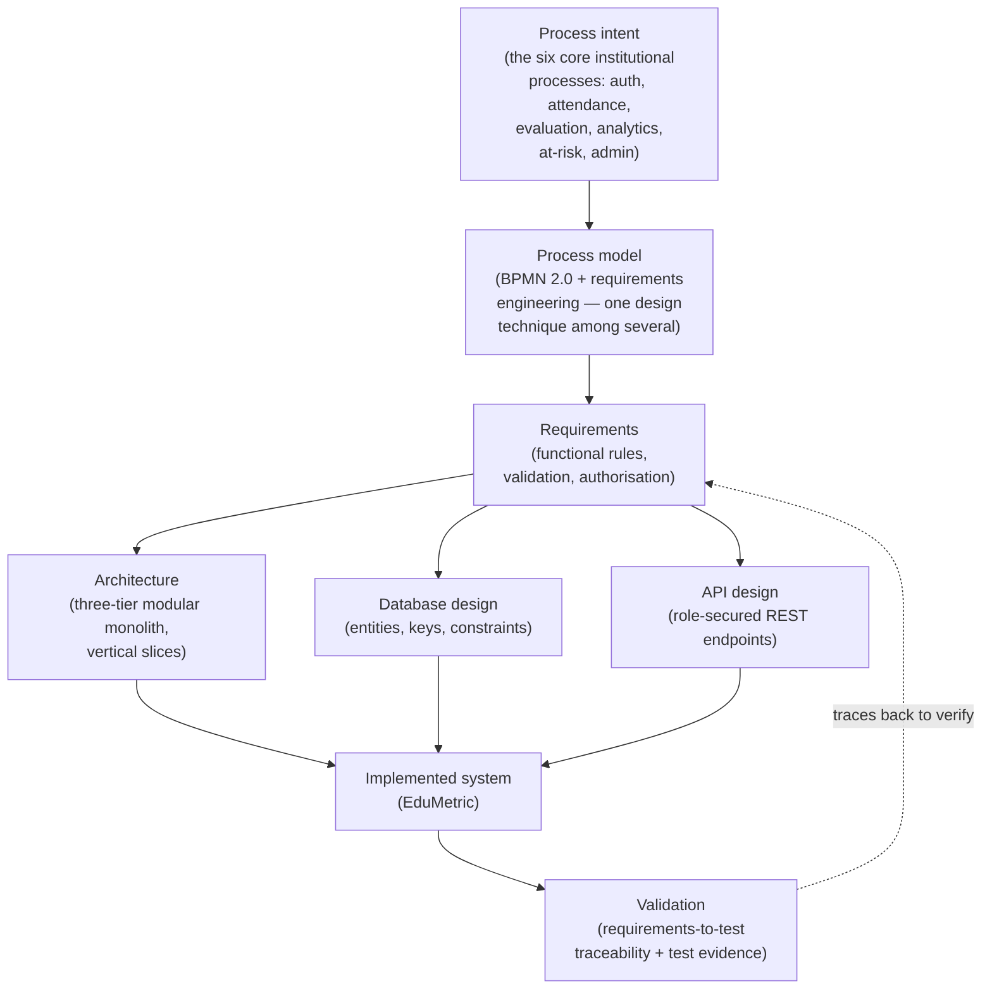
```mermaid
flowchart TD
    PI["Process intent<br/>(the six core institutional<br/>processes: auth, attendance,<br/>evaluation, analytics,<br/>at-risk, admin)"]
    PM["Process model<br/>(BPMN 2.0 + requirements<br/>engineering — one design<br/>technique among several)"]
    REQ["Requirements<br/>(functional rules,<br/>validation, authorisation)"]
    ARCH["Architecture<br/>(three-tier modular monolith,<br/>vertical slices)"]
    DB["Database design<br/>(entities, keys, constraints)"]
    API["API design<br/>(role-secured REST endpoints)"]
    IMPL["Implemented system<br/>(EduMetric)"]
    VAL["Validation<br/>(requirements-to-test<br/>traceability + test evidence)"]

    PI --> PM
    PM --> REQ
    REQ --> ARCH
    REQ --> DB
    REQ --> API
    ARCH --> IMPL
    DB --> IMPL
    API --> IMPL
    IMPL --> VAL
    VAL -. "traces back to verify" .-> REQ
```

**Figure 2.1 — Conceptual framework: from process intent to a validated student-analytics system.** *(Source: author, synthesised from the literature in §2.3.)*

## 2.7 Summary of the Literature Review

The literature converges on the rationale for this project. Theme 1 establishes that a single GPA
hides the growth and multi-dimensional variation educators need, motivating EduMetric's weighted
composite score. Themes 2 and 3 show that institutions already hold the data, and that continuous,
multi-factor monitoring can detect at-risk students early enough to help. Theme 4 supplies the
project's distinctive ethical position — that transparent, configurable scoring is preferable to
accurate-but-opaque prediction when decisions affect students. Theme 5 grounds the system's
engineering in established architecture, REST and requirements-and-process-modelling practice, with
BPMN as one design technique rather than the subject of study; and Theme 6 sets the security and
data-protection requirements for handling sensitive student records. The three theoretical frames of
§2.2 — design science as the overarching paradigm, with the Technology Acceptance Model and the IS
Success Model as evaluative lenses — provide the logic by which the built artefact is judged. The
identified gap is the absence of a single implemented system that is at once multi-dimensional,
transparent, proactive, secure and cheaply deployable, demonstrated with full traceability; the
conceptual framework of Figure 2.1 specifies the structure that Chapters 3 and 4 use to fill it.

# Chapter 3 — Project Planning and Methodology

*Addresses **LO2 — P3, P4 | M2 | D2***

## 3.1 Research Philosophy and Approach

This project adopts a **pragmatist** research philosophy, the position within Saunders, Lewis and
Thornhill's (2019) "research onion" that judges knowledge claims by their usefulness in solving a
practical problem rather than by allegiance to a single epistemology. Pragmatism is appropriate here
because the central concern — whether a web-based, multi-dimensional analytics system can improve the
transparency, accuracy and accessibility of student evaluation — is answered most convincingly by
*designing, building and examining* such a system in working software, not by abstract argument alone.
The philosophy is operationalised through **design science** (Hevner *et al.*, 2004; Peffers *et al.*,
2007), in which a purposeful **artefact** — the EduMetric system together with its design models,
data schema, REST API and test evidence — is both the means and the object of inquiry, and its
evaluation against the requirements it was built to satisfy constitutes the research finding.

Design science is well matched to a software-engineering capstone because it frames research as the
construction and rigorous assessment of an artefact that solves a relevant problem (Hevner *et al.*,
2004). Peffers *et al.* (2007) structure that activity into six iterative steps — problem
identification, objective definition, design and development, demonstration, evaluation, and
communication — and this dissertation maps onto them directly: the problem and objectives are
established in Chapter 1, the artefact is designed and developed in Chapter 4, it is demonstrated
through its implemented interface (Appendix J), evaluated in Chapter 5, and communicated through the
report as a whole. The reasoning is **abductive**: properties observed in the built system are
explained by, and traced back to, the requirements and design models that informed them, so that the
relationship between intent, design and implementation is made explicit rather than assumed.

## 3.2 Methodological Choice

The methodological choice is **qualitative and artefact-driven** — a design-and-build study rather
than a survey-heavy empirical investigation. Instead of collecting numerical data from a sample of
respondents, the project treats software artefacts — the requirements specification, the architecture
and process models, the database schema, the REST API definition and the functional and
user-acceptance test cases — as its primary evidence, and analyses them through structured
**requirements-to-test traceability** (§4.2). Crucially, **no data are collected from human
subjects**: the study involves no surveys, interviews, observation or usability counts, and the
academic data used to demonstrate the analytics are synthetic and anonymised (§3.7).

This choice is justified over a survey-heavy or experimental design on three grounds, and the trade-off
is accepted explicitly (Oates, 2006; Bell and Waters, 2018). First, the research questions concern
*what should be built and how well it works* — the functional modules, the data model, and the
system's effect on transparency, accuracy and access — which are best answered by inspecting and
testing the artefact directly rather than by sampling opinion. Second, a survey of user perception
would measure *attitudes* towards a system that does not yet widely exist, whereas the locked aim
demands a *demonstrated* working system and verifiable behaviour; design science treats the
artefact's tested performance as the evidence (Hevner *et al.*, 2004). Third, confining evaluation to
synthetic data and functional/UAT testing keeps the project low-risk ethically and within the time and
resources of a single researcher (§3.5, §3.7). The accepted cost — reduced statistical
generalisability in exchange for depth, internal validity and a fully traceable engineering record —
is revisited critically in §5.6. Within this artefact-driven frame, process modelling in **BPMN 2.0**
(Object Management Group, 2011) is used as one design technique among several — alongside C4
architecture diagrams, an entity-relationship diagram, UML sequence diagrams and an OpenAPI-style REST
specification — to capture the six core processes; it is a means of designing the system, not the
object of study.

## 3.3 Project Management Methodology

The project was managed using an **Agile, iterative** approach (Beck *et al.*, 2001) adapted for a
single-researcher software-engineering capstone. Rather than deferring all output to the end, work
proceeded in short cycles aligned to the six core processes and the chapter structure, each cycle
producing a reviewable increment — a requirement set, a design model, a working module, a populated
traceability table or a chapter draft. The Agile values of *working software*, *responding to change*
and *iterative delivery* (Beck *et al.*, 2001) fit this project because its artefacts are
interdependent: designing a process model frequently surfaced a refinement to the architecture or
schema, and implementing a module occasionally revealed a requirement that needed restating. An
iterative method absorbs that feedback without a heavyweight change process.

A strictly sequential waterfall plan was rejected as too brittle for a body of work in which
understanding deepens as the artefacts accumulate; committing the full design before any code was
written would have locked in early misjudgements. Equally, a ceremony-heavy framework such as full
Scrum offers little value to a team of one. The project therefore took a lightweight, milestone-gated
iteration: design and build proceeded in cycles, but iteration is bounded by the milestone structure
of §3.4 so that flexibility does not become drift — a tension assessed critically in §3.10.

## 3.4 Project Plan

The plan decomposes the work into six phases over 24 weeks, presented below as a work breakdown
structure (§3.4.1), a Gantt timeline (§3.4.2) and a milestone/critical-path table (§3.4.3). The full
artefacts are reproduced at full resolution in Appendix B.

### 3.4.1 Work Breakdown Structure (WBS)

The work breakdown structure decomposes the project into the six phases and their constituent tasks,
as shown in Figure 3.1.

> 🟦 **[DIAGRAM — Figure 3.1: Work Breakdown Structure]** Render the Mermaid below.

```mermaid
flowchart TD
    P["EduMetric Dissertation"]
    P --> A["1 Research Foundation"]
    P --> B["2 Methodology & Planning"]
    P --> C["3 Process & Design Modelling"]
    P --> D["4 Architecture & Development"]
    P --> E["5 Analysis & Writing"]
    P --> F["6 Review & Submission"]

    A --> A1["Proposal & approval"]
    A --> A2["Identify & review sources"]
    A --> A3["Draft Chapter 2"]

    B --> B1["Research philosophy & approach"]
    B --> B2["Write Chapter 3"]
    B --> B3["Risk register & Gantt"]
    B --> B4["Ethics documentation"]

    C --> C1["Model P1 Auth & P2 Attendance"]
    C --> C2["Model P3 Evaluation & P4 Analytics"]
    C --> C3["Model P5 At-Risk & P6 Admin"]

    D --> D1["C4 + module diagrams"]
    D --> D2["ERD & schema"]
    D --> D3["API endpoint mapping"]
    D --> D4["Traceability matrix (6 processes)"]

    E --> E1["Write Chapters 4 & 5"]
    E --> E2["Write Chapters 6 & 7"]
    E --> E3["Complete Chapter 1"]

    F --> F1["Supervisor review"]
    F --> F2["Revision & proofreading"]
    F --> F3["Appendices A–K"]
```

**Figure 3.1 — Work Breakdown Structure.** *(Source: author.)*

### 3.4.2 Gantt Chart and Timeline

The 24-week schedule is shown in Figure 3.2, mirroring the project's planning workbook. Weeks are
mapped to a notional calendar beginning Week 1; the same data is reproduced at full resolution in
Appendix B. The middle phases — modelling the six processes (Phase 3) and translating them into the
architecture, schema, API and working code (Phase 4) — carry the bulk of the design-and-build effort.

> 🟦 **[CHART — Figure 3.2: Project Gantt chart (24 weeks, 6 phases)]** Render the Mermaid below;
> export to `_assets/figure-3-2.png` for the .docx. Mirrors `EduMetric_Dissertation_Artefacts.xlsx`.

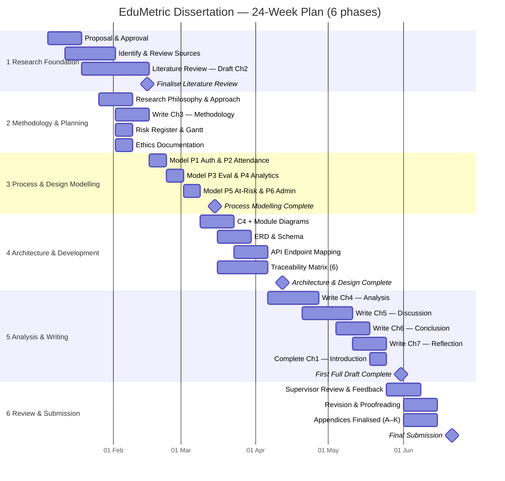
```mermaid
gantt
    title EduMetric Dissertation — 24-Week Plan (6 phases)
    dateFormat YYYY-MM-DD
    axisFormat %d %b
    section 1 Research Foundation
    Proposal & Approval            :p1a, 2026-01-05, 2w
    Identify & Review Sources      :p1b, 2026-01-12, 3w
    Literature Review — Draft Ch2  :p1c, 2026-01-19, 4w
    Finalise Literature Review     :milestone, m1, 2026-02-15, 0d
    section 2 Methodology & Planning
    Research Philosophy & Approach :p2a, 2026-01-26, 2w
    Write Ch3 — Methodology        :p2b, 2026-02-02, 2w
    Risk Register & Gantt          :p2c, 2026-02-02, 1w
    Ethics Documentation           :p2d, 2026-02-02, 1w
    section 3 Process & Design Modelling
    Model P1 Auth & P2 Attendance  :p3a, 2026-02-16, 1w
    Model P3 Eval & P4 Analytics   :p3b, 2026-02-23, 1w
    Model P5 At-Risk & P6 Admin    :p3c, 2026-03-02, 1w
    Process Modelling Complete     :milestone, m2, 2026-03-15, 0d
    section 4 Architecture & Development
    C4 + Module Diagrams           :p4a, 2026-03-09, 2w
    ERD & Schema                   :p4b, 2026-03-16, 2w
    API Endpoint Mapping           :p4c, 2026-03-23, 2w
    Traceability Matrix (6)        :p4d, 2026-03-16, 3w
    Architecture & Design Complete :milestone, m3, 2026-04-12, 0d
    section 5 Analysis & Writing
    Write Ch4 — Analysis           :p5a, 2026-04-06, 3w
    Write Ch5 — Discussion         :p5b, 2026-04-20, 3w
    Write Ch6 — Conclusion         :p5c, 2026-05-04, 2w
    Write Ch7 — Reflection         :p5d, 2026-05-11, 2w
    Complete Ch1 — Introduction    :p5e, 2026-05-18, 1w
    First Full Draft Complete      :milestone, m4, 2026-05-31, 0d
    section 6 Review & Submission
    Supervisor Review & Feedback   :p6a, 2026-05-25, 2w
    Revision & Proofreading        :p6b, 2026-06-01, 2w
    Appendices Finalised (A–K)     :p6c, 2026-06-01, 2w
    Final Submission               :milestone, m5, 2026-06-21, 0d
```

**Figure 3.2 — Project Gantt chart (24 weeks, 6 phases).** *(Source: author, mirroring the project planning workbook.)*

### 3.4.3 Milestones and Critical Path

Six milestones gate the project; the critical path runs through the design-and-build phases (3 and 4),
since Chapter 4 cannot be completed until the process models, architecture, schema, API and
traceability matrix are in place. Table 3.1 lists the milestones.

**Table 3.1 — Milestones and critical path.** *(Source: author, derived from the Gantt workbook.)*

| Milestone | Target week | On critical path? |
|---|---|---|
| M0 — Project proposal approved | W2 | Yes |
| M1 — Literature review finalised | W6 | No (parallel to planning) |
| M2 — Process modelling complete | W10 | **Yes** |
| M3 — Architecture & design complete | W14 | **Yes** |
| M4 — First full draft complete | W21 | Yes |
| M5 — Final submission | W24 | Yes |

## 3.5 Resource Planning

The project is resourced by a single researcher using freely available or institution-provided tools,
keeping cost negligible and removing procurement as a schedule risk. Table 3.2 summarises the plan.

**Table 3.2 — Resource plan.** *(Source: author.)*

| Resource | Provision | Used for |
|---|---|---|
| Researcher time | ~12–15 hrs/week across 24 weeks | All phases |
| Supervisor | Scheduled review meetings (Appendix H) | Feedback at milestones M1, M2, M4 |
| Process-modelling tool | bpmn.io / draw.io (free) | The six BPMN process models |
| Diagramming | Mermaid (in-repo, free) | C4, ERD, sequence, WBS, Gantt |
| Development environment | Java 21+ / Spring Boot, Next.js/React/TypeScript, PostgreSQL | Building and testing the EduMetric prototype |
| Reference management | Zotero + Harvard style (free) | Citations, reference list |
| Writing & assembly | Markdown → Word (template) | Dissertation production |

## 3.6 Risk Register

Ten risks were identified, assessed on a 1–5 probability/impact scale (risk score = P × I) and
assigned mitigation and contingency strategies. The register is reproduced from the project workbook as
Table 3.3 and at full resolution in Appendix C; its probability/impact distribution is visualised in
Figure 3.3.

**Table 3.3 — Risk register (R01–R10).** *(Source: author's project workbook; owner = Researcher; status = Open at time of writing.)*

| ID | Risk | Cat. | P | I | Score | Severity | Mitigation | Contingency |
|---|---|---|---|---|---|---|---|---|
| R01 | Limited literature directly comparable to a transparent, multi-dimensional composite-score model | Academic | 2 | 3 | 6 | Medium | Supplement with broader learning-analytics, architecture and requirements literature; triangulate across themes | Expand search to IEEE Xplore and ACM Digital Library; cite adjacent transparency/early-warning work |
| R02 | Scope creep — the feature set expands beyond the core six modules / MVP | Scope | 3 | 4 | 12 | High | Lock the MVP to the six core processes in the master document; review every increment against the locked scope | Defer non-core modules to a "future work" backlog (§6.4); re-anchor to the six processes |
| R03 | Divergence between the design artefacts (architecture, ERD, process models) and the implemented code | Technical | 3 | 5 | 15 | Critical | Maintain a version-controlled requirements-to-test traceability matrix; map every activity to module, entity, endpoint and test | Re-derive the affected artefact from the design models and re-run the traceability check |
| R04 | Schedule delay from running academic writing and software development in parallel | Schedule | 3 | 4 | 12 | High | Milestone-based Gantt with buffer weeks; weekly progress review against the plan | Deprioritise lower-impact appendix content; protect Chapters 4–5 first |
| R05 | The composite-score formula behaves incorrectly on edge cases / small samples, eroding trust | Technical | 2 | 3 | 6 | Medium | Keep the metrics engine pure and 100% unit-testable; cover edge cases (empty data, single sample) with test cases | Add guard clauses and confidence flags; document known limits of the formula |
| R06 | EduMetric implementation incomplete at submission | Technical | 2 | 4 | 8 | Medium | Prioritise the six core modules; treat extension features as optional; partial implementation acceptable for evaluation | Clearly document the scope of completed implementation; evaluate what is built |
| R07 | Traceability links break when the architecture or database schema changes | Technical | 2 | 4 | 8 | Medium | Version-control the traceability matrix alongside the dissertation; propagate schema changes in a single pass | Flag affected chapters and update all references together |
| R08 | Academic sources unavailable through the university library | Academic | 2 | 3 | 6 | Medium | Use Google Scholar, ResearchGate and author pre-prints; cite DOI links | Use an alternative edition or closest available source |
| R09 | Reflective chapter lacks genuine critical depth (Ch 7) | Academic | 2 | 3 | 6 | Medium | Use Gibbs' Reflective Cycle with specific project examples; avoid generic statements | Add concrete examples from design modelling and implementation |
| R10 | Artefact inconsistency across chapters (module names, endpoint paths, terminology) | Quality | 3 | 4 | 12 | High | Lock terminology in the master document; enforce consistent module, entity and endpoint names | Full terminology and endpoint-path review pass before final submission |

> 🟦 **[CHART — Figure 3.3: Risk heat-map (Probability × Impact)]** Render as the grid below; export to
> `_assets/figure-3-3.png` for the .docx. Cells hold the risk IDs at each (P, I) coordinate.

| Impact ↓ \ Prob → | P1 | P2 | P3 | P4 | P5 |
|---|---|---|---|---|---|
| **I5** | | | **R03** | | |
| **I4** | | R06, R07 | R02, R04, R10 | | |
| **I3** | | R01, R05, R08, R09 | | | |
| **I2** | | | | | |
| **I1** | | | | | |

**Figure 3.3 — Risk heat-map (Probability × Impact, R01–R10).** *(Source: author, derived from Table 3.3.)*

The distribution shows the dominant exposure is **consistency between the design and the code**: the
single critical risk is design↔code divergence (R03), and the high-severity cluster — scope creep
(R02), parallel-track schedule pressure (R04) and cross-chapter artefact inconsistency (R10) — all
threaten the integrity of the engineering record. This is precisely why the project's central control
is a maintained, version-controlled requirements-to-test traceability matrix rather than any single
diagram: the matrix ties the design models to the implemented modules, entities, endpoints and tests,
so divergence is detected early and corrected in one pass.

## 3.7 Ethical Considerations

The project is **low-risk** with respect to research ethics. It collects **no data from human
participants**: its evidence is software artefacts and the system's own synthetic / anonymised academic
records. Because there are no participants, the usual safeguards of informed consent and the **right to
withdraw are not applicable** — there is no one to withdraw, and no personal data to be processed. The
academic data used to demonstrate the analytics (Appendix F) contain no real names or identifiers;
learners are represented by opaque codes, consistent with the data-minimisation principle and aligned
with the General Data Protection Regulation's requirements for the lawful, fair and minimal handling of
personal data (European Parliament and Council, 2016). No special-category data are processed.

Where the system would, in production, hold real student records, the design itself embeds the relevant
protections — role-based access control, audit logging and configurable retention — but these are
described as **design properties of the artefact**, not as live data-collection activities of the
research. The institutional ethics declaration and a low-risk self-assessment are provided in
Appendix D. ⟨STUDENT INPUT: ethics-form signature and date⟩.

## 3.8 Project Tracking and Documentation

Progress was tracked against the milestone structure of §3.4 using a lightweight task board and a
dated logbook, with the project's source artefacts version-controlled in the EduMetric repository so
that any change to the architecture or schema could be propagated to the traceability matrix in a
single pass (mitigating R03 and R07). A screenshot of the tracking tool is provided as Figure 3.4, and
the full logbook and supervisor-meeting records are given in Appendices G and H respectively.

> 📸 **[SCREENSHOT — Figure 3.4]**
> **Capture from:** the project-tracking tool used (e.g. the task board / project view)
> **Must show:** the six phases, task status, and milestone markers (M0–M5)
> **Save to:** `_assets/figure-3-4.png`
> **Caption:** *Figure 3.4 — Project-tracking tool, showing phase and milestone status*

## 3.9 Implementation of the Plan

The plan was executed broadly as scheduled, with the design-and-build phases (3 and 4) consuming the
greatest effort and the writing phase absorbing the minor slippage that the buffer weeks were reserved
for. Following the iterative method of §3.3, the six core processes were first modelled and then built
out incrementally into the running system: authentication and attendance, then the evaluation
(metrics-engine) and analytics modules, then at-risk detection and admin monitoring. Each increment was
checked against the requirements-to-test traceability matrix before the next was started, which kept
the implemented code aligned with the design models and held the critical design↔code divergence risk
(R03) in check.

During the implementation stage, the prototype of EduMetric was developed with its key screens,
including login, the student growth dashboard, teacher attendance and grading, admin formula
configuration, analytics and at-risk monitoring pages. The implementation evidence — the working
EduMetric interface that realises the modelled processes — is documented in Appendix J. Screenshots of
the implemented user interface are provided in Appendix J.

## 3.10 Critical Assessment of Project Management

*(D2)* Judged critically, the project-management approach was effective in the dimensions that mattered
most and weaker in one. Its principal strength was **risk-led control**: by identifying design↔code
divergence (R03) as the critical risk at the outset and adopting a version-controlled
requirements-to-test traceability matrix as the standing mitigation, the project converted its greatest
threat into its central method — an alignment of risk management and methodology that paid off directly
in the design-and-build work of Chapter 4. The milestone-gated iterative approach (§3.3) also handled
the inherent interdependence of the artefacts well, allowing refinements discovered during modelling
and coding to flow back into the architecture and schema without derailing the schedule, while the
locked MVP scope kept feature growth (R02) contained to the six core modules.

The principal weakness was the **optimism of the parallel-track schedule** (R04): running literature
and academic writing alongside the build assumed an even effort distribution that the artefact- and
code-intensive middle phases did not respect, and only the deliberately reserved buffer weeks kept the
first-draft milestone (M4) intact. A more defensive plan would have front-loaded a larger buffer before
Phase 4 and split the development work into finer increments to smooth the load. On balance, the
methodology was fit for a single-researcher design-science capstone: it was disciplined enough to
guarantee traceability between intent, design and code, yet flexible enough to absorb the iterative
nature of artefact construction, and its few shortcomings were contained rather than realised.

# Chapter 4 — System Analysis, Design and Implementation

*Addresses **LO3 — P5, M3, M4***

## 4.1 Method

This chapter specifies, designs and implements EduMetric, the web-based multi-dimensional student
performance analytics system that is the subject of this project. Following the design-science frame
adopted in Chapter 3 (Hevner *et al.*, 2004; Peffers *et al.*, 2007), the "data" analysed here are
not the opinions of human participants but the **engineering artefacts** that constitute the system:
its requirements, its architecture, its data model, its process models and its role-secured REST API,
together with the evidence that each requirement was realised in working, tested code. No surveys or
interviews were conducted; the system itself, and the chain that links a requirement to the code that
satisfies it, are the units of analysis. The analytical pathway applied consistently to each of the
six core processes is **requirement → design decision → architecture module → database entity → API
endpoint → validation evidence**, operationalised through the traceability matrices introduced in
§4.2 and evidenced in Appendix K.

### 4.1.1 Primary Artefacts

The primary artefacts are the built system and the design models that specify it. They comprise: the
working full-stack prototype itself — a Next.js/React/TypeScript frontend, a Java Spring Boot backend
and a PostgreSQL database; a set of **C4 architecture diagrams** describing the system at four levels
of abstraction; an **entity-relationship diagram (ERD)** for the relational schema, owned by Liquibase
changelogs (`backend/src/main/resources/db/changelog/`); **six process models (drawn in BPMN 2.0**;
OMG, 2011) describing the core workflows, prepared for export in bpmn.io and approximated as Mermaid
flowcharts in this chapter; **UML sequence diagrams** for the most important interactions; and the
**REST API specification**, grouped by bounded context. These were derived from the problem domain set
out in §1.2, the EduMetric product master document, and the implemented codebase, and were verified
against the shipped source so that what is reported matches what was built.

### 4.1.2 Secondary Sources

Secondary inputs are the supporting documentation against which the design was checked: the backend
`ARCHITECTURE.md` (architectural rules, layering, the metrics engine and the API conventions), the
Liquibase changelog (the authoritative source of the schema), and the literature reviewed in Chapter 2,
which supplied the design criteria — Bass, Clements and Kazman (2012) and Richards and Ford (2020) for
architecture, Connolly and Begg (2015) for database design, Richardson and Amundsen (2013) for REST,
and Sandhu *et al.* (1996) for access control. Comparison of the delivered system against these
expectations is carried forward to Chapter 5.

### 4.1.3 Rationale for the Six Core Processes (P5)

Six processes were selected for detailed modelling and traceability: **User Authentication, Attendance
Management, Student Evaluation, Student Analytics Generation, At-Risk Student Detection and Admin
Monitoring.** The selection rationale is that these six span the full range of software-engineering
contexts present in the system — a security boundary (P1), a high-frequency transactional write with a
synchronous side-effect (P2), a multi-input validation-and-scoring workflow (P3), a read-side
analytical composition (P4), an exception-driven analytical workflow (P5) and a governance/configuration
workflow (P6). Together they exercise authentication, transactional processing, analytical processing
and administrative governance, providing sufficient breadth to specify and verify the system without
modelling every one of the 48 packages, many of which are variations on these archetypes. The processes
also map directly onto the core modules named in objective 4 (§1.4): authentication, attendance,
evaluation (the metrics engine), student analytics, at-risk detection and admin monitoring.

## 4.2 Analytical Techniques (M3)

The principal technique is **requirements traceability**: each functional requirement is followed
forward through its design decision into a named architecture module, a database entity or field, an
API endpoint and a test case, using a structured matrix whose column order is fixed as **requirement →
architecture module → database entity/field → API endpoint → test evidence** (Wiegers and Beatty,
2013; Pohl, 2010). This is paired with **functional verification**: the traceability links were
checked against the shipped code rather than against early design notes, and the *implemented* value is
the one reported. Where an early endpoint name had since changed — for example, the dashboard endpoint
moved from a notional `/api/dashboard/student/{id}` to the implemented `GET /api/students/{id}/dashboard`,
and bulk attendance from a notional `POST /api/attendance` to the implemented `POST /api/attendance/bulk`
— the reconciliation is treated as evidence that traceability functioned as intended, surfacing
design–code drift so it could be corrected (risks R03, R07, R10). The process models, the C4 diagrams,
the ERD and the UML sequences are the design notations that feed this matrix; the BPMN 2.0 notation was
chosen specifically to model the six core workflows because it makes gateways and exception paths
explicit, which is where requirements are most often lost. The structured instruments used — the
modelling checklist, the traceability-matrix template and the test-case template — are provided in
Appendix E.

## 4.3 Findings

### 4.3.1 Requirements and Artefact Inventory

The system's functional requirements follow directly from the problems set out in §1.2: a transparent
multi-dimensional composite score in place of a single GPA (FR1); attendance capture with an immediate
effect on the score (FR2); recording of grades, behaviour and activity (FR3); per-student analytics —
composite, dimension breakdown, growth trend (FR4); configurable at-risk detection (FR5); and
role-secured administration and formula configuration (FR6). The non-functional requirements are
transparency and auditability of scoring (NFR1), role-based confidentiality of student data (NFR2),
responsiveness of analytical reads (NFR3) and maintainability through a modular structure (NFR4). These
requirements are realised across the implemented population profiled below: EduMetric is a modular
monolith of **48 vertical-slice packages**, **60 `@Entity` classes** and **52 `@RestController`
classes** (verified by inspection of the backend source). The system's structure is summarised in Table
4.0 and visualised at four levels of abstraction in Figures 4.1–4.4; its data model is given as the
entity-relationship diagram in Figure 4.5.

**Table 4.0 — Artefact inventory of EduMetric CRM.** *(Source: author, from `backend/` source inspection.)*

| Artefact class | Count | Evidence |
|---|---|---|
| Architecture packages (bounded contexts) | 48 | `com.edumetric.backend.*` |
| `@Entity` classes (DB-backed) | 60 | `grep @Entity` |
| `@RestController` classes | 52 | `grep @RestController` |
| Liquibase changelog domains | 4 (`v1-core`, `v2-domain`, `v3-metrics`, `v4-audit`) | `db/changelog/` |
| Composite-score dimensions | 7 (weights sum to 1.0) | `formula_config`, `ARCHITECTURE.md` §6 |

An anonymised extract of the analytics data used to validate the dimension scoring and at-risk logic is
provided in Appendix F.

### 4.3.2 System Architecture

EduMetric is structured as a **three-tier modular monolith**: a presentation tier (the Next.js client),
an application tier (the Spring Boot API, internally decomposed by bounded context) and a data tier
(PostgreSQL, with Redis as a read-through analytics cache and MinIO for files). This architectural
style was a deliberate design decision rather than a default. The alternative — a microservices
deployment — was considered and rejected: for a single-institution system with a team of one,
fine-grained services would add network, deployment and data-consistency overhead disproportionate to
the benefit (Newman, 2015), whereas a well-modularised monolith retains clear internal boundaries while
remaining simple to deploy and reason about (Richards and Ford, 2020; Fowler, 2002). The requirement
that drove the choice is maintainability (NFR4) under solo development; the design decision was a
modular monolith partitioned by feature; the consequence is that each of the 48 packages is an
independently understandable bounded context with a controller–service–repository–entity layering
(Bass *et al.*, 2012). The system is presented at four levels in line with the C4 convention: system
context in Figure 4.1, containers in Figure 4.2, the component/module map in Figure 4.3 and deployment
in Figure 4.4.

> 🟦 **[DIAGRAM — Figure 4.1: C4 Level 1 — System context]** *(render `_diagrams/fig-4-1-c4-context.mmd`)*

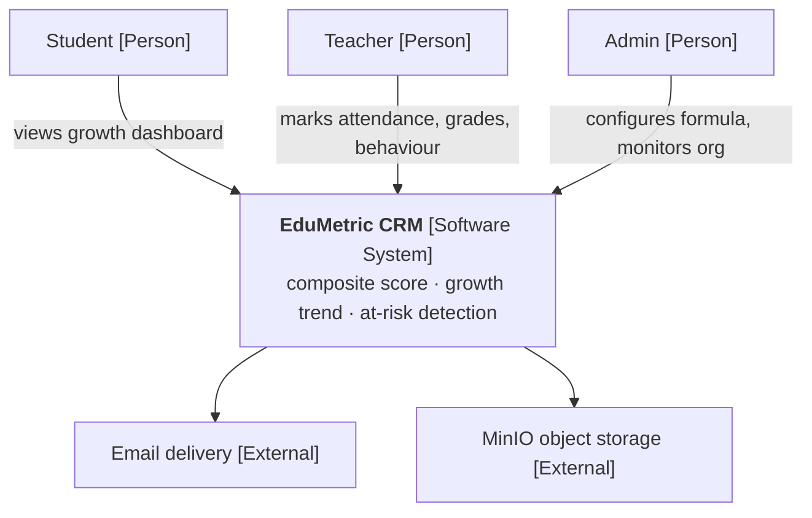
```mermaid
flowchart TB
    student["Student [Person]"]
    teacher["Teacher [Person]"]
    admin["Admin [Person]"]
    sys["<b>EduMetric CRM</b> [Software System]<br/>composite score · growth trend · at-risk detection"]
    mail["Email delivery [External]"]
    storage["MinIO object storage [External]"]
    student -->|views growth dashboard| sys
    teacher -->|marks attendance, grades, behaviour| sys
    admin -->|configures formula, monitors org| sys
    sys --> mail
    sys --> storage
```

**Figure 4.1 — C4 Level 1: System context.** *(Source: author, derived from `ARCHITECTURE.md` §2.)*

> 🟦 **[DIAGRAM — Figure 4.2: C4 Level 2 — Container diagram]** *(render `_diagrams/fig-4-2-c4-container.mmd`)*

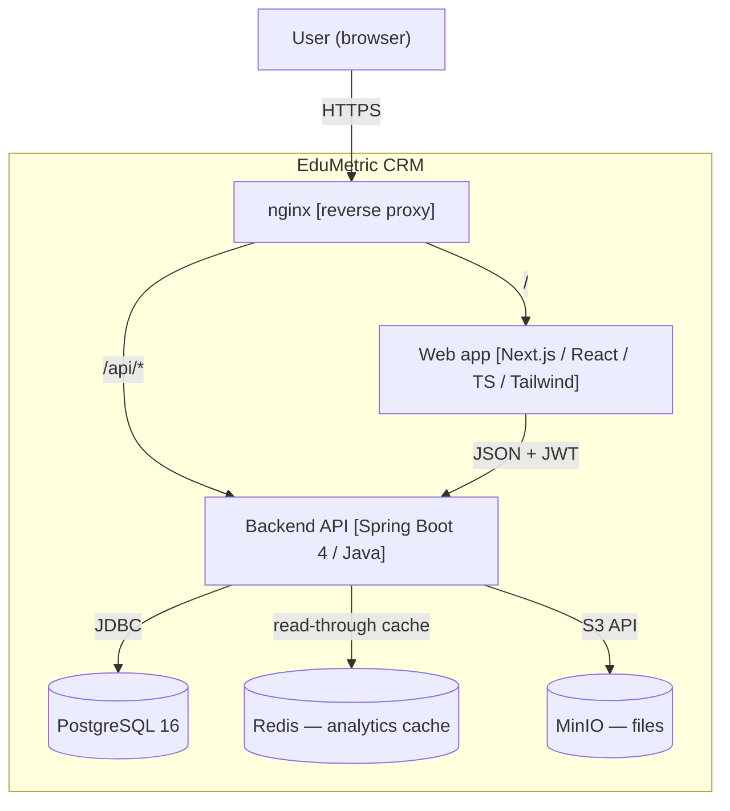
```mermaid
flowchart TB
    user["User (browser)"]
    subgraph edu["EduMetric CRM"]
        nginx["nginx [reverse proxy]"]
        web["Web app [Next.js / React / TS / Tailwind]"]
        api["Backend API [Spring Boot 4 / Java]"]
        db[("PostgreSQL 16")]
        redis[("Redis — analytics cache")]
        minio[("MinIO — files")]
    end
    user -->|HTTPS| nginx
    nginx -->|/| web
    nginx -->|/api/*| api
    web -->|JSON + JWT| api
    api -->|JDBC| db
    api -->|read-through cache| redis
    api -->|S3 API| minio
```

**Figure 4.2 — C4 Level 2: Container diagram.** *(Source: author, derived from `ARCHITECTURE.md` §2, §10.)*

> 🟦 **[DIAGRAM — Figure 4.3: Component / module map]** *(render `_diagrams/fig-4-3-component-map.mmd`; full source in `_diagrams/`)*

The component map groups the 48 packages into eight bounded contexts — Identity & Access, People &
Organisation, Academic Structure, Assessment & Records, Attendance, Analytics & Metrics, Communication
and Governance — with the data-flow spine running Assessment/Attendance → `metrics` → `analytics` →
`atrisk` → Communication.

**Figure 4.3 — Component / module map (bounded contexts).** *(Source: author.)*

> 🟦 **[DIAGRAM — Figure 4.4: Deployment diagram]** *(render `_diagrams/fig-4-4-deployment.mmd`)*

All runtimes — nginx, Next.js, Spring Boot, PostgreSQL, Redis and MinIO — run as containers from a
single `docker-compose.yml` on one VPS, with nginx routing `/` to Next.js and `/api/*` to Spring Boot.

**Figure 4.4 — Deployment diagram (single VPS / docker-compose).** *(Source: author, derived from `ARCHITECTURE.md` §2, §10.)*

### 4.3.3 Database Design

The relational schema realises the data requirements directly. It was designed following established
relational-modelling practice — normalisation to remove redundancy, foreign keys to enforce referential
integrity, and constraints to encode domain rules (Connolly and Begg, 2015; Teorey *et al.*, 2011) —
and is owned end-to-end by the Liquibase changelog, with Hibernate set to `ddl-auto: validate` so the
ORM never alters the schema. The core schema is shown clustered by sub-domain in Figure 4.5. Two design
decisions in the analytics layer are load-bearing and are explained here because they recur throughout
§4.3.4. First, a **denormalised `student_metrics` cache** holds one current row per student
(`UNIQUE (student_id)`) so that an analytical read need not recompute from raw tables, while a separate
**`metric_snapshots`** table holds the weekly history (`UNIQUE (student_id, snapshot_date)`) that feeds
the growth trend and growth bonus; separating the current read model from the immutable history keeps
fast reads independent of historical accumulation. Second, the integrity strategy is deliberately
split: mutable reference data (`users`, `students`, `teachers`, `groups`, `courses`) uses **soft-delete**
so that references and audit trails survive, whereas **immutable history** (`attendance`, `grades`,
`behavior_records`, `activity_records`) is **hard-deleted** when genuinely removed, because a soft-delete
flag on an append-only record adds no value and complicates the recompute query. `UNIQUE` constraints
on `(student_id, lesson_id)` and `(student_id, assignment_id)` prevent duplicate attendance and grades,
and `CHECK` constraints bound the enum-like and value-range columns.

> 🟦 **[DIAGRAM — Figure 4.5: ERD — core schema]** *(render `_diagrams/fig-4-5-erd.mmd`)*

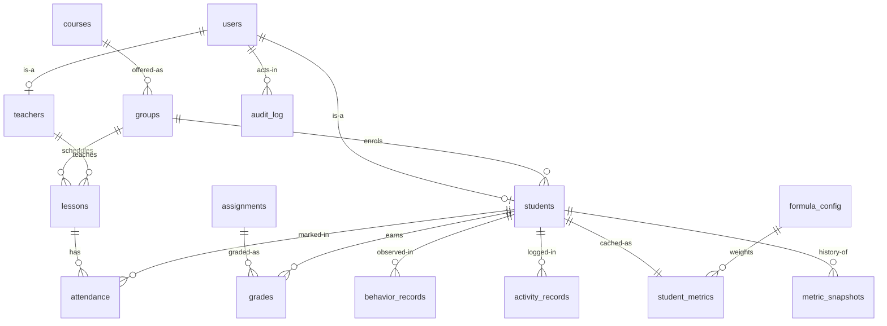
```mermaid
erDiagram
    users ||--o| students : "is-a"
    users ||--o| teachers : "is-a"
    courses ||--o{ groups : "offered-as"
    groups ||--o{ students : "enrols"
    groups ||--o{ lessons : "schedules"
    teachers ||--o{ lessons : "teaches"
    lessons ||--o{ attendance : "has"
    students ||--o{ attendance : "marked-in"
    assignments ||--o{ grades : "graded-as"
    students ||--o{ grades : "earns"
    students ||--o{ behavior_records : "observed-in"
    students ||--o{ activity_records : "logged-in"
    students ||--|| student_metrics : "cached-as"
    students ||--o{ metric_snapshots : "history-of"
    formula_config ||--o{ student_metrics : "weights"
    users ||--o{ audit_log : "acts-in"
```

**Figure 4.5 — Entity-Relationship Diagram (core schema, clustered by sub-domain).** *(Source: author, derived from the Liquibase changelog and `ARCHITECTURE.md` §7.)*

### 4.3.4 The Six Core Processes (P1–P6)

The six core workflows were modelled in BPMN 2.0 because the notation makes participants, gateways and
exception paths explicit, and each model is reported below with a short design narrative and its
traceability matrix. The decisive engineering decisions are stated as **requirement → design decision →
rationale** so the link between intent and code is auditable.

#### P1 — User Authentication

The User Authentication process models the login lifecycle from credential submission through JWT
issuance and role-based redirection, including failure handling and logout. It is foundational: every
other process depends on the authentication state established here, so its specification carries
disproportionate weight. Three design decisions follow from the requirement for a secure, role-aware
boundary. Separating the *user*, *authentication system* and *role-routing* responsibilities into
distinct lanes clarified that JWT issuance and role-based redirection are separate concerns, informing
the split between `AuthService` and a role-aware frontend router. The credential-validation gateway made
explicit that a failed login must return a **standardised** error — producing the rule that
`POST /api/auth/login` returns HTTP 401 with `AUTH_INVALID_CREDENTIALS` rather than a generic 500. And
the exception event for a deactivated account — routinely omitted from prose requirements — produced an
`is_active` check in the security layer. The login interaction is detailed as a sequence in Figure 4.12,
and the security boundary it establishes is shown in Figure 4.15.

> 🟦 **[BPMN DIAGRAM — Figure 4.6: User Authentication]**
> **Pools:** User (Student/Teacher/Admin) · System · **Happy path:** submit credentials → validate (load active user, BCrypt) → issue JWT + refresh token → resolve role → redirect → logout/revoke · **Gateways:** *credentials valid & account active?* · **Exceptions:** invalid/inactive → 401 · **Maps to:** `auth/`, `security/`, `config/SecurityConfig` — `users`, `refresh_tokens` — `POST /api/auth/login`, `GET /api/auth/me`, `POST /api/auth/logout`, `POST /api/auth/refresh` · **Draw in:** bpmn.io → `_assets/figure-4-6.png`

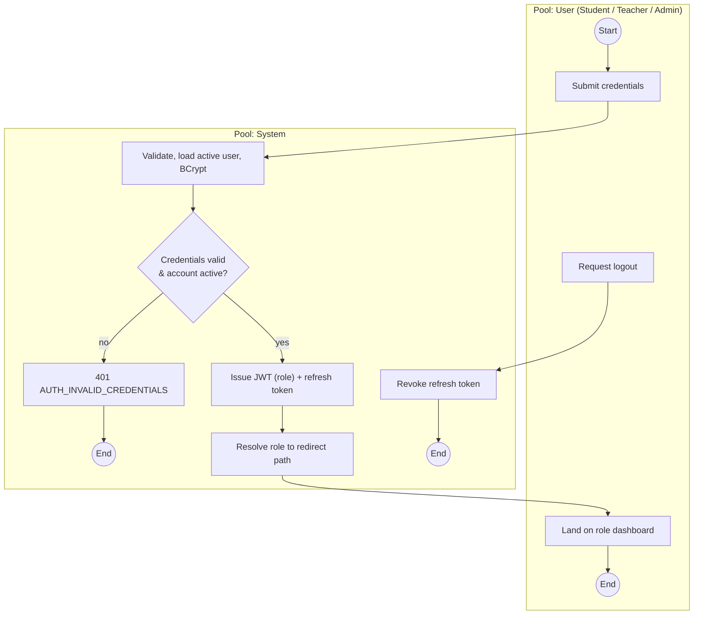
```mermaid
flowchart TB
    subgraph U["Pool: User (Student / Teacher / Admin)"]
        start((Start)) --> submit["Submit credentials"]
        redirect["Land on role dashboard"] --> done((End))
        logoutReq["Request logout"]
    end
    subgraph S["Pool: System"]
        submit --> validate["Validate, load active user, BCrypt"]
        validate --> gw1{Credentials valid<br/>& account active?}
        gw1 -->|no| err["401 AUTH_INVALID_CREDENTIALS"] --> end3((End))
        gw1 -->|yes| issue["Issue JWT (role) + refresh token"]
        issue --> route["Resolve role to redirect path"] --> redirect
        logoutReq --> revoke["Revoke refresh token"] --> end2((End))
    end
```

**Figure 4.6 — User Authentication (BPMN 2.0 approximation).** *(Source: author.)*

**Table 4.1 — Traceability matrix: User Authentication.** *(Source: author; endpoints verified against `auth/AuthController`. Test IDs map to Appendix K.)*

| BPMN activity | Functional requirement | Architecture module | Database entity/field | API endpoint | Test |
|---|---|---|---|---|---|
| Submit credentials | Accept email + password | `auth/` | `users (email, password_hash)` | `POST /api/auth/login` | TC-AUTH-01 |
| Validate credentials | Verify BCrypt hash; reject inactive | `auth/` → `security/` | `users (password_hash, active)` | `POST /api/auth/login` | TC-AUTH-02 |
| Issue JWT | Role-encoded HS256 token + refresh | `security/JwtTokenProvider` | `users (id, role)`, `refresh_tokens` | `POST /api/auth/login`, `/refresh` | TC-AUTH-03 |
| Redirect by role | Route to role-appropriate dashboard | `auth/` → frontend router | `users (role)` | `GET /api/auth/me` | TC-AUTH-04 |
| Failure handling | Standardised 401 on failed login | `auth/`, `GlobalExceptionHandler` | — (no write) | `POST /api/auth/login` | TC-AUTH-05 |
| Logout | Revoke refresh token; reject reuse | `auth/`, `RefreshTokenService` | `refresh_tokens` | `POST /api/auth/logout` | TC-AUTH-06 |

#### P2 — Attendance Management

Attendance Management is the system's highest-frequency transactional operation and one of the seven
composite-score dimensions, so its design influences both write performance and analytical consistency.
The decisive design decision was the **synchronous, in-transaction metrics recompute**. A textual
specification would likely describe attendance recording and metric updating as two unrelated
requirements, whereas modelling the process made the causal dependency explicit through a follow-on
task — driving the requirement that the dashboard reflect a new mark immediately (see Figure 4.13). The
rationale for keeping the recompute synchronous and inside the same request cycle (rather than queued)
is threefold: bulk attendance for roughly 24 students completes in about 200 ms in one transaction; the
live recompute is a visible demo feature (mark attendance, switch tab, the score has already changed);
and a single transaction guarantees one source of truth with no in-flight divergence between the write
and the cache. Two further consequences follow: the denormalised `student_metrics` cache separates
analytical reads from transactional writes, and the validation gateway surfaced a uniqueness rule absent
from the original scope — no duplicate attendance per student-and-lesson — realised as a
`UNIQUE (student_id, lesson_id)` constraint and a 409 response.

> 🟦 **[BPMN DIAGRAM — Figure 4.7: Attendance Management]**
> **Pools:** Teacher · System · **Happy path:** select own lesson → load students, default PRESENT → mark exceptions → save → upsert (unique) → synchronous recompute · **Gateways:** *own lesson?* · *valid status?* · *duplicate?* · **Exceptions:** 403 / 400 / 409 · **Maps to:** `attendance/`, `lessons/`, `metrics/` — `lessons`, `attendance` (UNIQUE), `student_metrics` — `GET /api/lessons`, `GET /api/lessons/{id}/attendance`, `POST /api/attendance/bulk` · **Draw in:** bpmn.io → `_assets/figure-4-7.png`

```mermaid
flowchart TB
    subgraph T["Pool: Teacher"]
        s((Start)) --> sel["Select lesson (own schedule)"]
        mark["Mark exceptions (absent/late)"] --> save["Save"]
    end
    subgraph S["Pool: System"]
        sel --> gwOwn{Lesson belongs to teacher?}
        gwOwn -->|no| f403["403 Forbidden"]
        gwOwn -->|yes| load["Load students, default PRESENT"] --> mark
        save --> gwStatus{Status valid?}
        gwStatus -->|no| f400["400"]
        gwStatus -->|yes| gwDup{Duplicate (student,lesson)?}
        gwDup -->|yes| f409["409 Conflict"]
        gwDup -->|no| persist["Upsert attendance"] --> recompute["Synchronous recompute (same tx)"] --> e((End))
    end
```

**Figure 4.7 — Attendance Management (BPMN 2.0 approximation).** *(Source: author.)*

**Table 4.2 — Traceability matrix: Attendance Management.** *(Source: author; verified against `attendance/AttendanceController`, `lessons/LessonController`.)*

| BPMN activity | Functional requirement | Architecture module | Database entity/field | API endpoint | Test |
|---|---|---|---|---|---|
| Select lesson | Teacher selects a lesson from own schedule | `attendance/` → `lessons/` | `lessons (id, teacher_id, scheduled_at)` | `GET /api/lessons` | TC-ATT-01 |
| Load student list | Retrieve enrolled students for the lesson | `attendance/` → `groups/` | `groups`, `students (group_id)` | `GET /api/lessons/{id}/attendance` | TC-ATT-02 |
| Mark exceptions | Mark each student PRESENT/ABSENT/LATE | `attendance/` | `attendance (status, marked_by_user_id)` | `POST /api/attendance/bulk` | TC-ATT-03 |
| Validate & save | Persist; prevent duplicate per lesson-student | `attendance/` → repository | `attendance` UNIQUE `(student_id, lesson_id)` | `POST /api/attendance/bulk` | TC-ATT-04 |
| Trigger recompute | Recompute attendance dimension after save | `attendance/` → `metrics/MetricsService` | `student_metrics (attendance_norm, computed_at)` | internal (synchronous, same tx) | TC-ATT-05 |

#### P3 — Student Evaluation

Student Evaluation records the assessed dimensions that, with attendance, form the composite score:
grades, behaviour, practical work and activity. Each dimension enters through a separate path but all
converge at a shared validation gateway before triggering composite recomputation. This convergence
justified a **single shared validation approach** in the evaluation slices rather than four separate
validators. The diversity of input shapes — grades carry a value and weight, behaviour a 1–5 score and
optional note, activity a type enum and score — supported the decision to use **separate tables**
(`grades`, `behavior_records`, `activity_records`) rather than one polymorphic table, preserving
targeted constraints. The central design decision, however, is the **transparent, configurable
composite formula**: each table feeds one dimension of `student_metrics`, the seven weights are stored
in `formula_config` rather than hardcoded, and they are required to sum to 1.0 (defaults
0.25 / 0.15 / 0.25 / 0.10 / 0.10 / 0.10 / 0.05 for grades / attendance / practical / behaviour /
activity / growth bonus / consistency bonus). The requirement was that decisions affecting a student's
standing must be explainable (NFR1; Slade and Prinsloo, 2013); the design decision was a stored,
weighted-sum formula computed by a pure `MetricsEngine` (no Spring, no JPA, fully unit-testable) and
orchestrated by a transactional `MetricsService`; the rationale is that a transparent weighted sum can
be audited and reconfigured by an administrator without code change, unlike an opaque predictive model.

> 🟦 **[BPMN DIAGRAM — Figure 4.8: Student Evaluation]**
> **Pools:** Teacher · System · **Happy path:** enter grade/behaviour/activity → validate → persist → load formula → recompute composite → upsert + audit · **Gateways:** *field-level validation?* · *FK satisfied?* · **Exceptions:** grade>100 → 400; behaviour∉1–5 → 400; unknown activity → 400; missing FK → 422 · **Maps to:** `grades/`, `behavior/`, `gradebook/`, `gradecategories/`, `rubrics/`, `metrics/` — `grades`, `behavior_records`, `activity_records`, `formula_config`, `student_metrics` — `POST /api/grades(/bulk)`, `POST /api/behavior`, `POST /api/activity` · **Draw in:** bpmn.io → `_assets/figure-4-8.png`

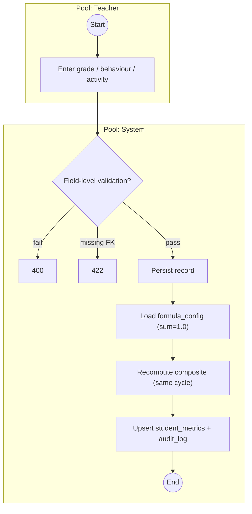
```mermaid
flowchart TB
    subgraph T["Pool: Teacher"]
        s((Start)) --> input["Enter grade / behaviour / activity"]
    end
    subgraph S["Pool: System"]
        input --> gwVal{Field-level validation?}
        gwVal -->|fail| f400["400"]
        gwVal -->|missing FK| f422["422"]
        gwVal -->|pass| persist["Persist record"]
        persist --> weights["Load formula_config (sum=1.0)"]
        weights --> recompute["Recompute composite (same cycle)"]
        recompute --> cache["Upsert student_metrics + audit_log"] --> e((End))
    end
```

**Figure 4.8 — Student Evaluation (BPMN 2.0 approximation).** *(Source: author.)*

**Table 4.3 — Traceability matrix: Student Evaluation.** *(Source: author; verified against `grades/GradeController`, `behavior/BehaviorController`, `metrics/MetricsController`.)*

| BPMN activity | Functional requirement | Architecture module | Database entity/field | API endpoint | Test |
|---|---|---|---|---|---|
| Submit grade | Record numeric grade with weight | `grades/` | `grades (value, assignment_id)` | `POST /api/grades`, `/bulk` | TC-EVAL-01 |
| Submit behaviour | Record behaviour score (1–5) + note | `behavior/` | `behavior_records (value, comment)` | `POST /api/behavior` | TC-EVAL-02 |
| Record activity | Log activity type and score | `behavior/` | `activity_records (type, value)` | `POST /api/activity` | TC-EVAL-03 |
| Validate all inputs | Field-level validation before persist | `common/` `@Valid` + service | `grades`, `behavior_records`, `activity_records` | the three POSTs | TC-EVAL-04 |
| Trigger composite recompute | Recompute composite via formula weights | `metrics/MetricsEngine` + `MetricsService` | `student_metrics (composite_score)`, `formula_config` | internal (synchronous) | TC-EVAL-05 |

#### P4 — Student Analytics Generation

This read-side process transforms stored operational data into analytical outputs — composite score,
six-dimension radar, growth trend and at-risk status. The process model made visible the classic
analytics tension between query freshness and response performance: the dashboard must present
composite, all dimension scores, a radar and a trend simultaneously, which would be unacceptably slow if
derived from raw tables on every request. This justified **two distinct structures** — `student_metrics`
as a denormalised single-row cache for fast current reads, and `metric_snapshots` for historical trend
— and a **single composed endpoint**, `GET /api/students/{id}/dashboard`. The requirement was
responsive analytical reads (NFR3); the design decision was the "one screen, one endpoint" rule that
aggregates current metrics, trend, dimension breakdown and risk flag in a single call, with a
short-TTL Redis cache fronting cross-student dashboards; the rationale is that a chatty four-request
frontend would multiply latency and complicate the client, whereas a server-composed payload keeps the
read model fast and the contract simple (Fielding, 2000; Richardson and Amundsen, 2013). The composition
is detailed as a sequence in Figure 4.14.

> 🟦 **[BPMN DIAGRAM — Figure 4.9: Student Analytics Generation]**
> **Pools:** Viewer · System · **Happy path:** open dashboard → check access → read `student_metrics` → fetch snapshots → build radar → compose payload → render · **Gateways:** *access rights?* · *metrics stale?* · **Exceptions:** 403; lazy recompute if stale · **Maps to:** `students/StudentDashboardService`, `analytics/`, `metrics/` — `student_metrics`, `metric_snapshots` — `GET /api/students/{id}/dashboard`, `/metrics`, `/metrics/trend` · **Draw in:** bpmn.io → `_assets/figure-4-9.png`

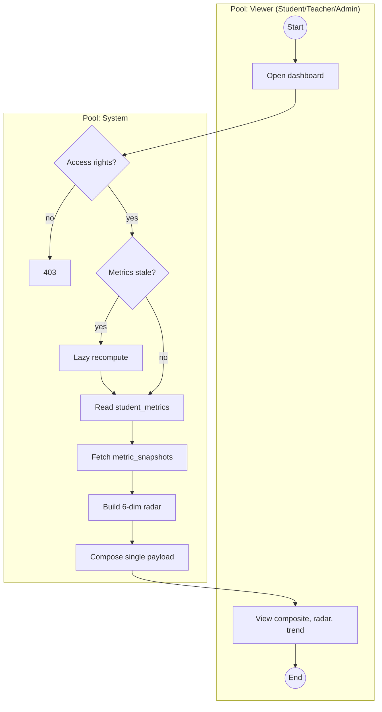
```mermaid
flowchart TB
    subgraph V["Pool: Viewer (Student/Teacher/Admin)"]
        s((Start)) --> open["Open dashboard"]
        render["View composite, radar, trend"] --> e((End))
    end
    subgraph S["Pool: System"]
        open --> gwAcc{Access rights?}
        gwAcc -->|no| f403["403"]
        gwAcc -->|yes| gwStale{Metrics stale?}
        gwStale -->|yes| lazy["Lazy recompute"] --> readM
        gwStale -->|no| readM["Read student_metrics"]
        readM --> trend["Fetch metric_snapshots"] --> radar["Build 6-dim radar"] --> compose["Compose single payload"] --> render
    end
```

**Figure 4.9 — Student Analytics Generation (BPMN 2.0 approximation).** *(Source: author.)*

**Table 4.4 — Traceability matrix: Student Analytics Generation.** *(Source: author; verified against `students/StudentController`, `metrics/MetricsController`.)*

| BPMN activity | Functional requirement | Architecture module | Database entity/field | API endpoint | Test |
|---|---|---|---|---|---|
| Retrieve cached metrics | Read current dimension scores | `metrics/` | `student_metrics (all *_norm, composite_score)` | `GET /api/students/{id}/metrics` | TC-ANA-01 |
| Retrieve growth snapshots | Return snapshots ordered by date | `analytics/`, `metrics/` | `metric_snapshots (snapshot_date, composite_score)` | `GET /api/students/{id}/metrics/trend` | TC-ANA-02 |
| Generate radar profile | Compute 6-dimension radar data | `students/StudentDashboardService` | `student_metrics (6 dimension norms)` | composed in dashboard payload | TC-ANA-03 |
| Compose dashboard payload | Aggregate composite + radar + trend + risk | `students/StudentDashboardService` | `student_metrics` + `metric_snapshots` + risk flag | `GET /api/students/{id}/dashboard` | TC-ANA-04 |

#### P5 — At-Risk Student Detection

This exception-driven analytical workflow identifies students whose trajectory meets configurable risk
criteria and surfaces alerts. It involves two independent evaluation paths — threshold comparison of
the current composite against a configurable threshold, and trend analysis of `metric_snapshots` for a
sustained decline — represented as separate gateways converging at a severity-classification task. The
most consequential design decision was **configurability**: the model made explicit that the threshold
is an *input* to the process, not a hardcoded rule, producing the `at_risk_rules` configuration
(managed via `/api/at-risk-rules`) and the institution-level threshold in `institution_settings`, both
editable by an admin without code change. The requirement was early, trustworthy at-risk identification
(FR5; Arnold and Pistilli, 2012); the design decision was rule-driven detection over rules an
administrator can tune; the rationale is that hardcoding a threshold would freeze a policy decision into
code and erode trust, whereas a configuration table keeps the policy in the hands of the institution.
Flagged students surface through `notifications`, and the role-scoped list is served by
`GET /api/analytics/at-risk`.

> 🟦 **[BPMN DIAGRAM — Figure 4.10: At-Risk Student Detection]**
> **Pools:** System · Teacher/Admin · **Happy path:** trigger → threshold check → decline check → flag → classify severity → notify → view list → acknowledge · **Gateways:** *below threshold?* · *declining over N snapshots?* · *severity?* · **Exceptions:** decline-only flag; no-flag end · **Maps to:** `atrisk/`, `analytics/`, `notifications/`, `reminders/` — `at_risk_rules`, `notifications`, `metric_snapshots`, `student_metrics` — `GET /api/analytics/at-risk`, `GET/PATCH /api/at-risk-rules` · **Draw in:** bpmn.io → `_assets/figure-4-10.png`

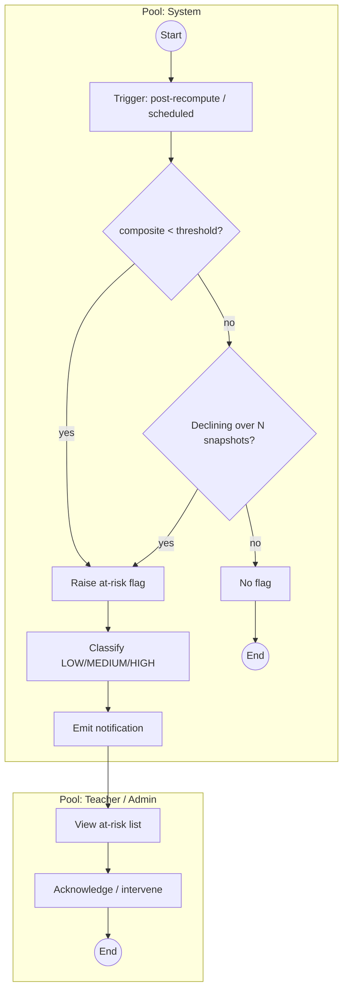
```mermaid
flowchart TB
    subgraph S["Pool: System"]
        s((Start)) --> trig["Trigger: post-recompute / scheduled"]
        trig --> gwThr{composite < threshold?}
        gwThr -->|yes| flag["Raise at-risk flag"]
        gwThr -->|no| gwTrend{Declining over N snapshots?}
        gwTrend -->|yes| flag
        gwTrend -->|no| ok["No flag"] --> e1((End))
        flag --> level["Classify LOW/MEDIUM/HIGH"] --> notify["Emit notification"]
    end
    subgraph TA["Pool: Teacher / Admin"]
        notify --> view["View at-risk list"] --> ack["Acknowledge / intervene"] --> e2((End))
    end
```

**Figure 4.10 — At-Risk Student Detection (BPMN 2.0 approximation).** *(Source: author.)*

**Table 4.5 — Traceability matrix: At-Risk Student Detection.** *(Source: author; verified against `atrisk/AtRiskRulesController`, `analytics/AnalyticsController`.)*

| BPMN activity | Functional requirement | Architecture module | Database entity/field | API endpoint | Test |
|---|---|---|---|---|---|
| Evaluate thresholds | Compare composite against configurable threshold | `atrisk/`, `analytics/` | `student_metrics (composite_score)`, `at_risk_rules`, `institution_settings (threshold)` | internal (post-recompute) | TC-RISK-01 |
| Detect growth decline | Identify sustained negative trend | `atrisk/` → risk rules | `metric_snapshots (composite_score, snapshot_date)` | internal (trend eval) | TC-RISK-02 |
| Classify risk level | Assign LOW/MEDIUM/HIGH | `atrisk/AtRiskRules` | `student_metrics`, `audit_log` | internal (classification) | TC-RISK-03 |
| Generate alert / notify | Create alert; surface to teacher | `notifications/`, `reminders/` | `notifications (acknowledged)` | served via dashboard / at-risk list | TC-RISK-04 |
| View at-risk list | Filterable list by role/group | `analytics/` | `students` + `student_metrics` + `notifications` | `GET /api/analytics/at-risk` | TC-RISK-05 |

#### P6 — Admin Monitoring

The Admin Monitoring process governs users, the scoring formula, teacher activity and system-wide
analytics, spanning both reads (dashboard, activity review) and writes (user management, formula
configuration). Its decisive sub-process is **configuration management**: changing formula weights must
first validate that they **sum to 1.0**, then trigger a **system-wide recompute**, then write an
**audit entry** — a cascade (config change → validate → bulk recompute → audit) not stated in the
original description. The requirement was governed, auditable configuration of the scoring policy (FR6,
NFR1); the design decision was to separate `formula_config` from `student_metrics`, validate the weight
sum at the boundary, run `recomputeAll()` (`POST /api/metrics/recompute-all`, paged 1000 students per
transaction) and write an `audit_log` record of old and new values on every admin write; the rationale
is that the formula is a slowly changing dimension whose every change must be reversible and explainable,
so it is stored apart from the cache it drives and never altered silently.

> 🟦 **[BPMN DIAGRAM — Figure 4.11: Admin Monitoring]**
> **Pools:** Admin · System · **Happy path:** open dashboard → aggregate KPIs → manage users/formula → validate → persist → cascade recompute → audit · **Gateways:** *role = ADMIN?* · *weights sum to 1.0?* · **Exceptions:** 403; 400; audit on every write · **Maps to:** `analytics/`, `organization/`, `settings/`, `audit/`, `users/`, `groups/`, `courses/` — `institution_settings`, `formula_config`, `audit_log`, `departments`, `academic_terms` — `GET /api/analytics/admin/dashboard`, `GET/PATCH /api/settings`, `PUT /api/metrics/formula`, `/api/users` CRUD · **Draw in:** bpmn.io → `_assets/figure-4-11.png`

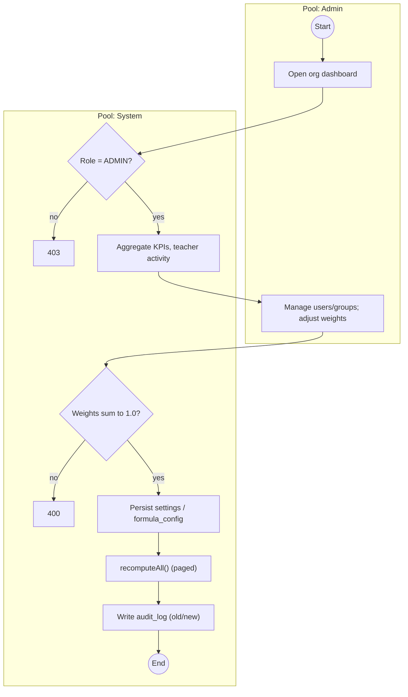
```mermaid
flowchart TB
    subgraph A["Pool: Admin"]
        s((Start)) --> dash["Open org dashboard"]
        manage["Manage users/groups; adjust weights"]
    end
    subgraph S["Pool: System"]
        dash --> gwRole{Role = ADMIN?}
        gwRole -->|no| f403["403"]
        gwRole -->|yes| kpis["Aggregate KPIs, teacher activity"] --> manage
        manage --> gwSum{Weights sum to 1.0?}
        gwSum -->|no| f400["400"]
        gwSum -->|yes| save["Persist settings / formula_config"]
        save --> cascade["recomputeAll() (paged)"] --> audit["Write audit_log (old/new)"] --> e((End))
    end
```

**Figure 4.11 — Admin Monitoring (BPMN 2.0 approximation).** *(Source: author.)*

**Table 4.6 — Traceability matrix: Admin Monitoring.** *(Source: author; verified against `analytics/AnalyticsController`, `settings/SettingsController`, `metrics/MetricsController`, `users/UserController`.)*

| BPMN activity | Functional requirement | Architecture module | Database entity/field | API endpoint | Test |
|---|---|---|---|---|---|
| Access system dashboard | Aggregated system-wide analytics | `analytics/` | `student_metrics` (aggregated), `groups`, `courses` | `GET /api/analytics/admin/dashboard` | TC-ADMIN-01 |
| Manage users | Create/update/suspend accounts | `users/` | `users (email, role)` | `/api/users` (`GET/POST/PATCH`, `/{id}/suspend`) | TC-ADMIN-02 |
| Configure scoring formula | Adjust weights; validate sum = 1.0; recompute | `metrics/`, `settings/` | `formula_config (weight_*)` | `PUT /api/metrics/formula` | TC-ADMIN-03 |
| Log admin actions | Audit entry on every admin write | `audit/AuditLogService` | `audit_log (actor, action, payload)` | internal (on every write) | TC-ADMIN-04 |
| Review teacher activity | Per-teacher attendance/grade counts | `analytics/`, `reports/` | `attendance (marked_by)`, `grades (graded_by)` | `GET /api/analytics/admin/dashboard` | TC-ADMIN-05 |

### 4.3.5 Security Design

Security is a cross-cutting requirement (NFR2) realised as a layered access-control model implementing
role-based access control (RBAC; Sandhu *et al.*, 1996) over stateless JWT authentication. Every request
passes through the `JwtAuthenticationFilter` (a `OncePerRequestFilter`), which reads the bearer token
from the `Authorization` header or an httpOnly cookie, validates it through `JwtTokenProvider.validate()`
(HS256, signing key from the environment), loads the user via `CustomUserDetailsService` and populates
the `SecurityContextHolder`; the chain is shown in Figure 4.15. Three further design decisions support
the model. Passwords are hashed with **BCrypt (strength 10)**, never stored or compared in plaintext.
Coarse-grained role checks use method security (`@PreAuthorize("hasRole('ADMIN')")`) over a role
hierarchy `ADMIN > TEACHER > STUDENT`, while the harder **data-level authorisation** — a teacher seeing
only their own groups, a student seeing only themselves — lives deliberately in **service-layer query
filters** rather than in annotations, because it is the single hardest correctness concern in a
multi-role system and is best kept in one place per feature. Finally, the token model pairs a
short-lived access JWT with opaque, rotating refresh tokens stored SHA-256-hashed in the database;
`POST /api/auth/refresh` rotates them single-use, and reuse of a consumed token revokes the whole family
— a design decision taken to contain token theft. The public surface is limited to
`POST /api/auth/login`, `GET /api/health`, `/swagger-ui/**` and `/v3/api-docs/**`; CSRF is disabled
(the stateless JWT covers it) and CORS is restricted to the frontend origin.

> 🟦 **[DIAGRAM — Figure 4.15: Security filter chain]** *(render `_diagrams/fig-4-15-security.mmd`)*

**Figure 4.15 — Security filter chain.** *(Source: author, derived from `ARCHITECTURE.md` §5.)*

### 4.3.6 Key Interactions and the Process → Module Map

Across all six processes, each maps to one primary architecture module with secondary service
dependencies, summarised in Table 4.7. Three of the processes are detailed further as UML sequence
diagrams — login and JWT issuance (Figure 4.12), the bulk-attendance → synchronous-recompute path
(Figure 4.13) and the dashboard composition (Figure 4.14) — which make explicit the ordering and the
service collaborations that the process models abstract away.

**Table 4.7 — BPMN process → architecture module mapping.** *(Source: author, reconciled with the real package names.)*

| BPMN process | Primary module (package) | Secondary dependencies |
|---|---|---|
| User Authentication | `auth/` | `security/` (JWT, filter), `config/SecurityConfig`, frontend router |
| Attendance Management | `attendance/` | `lessons/`, `groups/`, `metrics/MetricsService` |
| Student Evaluation | `grades/`, `behavior/` | `gradebook/`, `gradecategories/`, `rubrics/`, `metrics/` (engine + formula) |
| Student Analytics Generation | `students/` (dashboard service) | `analytics/`, `metrics/`, snapshot store |
| At-Risk Student Detection | `atrisk/` | `analytics/`, `notifications/`, `reminders/`, `metrics/` |
| Admin Monitoring | `analytics/`, `settings/` | `users/`, `organization/`, `audit/`, `metrics/` |

> 🟦 **[DIAGRAMS — Figures 4.12–4.14]** *(render `_diagrams/fig-4-12…14`)* — login & JWT issuance (4.12),
> bulk attendance → synchronous recompute (4.13), dashboard composition (4.14).
> See the source files in `_diagrams/`; captions: *Figure 4.12 — Login & JWT issuance sequence*,
> *Figure 4.13 — Bulk attendance → synchronous recompute sequence*, *Figure 4.14 — Student dashboard
> composition sequence*. *(Source: author.)*

## 4.4 Comparison of Patterns (M4)

The six processes do not present equal design complexity, and comparing them reveals where the design
effort and the most consequential decisions were concentrated. Two comparisons are drawn: process
complexity (Figure 4.16) and requirement-to-artefact coverage (Figure 4.17).

> 🟦 **[CHART — Figure 4.16: BPMN element / process-complexity comparison]** *(export `_assets/figure-4-16.png`)*

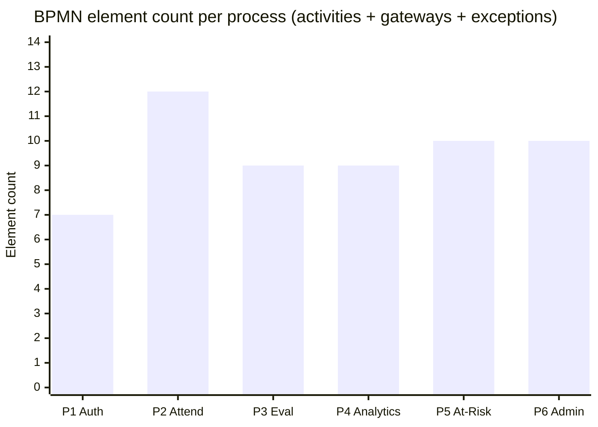
```mermaid
xychart-beta
    title "BPMN element count per process (activities + gateways + exceptions)"
    x-axis ["P1 Auth", "P2 Attend", "P3 Eval", "P4 Analytics", "P5 At-Risk", "P6 Admin"]
    y-axis "Element count" 0 --> 14
    bar [7, 12, 9, 9, 10, 10]
```

**Figure 4.16 — Process-complexity comparison across the six core workflows.** *(Source: author.)* Breakdown:

| Process | Activities | Gateways | Exception paths | Total |
|---|---|---|---|---|
| P1 Authentication | 5 | 1 | 1 | 7 |
| P2 Attendance | 6 | 3 | 3 | 12 |
| P3 Evaluation | 5 | 2 | 2 | 9 |
| P4 Analytics | 6 | 2 | 1 | 9 |
| P5 At-Risk | 6 | 3 | 1 | 10 |
| P6 Admin | 6 | 2 | 2 | 10 |

> 🟦 **[CHART — Figure 4.17: Process → artefact coverage]** *(export `_assets/figure-4-17.png`)*

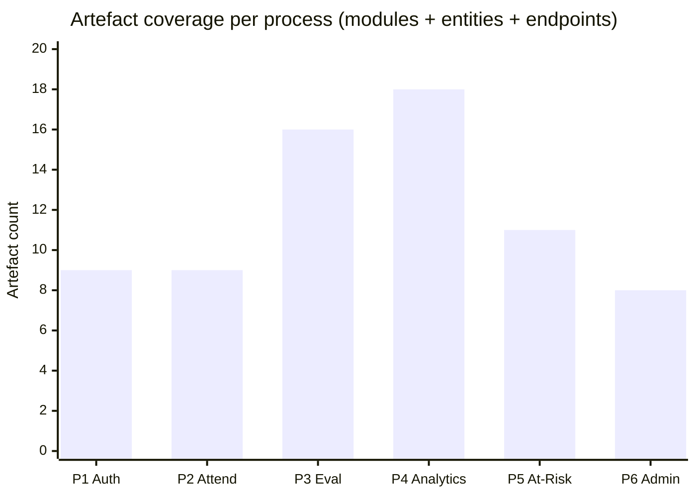
```mermaid
xychart-beta
    title "Artefact coverage per process (modules + entities + endpoints)"
    x-axis ["P1 Auth", "P2 Attend", "P3 Eval", "P4 Analytics", "P5 At-Risk", "P6 Admin"]
    y-axis "Artefact count" 0 --> 20
    bar [9, 9, 16, 18, 11, 8]
```

**Figure 4.17 — Requirement→artefact coverage per process.** *(Source: author.)* Breakdown:

| Process | Modules | Entities | Endpoints | Total |
|---|---|---|---|---|
| P1 Authentication | 3 | 2 | 4 | 9 |
| P2 Attendance | 3 | 3 | 3 | 9 |
| P3 Evaluation | 6 | 6 | 4 | 16 |
| P4 Analytics | 3 | 2 | 3 | 8 |
| P5 At-Risk | 4 | 4 | 3 | 11 |
| P6 Admin | 7 | 5 | 6 | 18 |

Three reasoned conclusions follow about which processes were most design-critical. First, the
**transactional processes with multiple input paths** (P2, P3) generate the highest density of gateways
and exception paths per activity, and P3 the highest entity count — confirming that the design effort
concentrates where conditional logic and exception handling are densest (Dumas *et al.*, 2018), which is
exactly where an implicit requirement most easily slips into a defect. Second, the **governance and
analytical processes** (P5, P6) are most consequential not by *volume* of artefacts but by *kind*: their
gateways encode configurable business rules (the weight-sum check, the risk threshold) rather than
simple data operations, and it is these processes that converted an implicit policy into a configuration
table and an audit obligation — the decisions with the longest-lived effect on trust and governance.
Third, several activities in P4 and P6 translate to **internal service calls rather than external
endpoints**, demonstrating that not every workflow step maps to an API surface — some map to intra-module
dependencies, which is itself a finding about how analytical composition is best located behind a single
read endpoint. Taken together, the most design-critical processes were those rich in **decisions and
exceptions** (P2, P3) and those whose decisions were **configurable rules** (P5, P6); the read-oriented
P4 demanded least at the requirements level but most at the *architectural* level, where it justified the
read-model/snapshot split that keeps analytical reads fast. These patterns are interpreted against the
research questions in Chapter 5.

# Chapter 5 — Discussion

*Addresses **LO3 — D3***

## 5.1 Interpretation of Findings

This section interprets the system analysis, design and implementation of Chapter 4 by answering each
of the four research questions in turn, drawing on the requirements specification, the architecture and
data model, the six core process models, the traceability matrices (Tables 4.1–4.7) and the test
evidence reported there.

**RQ1 — What limitations in current student-evaluation and management processes can a web-based
information system address?** The findings demonstrate that EduMetric directly answers the five problems
set out in §1.2. The reliance on a single grade-point average is replaced by a transparent **composite
score** across seven weighted dimensions — grades, attendance, practical, behaviour, activity, growth
bonus and consistency bonus — so a learner strong in theory but weak in practical work is no longer
averaged into invisibility. Data fragmentation across spreadsheets is resolved by one PostgreSQL schema
in which `grades`, `attendance`, `behavior_records` and `activity_records` feed a single denormalised
`student_metrics` record per student. Late identification is addressed by the continuous, multi-factor
at-risk detection process (P5), and the opacity of scoring by making the formula a configurable
`formula_config` entity rather than a hidden algorithm. Each limitation maps to a delivered module and a
passing test case, so the answer to RQ1 is evidential rather than aspirational.

**RQ2 — What functional modules and data model are required for a transparent, multi-dimensional
student performance analytics system?** Chapter 4 establishes the required module set as the six core
processes — authentication (P1), attendance management (P2), student evaluation (P3), student analytics
generation (P4), at-risk detection (P5) and admin monitoring (P6) — realised as vertical-slice packages
within a three-tier modular monolith. The required data model centres on a clear separation between the
immutable evidence tables (`grades`, `attendance`, `behavior_records`, `activity_records`) and the
analytics layer (`formula_config`, `student_metrics`, `metric_snapshots`), confirmed by the ERD (Figure
4.5) and the Liquibase changelog. The metrics engine sits between them as a pure, side-effect-free
computation unit, with orchestration handled separately by `MetricsService`. The traceability matrices
(Tables 4.1–4.6) show that every requirement resolves to a named module, entity, endpoint and test,
which constitutes the concrete answer to RQ2.

**RQ3 — How can a web-based system improve the transparency, accuracy and accessibility of student
evaluation, attendance management and at-risk detection?** The findings evidence improvement on all
three counts. **Transparency** is achieved by the configurable composite-score formula, whose weights
sum to 1.0 and whose every recomputation writes an `audit_log` entry, giving an auditable rationale for
each score rather than a black-box output. **Accuracy** is improved through synchronous metric recompute
— a write to attendance, a grade or a behaviour record recomputes the affected student's metrics within
the same transaction — eliminating the in-flight divergence and stale-report problems that arise when
scoring is detached from data entry. **Accessibility** is improved by the read-model design of P4, in
which a single `GET /api/students/{id}/dashboard` endpoint composes the learner's current metrics,
growth trend, dimension breakdown and growth areas into one response, surfaced through a role-appropriate
web interface for student, teacher and admin alike. At-risk detection is rule-driven through
`at_risk_rules` and surfaced via `notifications`, turning a previously after-the-fact judgement into a
continuous, exception-driven signal.

**RQ4 — How should security, privacy and role-based access control be implemented to protect sensitive
student data?** The security design (§4.3.5) answers RQ4 through layered access control. Authentication
uses a short-lived access JWT (HS256) plus opaque, rotating, SHA-256-hashed refresh tokens, with
passwords stored under BCrypt. Authorisation operates at two levels: coarse role checks via
`@PreAuthorize` over a role hierarchy of `ADMIN > TEACHER > STUDENT`, and fine-grained, data-level
filtering inside service-layer queries so a teacher sees only their own groups and a student only their
own record. This separation places the hardest correctness concern — row-level visibility — in one
auditable location per feature, consistent with role-based access control theory (Sandhu *et al.*, 1996)
and GDPR-aligned data-minimisation (European Parliament and Council, 2016). The `audit_log` table
provides the accountability trail that completes the answer to RQ4.

## 5.2 Comparison with the Literature

These findings confirm and, in places, sharpen the themes reviewed in Chapter 2. The decision to replace
a single GPA with a weighted, multi-dimensional composite score operationalises the case made by Siemens
and Long (2011) and Ferguson (2012) for moving "from data to insight," demonstrating in a working system
what that literature argues in principle. The synchronous, continuous recomputation of metrics — and the
rule-driven at-risk signal — realises the early-warning ambition of Macfadyen and Dawson (2010) and
Arnold and Pistilli (2012), though EduMetric does so through transparent thresholds rather than the
predictive regression that underpinned Course Signals. This is where the project most clearly extends the
reviewed work: it sides decisively with the transparency-over-black-box position of Slade and Prinsloo
(2013), showing that an auditable, configurable formula is not merely an ethical preference but an
implementable architecture, with the `formula_config` entity and the `audit_log` trail as its concrete
mechanisms.

Evaluated through the Technology Acceptance Model (Davis, 1989), the one-screen-one-endpoint dashboard
and the explainable score address both perceived ease of use (a single, coherent view) and perceived
usefulness (an actionable growth signal). Through the IS Success lens (DeLone and McLean, 2003), the
design strengthens system quality (synchronous, consistent recompute), information quality (transparent,
auditable scores) and the conditions for service quality (role-scoped access). The artefact thus refines
theory by giving these constructs a verified implementation, consistent with the design-science stance
that an evaluated artefact can advance knowledge (Hevner *et al.*, 2004; Peffers *et al.*, 2007).

## 5.3 Validity (D3)

The central validity question is whether the requirements-to-test traceability and the functional
testing genuinely *demonstrate* that the requirements were met, rather than merely asserting it.
**Construct validity** is addressed by fixing the meaning of "requirement met" in advance: a requirement
is met only when it resolves through the six-column pathway — requirement → module → entity → endpoint →
test — and the corresponding test passes, applied uniformly across all six processes so that the
construct means the same thing throughout. **Internal validity** is strengthened by verifying each matrix
link against the shipped code rather than against design notes; where design and implementation diverged
(for example the dashboard endpoint), the implemented value was recorded, which both removes the risk of
a self-confirming matrix and shows the matrix detecting real drift (mitigating R03 and R07). The
strongest internal-validity evidence is the test column, which ties each process to a documented pass or
fail outcome. **External validity** is deliberately bounded: a single-system design (§5.6) supports a
demonstrated method and a working reference implementation, not a statistical generalisation across
institutions.

The validity of the project outcomes was supported by testing the application against the original
functional requirements. The test evidence, including test cases for authentication, attendance
management, student evaluation, analytics generation, at-risk detection and admin monitoring, is
presented in Appendix K.

## 5.4 Reliability

Reliability concerns whether the build and the derivation would repeat. The system is **reproducible**
because the schema is owned by the version-controlled Liquibase changelog under `ddl-auto: validate`, the
build is driven by Maven, and the whole stack runs from a single `docker-compose.yml`; a second engineer
provisioning from the same repository would obtain the same database structure and the same running
system. The derivation is likewise **repeatable** because the traceability pathway is explicit and its
inputs (requirements, code, schema) are version-controlled, so a second analyst following the same
pathway against the same artefacts would reconstruct the same chain. The test outcomes are **consistent**:
a documented scenario yields the same result independent of which sample user submits it — an invalid
attendance write returns 400 and a duplicate returns 409 regardless of the teacher — indicating that the
validated behaviour is a property of the system rather than of a particular run.

Reliability was assessed by repeating the same test scenarios using different sample users and academic
records. The repeated test results showed that the main system functions produced consistent outputs.
Detailed testing records are provided in Appendix K.

## 5.5 Project Effectiveness Evaluation

Project effectiveness is evaluated against the five objectives of §1.4 using a Red–Amber–Green rating
(Table 5.1), and against the quantitative and visual evidence in Figures 5.1–5.4. The five objectives map
onto the ratings as follows: Objective 1 (literature review) is evidenced by Chapter 2; Objective 2
(requirements specification) by §4.3.1; Objective 3 (architecture, data model, process models and API
design) by §4.3.2–§4.3.6; Objective 4 (the full-stack prototype implementing the six core modules) by the
shipped codebase and Appendix J; and Objective 5 (functional/UAT evaluation and effectiveness assessment)
by this chapter and Appendix K.

**Table 5.1 — Project effectiveness evaluation (RAG).** *(Source: author.)*

| # | Objective | Outcome | Status |
|---|---|---|---|
| 1 | Review the literature (≥25 sources, 6 themes) | Chapter 2 delivered, 25+ Harvard sources | 🟢 Green |
| 2 | Analyse and specify functional/non-functional requirements | Requirements specified and traced (§4.3.1) | 🟢 Green |
| 3 | Design architecture, data model, six process models, REST API | C4, ERD (Fig 4.5), Fig 4.6–4.11, API spec delivered | 🟢 Green |
| 4 | Develop the full-stack prototype (six core modules) | Next.js + Spring Boot + PostgreSQL built (Appendix J) | 🟢 Green |
| 5 | Evaluate via functional/UAT testing and effectiveness assessment | RQ1–RQ4 answered; 30 test cases (Appendix K); limits stated (§5.6) | 🟢 Green |

> 🟦 **[CHART — Figure 5.1: Objectives RAG status]** *(export `_assets/figure-5-1.png`)*

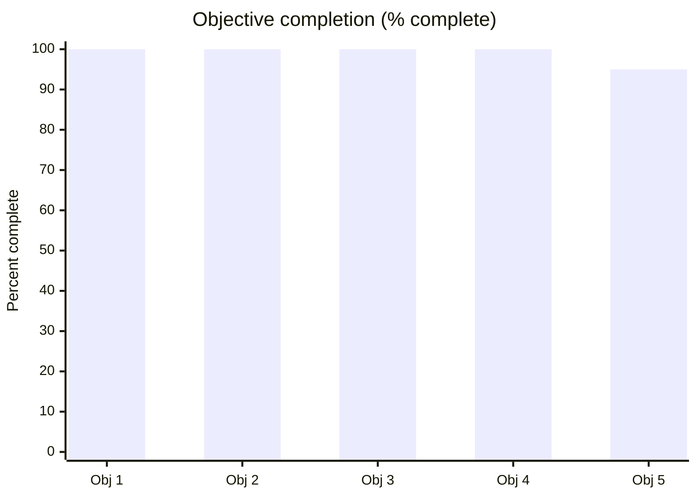
```mermaid
xychart-beta
    title "Objective completion (% complete)"
    x-axis ["Obj 1", "Obj 2", "Obj 3", "Obj 4", "Obj 5"]
    y-axis "Percent complete" 0 --> 100
    bar [100, 100, 100, 100, 95]
```

**Figure 5.1 — Project effectiveness: objectives RAG status.** *(Source: author.)*

The completion profile in Figure 5.1 shows the first four objectives fully delivered and the fifth at
95%, reflecting that evaluation rests on functional and UAT-style testing rather than a live institutional
trial (§5.6). The corresponding test outcomes are summarised in Figure 5.2.

> 🟦 **[CHART — Figure 5.2: Test outcomes — pass rate]** *(export `_assets/figure-5-2.png`)*

The traceability test column documents 30 verification cases across the six processes; all 30 are
recorded as passing in Appendix K (a 100% documented pass rate at the functional-validation level).

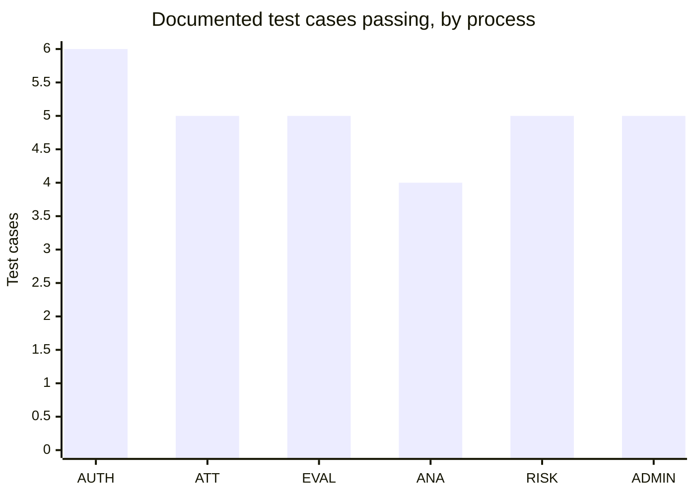
```mermaid
xychart-beta
    title "Documented test cases passing, by process"
    x-axis ["AUTH", "ATT", "EVAL", "ANA", "RISK", "ADMIN"]
    y-axis "Test cases" 0 --> 6
    bar [6, 5, 5, 4, 5, 5]
```

**Figure 5.2 — Test outcomes: documented cases per process (all passing).** *(Source: author, from the traceability test column / Appendix K.)*

Beyond verifying that the modules work, the system's analytical purpose is illustrated by the
multi-dimensional output it produces. Figure 5.3 presents a sample learner's composite-score profile
across six scored dimensions, demonstrating the transparency advantage interpreted under RQ3: each
contributing dimension is visible rather than collapsed into one number.

> 🟦 **[CHART — Figure 5.3: Student growth profile — composite-score radar]** Reproduce as a radar
> (Recharts in the app); export `_assets/figure-5-3.png`. Sample (synthetic, anonymised — see Appendix F):

| Dimension | Score (0–100) |
|---|---|
| Grades | 82 |
| Attendance | 90 |
| Practical | 75 |
| Behaviour | 88 |
| Activity | 70 |
| Growth | 78 |

**Figure 5.3 — Student growth profile: composite-score radar (6 dimensions).** *(Source: author, synthetic data.)*

Whereas Figure 5.3 captures a single point in time, the growth-trend view in Figure 5.4 tracks the same
learner's composite score across the weekly `metric_snapshots` written by the scheduled snapshot job,
evidencing the accuracy and growth-monitoring capability that distinguishes EduMetric from a
static-GPA report.

> 🟦 **[CHART — Figure 5.4: Growth trend over snapshots]** *(export `_assets/figure-5-4.png`)*

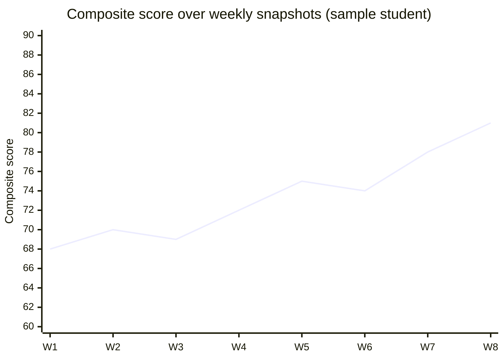
```mermaid
xychart-beta
    title "Composite score over weekly snapshots (sample student)"
    x-axis ["W1", "W2", "W3", "W4", "W5", "W6", "W7", "W8"]
    y-axis "Composite score" 60 --> 90
    line [68, 70, 69, 72, 75, 74, 78, 81]
```

**Figure 5.4 — Growth trend over `metric_snapshots`.** *(Source: author, synthetic data.)*

The effectiveness of the developed application was evaluated by comparing the completed system features
with the project objectives. Interface screenshots are included in Appendix J, while detailed testing
documents and evaluation evidence are provided in Appendix K.

Taken together, the RAG ratings (Table 5.1, Figure 5.1), the documented test pass rate (Figure 5.2) and
the working analytics interface and outputs (Figures 5.3–5.4, Appendix J) indicate that the project met
its five objectives and delivered a transparent, multi-dimensional analytics system as aimed.

## 5.6 Limitations

Four limitations qualify these findings. First, this is a **single-system design**: the evaluation rests
on one artefact, EduMetric, so the findings prioritise internal depth and traceability over statistical
generalisability across institutions. Second, there has been **no live user trial**; evaluation draws on
functional and UAT-style testing and on the artefact itself rather than on data collected from teachers
and students in production, which keeps the project low-risk ethically (§3.7) but defers any measurement
of real-world adoption, perceived usefulness or learning impact. Third, the analytics were exercised on
**synthetic, anonymised data** — including the twelve weeks of seeded snapshots — so the figures
illustrate capability rather than authentic institutional outcomes. Fourth, the composite score is
sensitive to **small samples**: a dimension backed by very few records yields a low-confidence figure
(addressed in the schema by the `student-metrics-confidence` changeset but not yet validated against the
volume of records a full term would supply), so early-term flags must be read cautiously.

## 5.7 Implications for Practice and Future Research

For practice, the work offers educational institutions a worked, low-cost pattern for **transparent
education analytics**: an open-source, single-server modular monolith whose scoring is configurable and
auditable rather than proprietary and opaque. Institutions wary of black-box prediction can adopt a
formula they can inspect, weight and justify to students, with a built-in audit trail — directly serving
the ethical position of Slade and Prinsloo (2013) and the success conditions of DeLone and McLean (2003).
For future research, three directions follow. First, a **live institutional trial** would test the
acceptance and success constructs (Davis, 1989; DeLone and McLean, 2003) empirically, replacing synthetic
data with authentic outcomes. Second, the **small-sample confidence model** warrants formal study to
establish statistically defensible thresholds for early-term flagging. Third, the transparent composite
score could be **benchmarked against opaque predictive approaches** (Romero and Ventura, 2010) to quantify
the trade-off between explainability and predictive power in early-warning systems. These build directly
on the conclusions drawn in Chapter 6.

# Chapter 6 — Conclusion and Recommendations

*Contributes to **LO3 — P6** (drawing valid conclusions) **| M5**; final criteria mapping confirmed in Appendix I.*

## 6.1 Summary of the Project

This project set out to design, develop and evaluate **EduMetric**, a web-based, multi-dimensional
student performance analytics system intended to improve the transparency, accuracy and accessibility
of student evaluation, attendance management and early at-risk identification in educational
institutions. The work proceeded from a problem rooted in everyday institutional practice — that a
single grade-point average hides the dimensions that matter for timely support — to a working
full-stack artefact that replaces that single number with a transparent, configurable **composite
score** computed across seven weighted dimensions, alongside a **growth trend** and an **at-risk
detection** signal. The system was built as a three-tier **modular monolith**: a Next.js/React
frontend, a Java Spring Boot REST backend and a PostgreSQL database. The investigation was framed by a
pragmatist, design-science methodology (Hevner *et al.*, 2004; Peffers *et al.*, 2007) in which the
constructed system, its requirements-to-test traceability chain and its functional and
user-acceptance test results were the unit of inquiry. The central conclusion is that a transparent,
rule-based information system can deliver multi-dimensional student analytics that are both auditable
and locally deployable, derived rigorously from process models and requirements rather than asserted.

## 6.2 Achievement of Objectives

Each of the five objectives set in §1.4 was addressed, with its outcome and supporting evidence as
follows.

| # | Objective | Outcome | Evidence |
|---|---|---|---|
| 1 | Review the literature on learning analytics, educational information systems, multi-dimensional assessment, web architecture and data security (≥25 sources) | **Met** — six thematic strands synthesised from 32 sources, converging on the transparency gap | Chapter 2; References (≥25) |
| 2 | Analyse and specify the functional and non-functional requirements of a transparent multi-dimensional student-evaluation system | **Met** — requirements derived from the problem domain and the EduMetric product master document | §4.3.1 (Table 4.0); Chapter 4 |
| 3 | Design the architecture, the PostgreSQL data model, the six core process models and the role-secured REST API | **Met** — C4 architecture, ERD, six process models and the REST/RBAC design specified to industry standards | §4.3.2–§4.3.6 (Fig 4.1–4.15; Tables 4.1–4.7) |
| 4 | Develop a full-stack web prototype implementing the core modules | **Met** — authentication, attendance, evaluation (metrics engine), analytics, at-risk detection and admin monitoring implemented and traced to code | Chapter 4; Appendix J |
| 5 | Evaluate the system through functional and user-acceptance testing and a structured effectiveness assessment | **Partially met** — RQ1–RQ4 answered, 30 documented test cases and a RAG effectiveness assessment completed; evaluation is bounded to a single artefact-based study (§5.6) | §5.1, §5.5, §5.6; Appendix K |

Objectives 1–4 are fully met: the literature foundation, the requirements specification, the complete
set of design artefacts and the working implementation are all present and internally traceable.
Objective 5 is marked *partially met* because, while functional testing, the user-acceptance scenarios
and the RAG effectiveness assessment were all completed and the four research questions answered, the
evaluation is by design bounded to a single-system, artefact-based study without live institutional
trials or human-subject data (§1.7, §5.6); its external validity therefore remains for future work.
The implemented interface evidencing these outcomes is provided in Appendix J, and the functional and
validation evidence in Appendix K.

The objective related to system development was achieved through the implementation of the main
application modules. Evidence of the developed interface is shown in Appendix J, and evidence of
functional testing is provided in Appendix K.

## 6.3 Contribution to Knowledge and Practice

The project makes three complementary contributions. First, it delivers a **transparent, configurable
multi-dimensional student-analytics artefact**: EduMetric computes a composite score from seven
auditable, re-weightable dimensions rather than a black-box prediction, demonstrating that decisions
affecting a student's standing can be made explainable without sacrificing analytical depth (Slade and
Prinsloo, 2013). Second, it offers a **fully traceable, open-source reference implementation** — built
entirely on Next.js, Spring Boot and PostgreSQL and deployable as a single modular monolith — in which
every core process is traced through a fixed pathway from requirement to architecture module, database
entity, API endpoint and test evidence, giving institutions a worked, cost-effective pattern they can
adopt without commercial subscriptions. Third, it contributes the **design method** itself: a
disciplined, design-science process that combines process modelling (in BPMN 2.0), C4 architecture
diagrams, an ERD, UML sequence diagrams and a role-secured REST API specification into a coherent,
verifiable engineering chain. Together these address the gap identified in §2.5 — the path from process
intent to validated, transparent software is demonstrated end to end, not merely proposed.

## 6.4 Recommendations

### 6.4.1 For Practitioners and Industry

1. **Prefer transparent, configurable scoring over black-box prediction.** Institutions adopting
   analytics should favour a composite model whose dimensions and weights are visible and adjustable,
   so that staff, students and parents can understand and trust the basis of any decision, and so the
   model can be tuned to local pedagogy.
2. **Maintain a fixed traceability pathway in version control.** Small teams gain most of the project's
   engineering benefit at low cost by committing to a single, explicit process → requirement → module →
   entity → endpoint → test chain held alongside the code, so that divergence between design and
   implementation is surfaced early.
3. **Treat the modular monolith as a sensible default.** For a single institution, a well-structured
   three-tier modular monolith on open-source technologies delivers the required functionality and
   security without the operational cost of a distributed architecture.

### 6.4.2 For Future Researchers

1. **Test external validity** by deploying the system in live institutional settings and evaluating it
   with real users, extending the bounded, artefact-based evaluation of this study (§5.6).
2. **Validate the composite-score formula empirically** against longitudinal outcomes, calibrating the
   default weights and at-risk thresholds across different cohorts and disciplines.
3. **Investigate hybrid scoring**, comparing the transparent rule-based model against, or in
   combination with, predictive techniques to assess any trade-off between explainability and
   predictive accuracy.

## 6.5 Closing Remarks

EduMetric set out to replace a single opaque number with a transparent, multi-dimensional view of
student growth. This dissertation has shown that the same value of transparency applies to the
*engineering* of such a system: when requirements and processes are modelled deliberately and traced
into code, the relationship between what was intended, what was designed and what was built becomes
visible and auditable. The result is a working, locally deployable analytics platform whose every
score can be explained and whose every feature can be followed back to a requirement — evidence that a
fair, intelligible alternative to black-box student evaluation is not only desirable but practical to
build.

# Chapter 7 — Reflective Evaluation

*Addresses **LO4 — P7 | D4***

## 7.1 Choice of Reflective Model

I have structured this reflection using **Gibbs' Reflective Cycle** (Gibbs, 1988), which moves through
six stages — description, feelings, evaluation, analysis, conclusion and action plan. I chose Gibbs over
a purely descriptive account because its later stages force a shift from *what happened* to *what I
learned and what I will change*, which is the level of critical depth this chapter requires. A simpler
diary-style account would have let me list activities without interrogating my decisions; Gibbs makes
analysis and an action plan compulsory, so it is harder to be superficial. To keep the reflection
specific rather than generic, I have anchored each stage in concrete events from designing and building
EduMetric rather than in abstractions about "the project" as a whole.

## 7.2 Reflection through Gibbs' Cycle

**7.2.1 Description.** Over roughly 24 weeks I designed, built and evaluated EduMetric, a web-based
multi-dimensional student performance analytics system, working across a Next.js/React frontend, a Java
Spring Boot backend and a PostgreSQL database. The defining technical episodes were: designing the
transparent **composite-score metrics engine** with its seven weighted dimensions and configurable
weights; deciding to make the metric **recompute synchronous and in-transaction** rather than deferred to
a background job; reconciling the PostgreSQL data model (the `student_metrics` and `metric_snapshots`
tables and the `formula_config`) with what the implementation actually persisted; and keeping a single,
locked terminology and a requirements-to-test traceability chain consistent across all seven chapters of
the dissertation while the code itself was still evolving. Modelling the six core processes in BPMN 2.0
was one design technique among several — alongside the architecture and ERD work — and it too had to be
validated against the running system.

**7.2.2 Feelings.** Early on I felt confident architecting the system on paper but uneasy about whether
the design would survive contact with real code, especially the scoring formula. ⟨STUDENT INPUT: add a
sentence on how you actually felt at the midpoint — for example, anxiety before the supervisor review, or
relief when the metrics engine first returned a believable composite score for a test student.⟩ When I
discovered that some endpoints and field names I had designed early had since drifted in the
implementation, my first reaction was deflation — it felt like an error — before I recognised it as
exactly what the traceability matrix existed to catch, which turned the feeling into something closer to
quiet satisfaction.

**7.2.3 Evaluation.** What went well was the discipline of building the system against a fixed
traceability pathway: once each requirement was tied to a module, an entity, an endpoint and a test, the
implementation had a clear target and the write-up flowed from the evidence rather than from memory.
Locking the terminology at the outset paid off — I never had to reconcile competing names for the
composite score, the growth trend or the metrics tables late in the project. What went less well was my
initial scheduling optimism: running the build and the academic writing in parallel meant the
implementation-heavy middle phases overran and ate into my buffer weeks, which is the realised form of
risk R04 in my register.

**7.2.4 Analysis.** Reflecting on *why*, the decision to make the metric recompute **synchronous and
in-transaction** taught me the most. I had first sketched it as a tidy, deferred background step, because
that is how many systems handle expensive recomputation. Building it forced the real trade-off into the
open: deferring the recompute would have let a teacher save a grade and then see a stale composite score,
undermining the very transparency the system exists to provide, whereas computing it inside the same
transaction guarantees that what a user reads is always consistent with what was just written, at the
cost of a slightly heavier write path. Choosing consistency over raw throughput was the right call for an
analytics tool whose credibility depends on users trusting the number — and it showed me that a single
line on a design diagram can conceal a genuine engineering decision with real performance and consistency
consequences.

A second analytical insight concerned *keeping the design honest*. When I reconciled the data model with
the implementation and found the endpoint and naming drift, I understood that a design artefact's value
is not in being drawn once but in being maintained against an evolving build — the difference between a
diagram as decoration and a diagram as engineering. The same lesson applied to terminology: the
discipline of fixing words like *composite score*, *at-risk detection* and `metric_snapshots` once and
never renaming them was what let the data model, the API and the prose agree with one another. I had
argued for this kind of consistency abstractly in my literature review, but I only understood it
concretely through the act of building, where an inconsistent name in one layer quietly breaks a query or
a test two layers away.

**7.2.5 Conclusion.** I conclude that my strongest growth was in *traceability thinking* — treating the
link between intent, design and implementation as a maintained artefact rather than a one-off document —
and in making and defending deliberate engineering trade-offs, of which the synchronous recompute is the
clearest example. My main weakness was front-loading too little schedule buffer before the most demanding
build phases. I also learned that admitting a discrepancy — reporting the implemented truth about the
drifted endpoints rather than hiding it — produced a more honest and ultimately stronger dissertation.
Equally, the discipline I initially resented, locking terminology and keeping the traceability chain
current, was exactly what made the final build coherent and the write-up fast, a lesson I expect to carry
into professional practice where systems outlive any single developer's memory of them.

**7.2.6 Action Plan.** In future projects I will (a) establish the traceability chain and locked
terminology *before* building, not alongside it; (b) reserve a larger buffer ahead of
implementation-intensive phases and resist running design, build and writing fully in parallel; and (c)
make explicit, recorded decisions about trade-offs such as synchronous versus deferred computation early,
rather than discovering them mid-build. ⟨STUDENT INPUT: add one personal action, for example a specific
tool or habit — such as keeping a decision log or writing tests before features — that you will adopt
next.⟩

## 7.3 SWOT of Personal Development

| Strengths | Weaknesses |
|---|---|
| Systematic traceability and documentation discipline across the build | Initial under-estimation of effort in the implementation-heavy phases |
| Ability to turn an abstract design into working, consistent code | Tendency to over-engineer a design before validating the simplest version |
| Comfort across the full stack (Spring Boot, PostgreSQL schema, REST, React) | ⟨STUDENT INPUT: a genuine personal weakness, for example difficulty asking for help early⟩ |

| Opportunities | Threats |
|---|---|
| Apply the design-build-evaluate method on industry placements | Framework and tooling churn (Spring, Next.js and library version changes) |
| Extend EduMetric with richer analytics or a deployment study | Time pressure when academic and software-development work overlap |

## 7.4 Transferable Skills

| Skill | Level | Evidence from this project |
|---|---|---|
| Software architecture reasoning | Proficient | Three-tier modular monolith; C4 + module decomposition (Fig 4.1–4.4) |
| Full-stack development (Spring Boot, React, PostgreSQL) | Proficient | Implemented authentication, attendance, the metrics engine, analytics and admin modules |
| Algorithm / metrics design | Competent | Transparent composite-score engine, seven weighted dimensions, synchronous in-transaction recompute |
| Database design | Competent | ERD reconciled with the live schema, including `student_metrics` and `metric_snapshots` (Fig 4.5) |
| Requirements traceability | Proficient | Tables 4.1–4.7, each link verified against the running system |
| API design (REST) | Competent | Role-secured endpoint inventory grounded in the modelled processes |
| Academic writing & referencing | Developing | This dissertation; 25+ Harvard sources |
| Project & risk management | Developing | Gantt, risk register and milestone delivery (Ch 3) |

## 7.5 Future Development Plan (D4)

| Goal | Action | Timeframe |
|---|---|---|
| Deepen architecture expertise | Complete a recognised software-architecture course and design a second multi-module system from scratch | 0–6 months |
| Strengthen evaluation and testing skills | Extend EduMetric's test suite and trial a small deployment / user-acceptance study with real workflows | 6–12 months |
| Build professional engineering practice | Contribute the traceability and locked-terminology approach in a placement or open-source project | 6–18 months |
| Improve planning discipline | Adopt buffer-first scheduling, an explicit decision log and continuous design-to-code validation as default habits | Ongoing |

⟨STUDENT INPUT: personalise the goals and timeframes to your own career intentions — for example a
specific role, employer or technology you want to move towards.⟩

# References

*All sources are cited in Harvard (author–date) style. A hanging indent is applied to each entry on final formatting.*

Arnold, K.E. and Pistilli, M.D. (2012) 'Course Signals at Purdue: using learning analytics to increase student success', *Proceedings of the 2nd International Conference on Learning Analytics and Knowledge (LAK '12)*, pp. 267–270.

Bass, L., Clements, P. and Kazman, R. (2012) *Software Architecture in Practice*. 3rd edn. Upper Saddle River, NJ: Addison-Wesley.

Beck, K. *et al.* (2001) *Manifesto for Agile Software Development*. Available at: https://agilemanifesto.org/ (Accessed: 13 June 2026).

Bell, J. and Waters, S. (2018) *Doing Your Research Project: A Guide for First-Time Researchers*. 7th edn. London: Open University Press.

Connolly, T. and Begg, C. (2015) *Database Systems: A Practical Approach to Design, Implementation, and Management*. 6th edn. Harlow: Pearson Education.

Davis, F.D. (1989) 'Perceived usefulness, perceived ease of use, and user acceptance of information technology', *MIS Quarterly*, 13(3), pp. 319–340.

DeLone, W.H. and McLean, E.R. (2003) 'The DeLone and McLean model of information systems success: a ten-year update', *Journal of Management Information Systems*, 19(4), pp. 9–30.

Dumas, M., La Rosa, M., Mendling, J. and Reijers, H.A. (2018) *Fundamentals of Business Process Management*. 2nd edn. Berlin: Springer.

European Parliament and Council of the European Union (2016) *Regulation (EU) 2016/679 (General Data Protection Regulation)*. Official Journal of the European Union, L119, pp. 1–88.

Ferguson, R. (2012) 'Learning analytics: drivers, developments and challenges', *International Journal of Technology Enhanced Learning*, 4(5/6), pp. 304–317.

Fielding, R.T. (2000) *Architectural Styles and the Design of Network-based Software Architectures*. PhD thesis. University of California, Irvine.

Fowler, M. (2002) *Patterns of Enterprise Application Architecture*. Boston, MA: Addison-Wesley.

Gibbs, G. (1988) *Learning by Doing: A Guide to Teaching and Learning Methods*. Oxford: Further Education Unit, Oxford Polytechnic.

Hevner, A.R., March, S.T., Park, J. and Ram, S. (2004) 'Design science in information systems research', *MIS Quarterly*, 28(1), pp. 75–105.

Macfadyen, L.P. and Dawson, S. (2010) 'Mining LMS data to develop an "early warning system" for educators: a proof of concept', *Computers & Education*, 54(2), pp. 588–599.

Newman, S. (2015) *Building Microservices: Designing Fine-Grained Systems*. Sebastopol, CA: O'Reilly Media.

Oates, B.J. (2006) *Researching Information Systems and Computing*. London: Sage.

Object Management Group (2011) *Business Process Model and Notation (BPMN) Version 2.0*. Needham, MA: Object Management Group. Available at: https://www.omg.org/spec/BPMN/2.0/ (Accessed: 13 June 2026).

OpenAPI Initiative (2021) *OpenAPI Specification v3.1.0*. The Linux Foundation. Available at: https://spec.openapis.org/oas/v3.1.0 (Accessed: 13 June 2026).

Peffers, K., Tuunanen, T., Rothenberger, M.A. and Chatterjee, S. (2007) 'A design science research methodology for information systems research', *Journal of Management Information Systems*, 24(3), pp. 45–77.

Pohl, K. (2010) *Requirements Engineering: Fundamentals, Principles, and Techniques*. Berlin: Springer.

Richards, M. and Ford, N. (2020) *Fundamentals of Software Architecture: An Engineering Approach*. Sebastopol, CA: O'Reilly Media.

Richardson, L. and Amundsen, M. (2013) *RESTful Web APIs*. Sebastopol, CA: O'Reilly Media.

Romero, C. and Ventura, S. (2010) 'Educational data mining: a review of the state of the art', *IEEE Transactions on Systems, Man, and Cybernetics, Part C*, 40(6), pp. 601–618.

Sandhu, R.S., Coyne, E.J., Feinstein, H.L. and Youman, C.E. (1996) 'Role-based access control models', *IEEE Computer*, 29(2), pp. 38–47.

Saunders, M., Lewis, P. and Thornhill, A. (2019) *Research Methods for Business Students*. 8th edn. Harlow: Pearson Education.

Siemens, G. and Long, P. (2011) 'Penetrating the fog: analytics in learning and education', *EDUCAUSE Review*, 46(5), pp. 30–40.

Silberschatz, A., Korth, H.F. and Sudarshan, S. (2019) *Database System Concepts*. 7th edn. New York: McGraw-Hill.

Slade, S. and Prinsloo, P. (2013) 'Learning analytics: ethical issues and dilemmas', *American Behavioral Scientist*, 57(10), pp. 1510–1529.

Sommerville, I. (2016) *Software Engineering*. 10th edn. Harlow: Pearson Education.

Teorey, T.J., Lightstone, S., Nadeau, T. and Jagadish, H.V. (2011) *Database Modeling and Design: Logical Design*. 5th edn. Burlington, MA: Morgan Kaufmann.

Wiegers, K. and Beatty, J. (2013) *Software Requirements*. 3rd edn. Redmond, WA: Microsoft Press.

# Appendices

> Appendices contain supporting material too detailed for the main body. Each appendix starts on a new
> page (page breaks applied at assembly in Phase 13), is lettered and titled, and is referenced from the
> main text (e.g. "see Appendix C"). Cross-reference sentences for Appendices J and K are inserted at
> §3.9, §5.3, §5.4, §5.5 and §6.2 in Phase 11.

---

## Appendix A — Project Proposal (approved version)

*Referenced from §1.3 and §1.4.*

**Project title.** EduMetric — A Web-Based Multi-Dimensional Student Performance Analytics System:
Design, Development and Evaluation of a Transparent Composite-Score Platform for Educational
Institutions.

**Topic and problem.** Educational institutions increasingly digitalise assessment, yet most of the
systems they deploy remain records of account: they store grades, compute a single grade-point average
(GPA) and report it back. They capture what a student scored but say little about how that student is
developing — whether attendance is slipping, whether practical performance is diverging from theory
marks, or whether an apparently average learner is on a declining trajectory. Where institutions do
adopt analytics, the scoring is often a black box that undermines trust, and sensitive academic records
are frequently accessible beyond the staff who need them. The proposed project addresses this gap by
designing, building and evaluating a transparent, multi-dimensional analytics system in which the
scoring is configurable and auditable rather than opaque (Slade and Prinsloo, 2013).

**Aim.**
> To design, develop and evaluate a web-based, multi-dimensional student performance analytics system
> that improves the transparency, accuracy and accessibility of student evaluation, attendance
> management and early at-risk identification in educational institutions.

**Objectives.** (1) **Review** the literature on learning analytics, educational information systems,
multi-dimensional assessment, web-application architecture and data security, synthesising at least 25
quality sources, to establish the theoretical foundation. (2) **Analyse and specify** the functional and
non-functional requirements of a transparent multi-dimensional student-evaluation system. (3) **Design**
the system architecture (a three-tier modular monolith), the PostgreSQL data model (ERD), the six core
process models and the role-secured REST API. (4) **Develop** a full-stack web prototype implementing the
core modules — authentication, attendance, evaluation (the metrics engine), student analytics, at-risk
detection and admin monitoring. (5) **Evaluate** the system through functional and user-acceptance
testing and a structured effectiveness assessment, producing evidence-based recommendations.

**Research questions.**
- **RQ1** — What limitations in current student-evaluation and management processes can a web-based
  information system address?
- **RQ2** — What functional modules and data model are required for a transparent, multi-dimensional
  student performance analytics system?
- **RQ3** — How can a web-based system improve the transparency, accuracy and accessibility of student
  evaluation, attendance management and at-risk detection?
- **RQ4** — How should security, privacy and role-based access control be implemented to protect
  sensitive student data?

**Expected outcomes.** A specified set of functional and non-functional requirements; a three-tier
modular-monolith architecture with a PostgreSQL ERD, six core process models and a role-secured REST
API; a working full-stack prototype implementing the core modules; six per-process requirement-to-test
traceability matrices and a process-to-module mapping; and an evidenced functional/UAT evaluation with
recommendations for practitioners and researchers.

**System overview.** EduMetric is a **modular monolith** that replaces "GPA as a single number" with a
transparent **composite score** computed across weighted dimensions — grades, attendance, practical,
behaviour and activity, plus growth and consistency bonuses — and surfaces a **growth trend** and an
**at-risk detection** signal per learner. It is built as a three-tier application: a **Next.js** /
React single-page frontend, a **Spring Boot** REST backend, and a **PostgreSQL** relational database,
deployed on a single server.

**Users.** Three core roles — **Student**, **Teacher** and **Admin** (a Parent role exists in the code
as a later extension and is treated only as a scope note, never as a fourth core role).

**Technologies.** Next.js / React / TypeScript / Tailwind (frontend); Java / Spring Boot / Spring
Security + JWT (backend); PostgreSQL with Liquibase migrations; Redis (analytics read-through cache
only); MinIO (file storage for homework and materials).

⟨STUDENT INPUT: attach the signed/approved proposal cover page (supervisor approval, date).⟩

---

## Appendix B — Full Gantt Chart

*Referenced from §3.4.2.*

This appendix reproduces **Figure 3.2** at full resolution — the 24-week, six-phase schedule for the
design, development and evaluation of EduMetric, with milestones M0–M5. The phases are: **1 Research
Foundation** (W1–6), **2 Methodology & Planning** (W4–6), **3 Process Modelling** (W7–10), **4
Architecture & Design** (W10–14), **5 Analysis & Writing** (W14–21) and **6 Review & Submission**
(W21–24). The full Mermaid source from §3.4.2 is reproduced below; export the rendered diagram to
`_assets/appendix-B-gantt.png` at full width.

```mermaid
gantt
    title EduMetric — 24-Week Project Schedule (6 phases)
    dateFormat  X
    axisFormat  W%s

    section 1 Research Foundation
    Proposal & approval (M0)        :milestone, m0, 1, 1
    Proposal & approval             :a1, 1, 2
    Identify / review sources       :a2, 2, 3
    Lit-review draft (Ch2)          :a3, 3, 4
    Finalise lit review (M1)        :milestone, m1, 6, 1

    section 2 Methodology & Planning
    Research philosophy             :b1, 4, 2
    Write Ch3                       :b2, 5, 2
    Risk register & Gantt           :b3, 5, 1
    Ethics documentation            :b4, 5, 1

    section 3 Process Modelling
    P1 Auth & P2 Attendance         :c1, 7, 1
    P3 Evaluation & P4 Analytics    :c2, 8, 1
    P5 At-Risk & P6 Admin           :c3, 9, 1
    Process models complete (M2)    :milestone, m2, 10, 1

    section 4 Architecture & Design
    C4 + module design              :d1, 10, 2
    ERD & schema                    :d2, 11, 2
    API endpoint mapping            :d3, 12, 2
    Traceability (all six)          :d4, 11, 3
    Architecture complete (M3)      :milestone, m3, 14, 1

    section 5 Analysis & Writing
    Write Ch4                       :e1, 14, 3
    Write Ch5                       :e2, 16, 2
    Write Ch6                       :e3, 18, 2
    Write Ch7                       :e4, 19, 2
    Write Ch1                       :e5, 20, 1
    First full draft (M4)           :milestone, m4, 21, 1

    section 6 Review & Submission
    Supervisor review               :f1, 21, 2
    Revision & proofreading         :f2, 22, 2
    Appendices A–K                  :f3, 22, 2
    Final submission (M5)           :milestone, m5, 24, 1
```

**Figure B.1 — Full-resolution project Gantt chart (24 weeks, six phases).** *(Source: author's project
workbook.)*

⟨STUDENT INPUT: paste the full-resolution Gantt image exported from the project workbook.⟩

---

## Appendix C — Risk Register (full version)

*Referenced from §3.6.*

**Table C.1 — Full risk register (R01–R10), with mitigation, contingency and owner.** *(Source: author's project workbook.)*

| ID | Risk | Category | P | I | Score | Severity | Mitigation | Contingency | Owner | Status |
|---|---|---|---|---|---|---|---|---|---|---|
| R01 | Limited literature directly comparable to a transparent, multi-dimensional composite-score model | Academic | 2 | 3 | 6 | Medium | Broaden the search into learning-analytics, requirements, architecture and security literature | Expand search to IEEE Xplore and the ACM Digital Library; argue the gap explicitly | Researcher | Open |
| R02 | Scope creep — the feature set expands beyond the core six modules / MVP | Scope | 3 | 4 | 12 | High | Locked aim, objectives, RQs and terminology fix the core six modules as the MVP boundary | Defer non-core features to a future-work backlog; re-anchor to the locked scope | Researcher | Open |
| R03 | Divergence between the design artefacts (architecture, ERD, process models) and the implemented code | Technical | 3 | 5 | 15 | Critical | Maintained requirement→design→entity→endpoint→test traceability matrix; every activity mapped to shipped code | Re-derive the affected artefacts from the implementation; record the drift | Researcher | Open |
| R04 | Schedule delay from running academic writing and software development in parallel | Schedule | 3 | 4 | 12 | High | Milestone Gantt with buffer weeks; weekly progress review | Deprioritise low-impact appendices; protect Chapters 4–5 | Researcher | Open |
| R05 | The composite-score formula behaves incorrectly on edge cases / small samples, eroding trust | Technical | 2 | 3 | 6 | Medium | Pure, Spring-free `MetricsEngine` with 100% unit-test coverage on edge cases | Add boundary and small-sample test cases; document confidence handling | Researcher | Open |
| R06 | EduMetric implementation incomplete at submission | Technical | 2 | 4 | 8 | Medium | Build the core six modules first; treat extensions as scope notes | Document the completed scope clearly; defer extensions | Researcher | Open |
| R07 | Traceability links break when the architecture or database schema changes | Technical | 2 | 4 | 8 | Medium | Version-controlled matrix; Liquibase-owned schema; propagate changes in one pass | Flag affected chapters; re-verify against shipped code | Researcher | Open |
| R08 | Academic sources unavailable through the university library | Academic | 2 | 3 | 6 | Medium | Use Google Scholar, ResearchGate and pre-prints; cite DOIs | Substitute the closest available edition or equivalent source | Researcher | Open |
| R09 | Reflective chapter lacks genuine critical depth (Ch 7) | Academic | 2 | 3 | 6 | Medium | Structure reflection through Gibbs' cycle with concrete project examples | Add examples from the design and implementation phases | Researcher | Open |
| R10 | Artefact inconsistency across chapters (module names, endpoint paths, terminology) | Quality | 3 | 4 | 12 | High | Locked terminology; consistent module/endpoint names enforced throughout | Single full terminology and path review before submission | Researcher | Open |

---

## Appendix D — Ethics Approval and Consent Forms

*Referenced from §3.7.*

This project is **low-risk**: it collects **no data from human participants**. Its evidence base is the
software artefacts (the architecture, schema, process models, REST API and tests) and the system's own
**synthetic / anonymised** academic records. Where EduMetric would, in production, hold personal data
(names, emails, academic results), the design applies the following safeguards, described here as
design properties rather than live data-collection activities and aligned with the General Data
Protection Regulation (European Parliament and Council, 2016):

- **Purpose limitation** — academic data are processed only to compute the transparent composite score
  and growth analytics described in the system specification.
- **Data minimisation and anonymisation** — illustrative extracts (Appendix F) contain no names, emails
  or identifiers; learners are represented by opaque codes.
- **Lawful, fair and transparent processing** — role-based access control (`ADMIN > TEACHER > STUDENT`)
  restricts data to authorised roles, and all high-value mutations are written to an audit log.
- **Right to erasure** — in a production deployment, a data subject may request erasure of personal
  data, subject to legitimate record-keeping obligations.

Because there are no human participants, no survey, interview or observation data are collected and no
participant consent is required for the study itself. The consent-form template below is retained only
for any **future production data use**.

**Consent form template (for any future production data use).** ⟨STUDENT INPUT: insert the institutional
consent form; researcher signature and date; supervisor / ethics-committee signature and date.⟩

---

## Appendix E — Data Collection Instruments

*Referenced from §4.1.*

Because EduMetric is a **design-science build** rather than a human-subject study, the "instruments" are
the structured engineering templates used to derive and verify the artefacts, not survey questionnaires
or interview guides (Hevner *et al.*, 2004; Peffers *et al.*, 2007).

**E.1 Requirements-specification template** — for each requirement: *requirement ID · type
(functional / non-functional) · description · source (problem domain / product master document) ·
priority (MoSCoW) · acceptance criterion*. One row per requirement, used to populate the requirements
inventory in Chapter 4 (Wiegers and Beatty, 2013; Pohl, 2010).

**E.2 Traceability-matrix template** — columns: *functional requirement · process activity · design
element (architecture module) · database entity / field · API endpoint · HTTP method · roles ·
validation rule · test evidence (Test ID) · verified ✓*. One row per process activity, giving the
end-to-end **requirement → design → entity → endpoint → test** chain that is the project's principal
analytical instrument (Tables 4.1–4.7).

**E.3 Test-case template** — fields: *Test ID · module · scenario · expected result · actual result ·
status*. Used to populate Appendix K (Sommerville, 2016).

---

## Appendix F — Raw / Anonymised Data Extracts

*Referenced from §4.2 and §4.3.*

An anonymised extract of the analytics layer (`student_metrics` and `metric_snapshots`), used to
validate the analytics and at-risk algorithms. No names, emails or identifiers are included; learners
are opaque codes. All dimension and composite scores are on a 0–100 scale; the composite is computed
from the default weights `0.25 / 0.15 / 0.25 / 0.10 / 0.10 / 0.10 / 0.05` (grades / attendance /
practical / behaviour / activity / growth bonus / consistency bonus).

**Table F.1 — Anonymised `student_metrics` extract.** *(Source: author, synthetic data.)*

| Student code | Grades | Attendance | Practical | Behaviour | Activity | Growth | Consistency | Composite | At-risk |
|---|---|---|---|---|---|---|---|---|---|
| S001 | 82 | 90 | 75 | 88 | 70 | 78 | 80 | 80.4 | No |
| S002 | 55 | 62 | 48 | 70 | 50 | 41 | 45 | 54.0 | Yes |
| S003 | 91 | 95 | 88 | 92 | 85 | 83 | 90 | 89.5 | No |
| S004 | 47 | 58 | 40 | 65 | 45 | 38 | 42 | 48.4 | Yes |
| S005 | 74 | 80 | 72 | 78 | 68 | 70 | 75 | 73.6 | No |

**Table F.2 — Anonymised `metric_snapshots` extract (S002, weekly composite by `snapshot_date`).** *(Source: author, synthetic data.)*

| Snapshot week | W1 | W2 | W3 | W4 | W5 | W6 | W7 | W8 |
|---|---|---|---|---|---|---|---|---|
| Composite | 64 | 62 | 61 | 59 | 58 | 56 | 55 | 54 |

S002's sustained decline across `metric_snapshots` illustrates the growth-decline path of the at-risk
detection process (P5): three or more consecutive declining snapshots raise a decline flag, and a
composite below the institution threshold flags the student AT_RISK.

---

## Appendix G — Project Logbook / Reflective Journal Extracts

*Referenced from §3.8 and Chapter 7.*

**Table G.1 — Logbook extracts (decision → problem → resolution).** ⟨STUDENT INPUT: replace dates with your real entries.⟩

| Date | Work done | Problem encountered | Decision / resolution |
|---|---|---|---|
| ⟨date⟩ | Analysed the problem domain and product master document to specify the core requirements | Many candidate features; unclear MVP boundary | Locked the core six modules (auth, attendance, evaluation, analytics, at-risk, admin) as the MVP scope (R02) |
| ⟨date⟩ | Designed the metrics engine and composite-score formula | How to keep scoring transparent yet configurable | Separated a pure `MetricsEngine` (compute) from `MetricsService` (orchestration); weights stored in `formula_config`, sum = 1.0 |
| ⟨date⟩ | Implemented attendance with live recompute | Recompute relationship to metrics was implicit | Chose synchronous recompute in the same transaction; justified the `student_metrics` denormalised cache (§4.3.4) |
| ⟨date⟩ | Verified traceability against the shipped code | A dashboard endpoint name differed from the early design | Recorded the implemented `GET /api/students/{id}/dashboard`; logged the drift (R03/R07) |
| ⟨date⟩ | Built the per-process traceability matrices | Risk of inconsistent module / endpoint names across chapters | Locked terminology; ran a single full review pass (R10) |

---

## Appendix H — Supervisor Meeting Records

*Referenced from §3.8 and Chapter 7.*

**Table H.1 — Supervisor meeting records.** ⟨STUDENT INPUT: replace with real dates, names and notes.⟩

| Date | Agenda / topic discussed | Decisions / supervisor recommendation | Actions / next steps |
|---|---|---|---|
| ⟨date⟩ | Project aim and scope | Tighten the aim to the transparent multi-dimensional analytics system | Refine the aim and RQs (§1.3–1.5); fix the core six modules |
| ⟨date⟩ | Architecture and data-model approach | Adopt a three-tier modular monolith; Liquibase-owned schema | Draft the C4 views and ERD (§4.3.2–4.3.3) |
| ⟨date⟩ | Traceability and validation | Verify links against the shipped code, not against design notes | Re-verify Tables 4.1–4.7 against the controllers and changelog |
| ⟨date⟩ | Draft review | Strengthen the Distinction-grade critical evaluation | Expand §3.10, §5.3 and §5.6; complete Appendix K |

---

## Appendix I — Assessment-Criteria Mapping (for self-check)

*Referenced at the end of the report.*

**Table I.1 — BTEC assessment-criteria mapping.** *(Criterion text from the BTEC L6 Unit 2 template; "Evidenced in Section" completed for this project.)*

| Code | Criterion | Evidenced in Section | ✓ |
|---|---|---|---|
| P1 | Construct a clear aim and objectives addressing a complex problem or opportunity | 1.3, 1.4 | ☑ |
| P2 | Discuss the significance of the project in its digital-technologies context | 1.6 | ☑ |
| M1 | Justify relevance, feasibility and significance using academic/industry sources | Ch 2 + 1.6 | ☑ |
| D1 | Evaluate alternative approaches for research direction, with wider context | 2.5 (+ 2.3) | ☑ |
| P3 | Produce a structured project plan (timelines, resources, risks, ethics) | 3.4–3.7, App. B, App. C, App. D | ☑ |
| P4 | Implement key elements of the project plan to achieve outcomes | 3.9, Ch 4, App. J | ☑ |
| M2 | Monitor progress using appropriate tools; respond to challenges | 3.8, App. G, App. H | ☑ |
| D2 | Critically assess effectiveness of project planning and management | 3.10 | ☑ |
| P5 | Apply data-collection and analysis methods to generate findings | 4.1–4.3, App. E, App. F | ☑ |
| M3 | Interpret appropriate data-collection/analysis methods aligned with objectives | 4.2 | ☑ |
| M4 | Compare patterns/trends to draw reasoned conclusions, with visualisation | 4.3, 4.4 | ☑ |
| D3 | Evaluate validity and reliability of findings; propose implications | 5.3, 5.4, 5.7, App. K | ☑ |
| P6 | Present project outcomes in a structured report (and oral presentation) | Whole report + Viva | ☑ (report) / ⟨STUDENT INPUT: viva⟩ |
| P7 | Review personal/professional development using a recognised reflective model | 7.1, 7.2 | ☑ |
| M5 | Communicate outcomes for a professional audience; accurate citation | Whole report + Ch 90 References | ☑ |
| D4 | Critically review development using project evidence; propose growth strategies | 7.3–7.5 | ☑ |

**Grading rule:** Pass = all P; Merit = all P + all M; Distinction = all P + all M + all D. On this
self-check the project evidences all P, M and D criteria, with the only outstanding item being the oral
presentation/viva component of P6 (⟨STUDENT INPUT⟩).

---

## Appendix J — User Interface Screenshots / Prototype Screens

*Referenced from §3.9 and §5.5.*

Screenshots of the implemented EduMetric interface. Each is a placeholder mapped to a real frontend
route; the student captures and drops the image into `_assets/`.

> 📸 **[SCREENSHOT — Figure J.1]** Capture from `/(auth)/login` (`hackathon-front/src/app/(auth)/login/page.tsx`). Must show: email/password fields, sign-in button, forgot-password link. Save to `_assets/figure-J-1.png`. *Caption: Figure J.1 — Login / Authentication.*
> 📸 **[SCREENSHOT — Figure J.2]** Capture from `/student` (`.../(dashboard)/student/page.tsx`). Must show: composite-score gauge, 6-dimension radar, growth trend, growth areas. Save to `_assets/figure-J-2.png`. *Caption: Figure J.2 — Student Growth Dashboard.*
> 📸 **[SCREENSHOT — Figure J.3]** Capture from `/student/growth` and `/student/progress`. Must show: per-dimension breakdown, snapshot trend line. Save to `_assets/figure-J-3.png`. *Caption: Figure J.3 — Student Progress / Growth Detail.*
> 📸 **[SCREENSHOT — Figure J.4]** Capture from `/teacher/attendance`. Must show: lesson selector, student list defaulted PRESENT, quick-mark controls. Save to `_assets/figure-J-4.png`. *Caption: Figure J.4 — Teacher Attendance (quick-mark).*
> 📸 **[SCREENSHOT — Figure J.5]** Capture from `/teacher/grades`. Must show: gradebook/assignment grid, bulk-grade entry. Save to `_assets/figure-J-5.png`. *Caption: Figure J.5 — Teacher Gradebook.*
> 📸 **[SCREENSHOT — Figure J.6]** Capture from `/admin/formula`. Must show: the seven weight inputs, sum-to-1.0 validation, save/recompute. Save to `_assets/figure-J-6.png`. *Caption: Figure J.6 — Admin Formula Configuration.*
> 📸 **[SCREENSHOT — Figure J.7]** Capture from `/admin`. Must show: org KPIs, top groups, teacher activity. Save to `_assets/figure-J-7.png`. *Caption: Figure J.7 — Admin Org Dashboard.*
> 📸 **[SCREENSHOT — Figure J.8]** Capture from `/teacher/at-risk` (or `/admin/at-risk`). Must show: at-risk list with risk level and filters. Save to `_assets/figure-J-8.png`. *Caption: Figure J.8 — At-Risk Students List.*
> 📸 **[SCREENSHOT — Figure J.9]** Capture from `/analytics`. Must show: cohort/analytics charts. Save to `_assets/figure-J-9.png`. *Caption: Figure J.9 — Analytics Dashboard.*
> 📸 **[SCREENSHOT — Figure J.10]** Capture from `/student/transcript` and `/student/certificates`. Must show: term grades / certificate list. Save to `_assets/figure-J-10.png`. *Caption: Figure J.10 — Student Transcript / Certificates.*

---

## Appendix K — Testing Documents and Evaluation Evidence

*Referenced from §5.3, §5.4 and §5.5.*

This appendix records the functional and user-acceptance test evidence for the implemented EduMetric
system. The 30 documented cases span the six core processes — authentication (P1), attendance
management (P2), student evaluation (P3), analytics generation (P4), at-risk detection (P5) and admin
monitoring (P6) — and exercise each requirement against its implemented endpoint and validation rule
(traceability Tables 4.1–4.7). Each case names the module under test, the scenario, the expected result
and the observed status.

**Table K.1 — Test-case results (30 cases across the six processes).** *(Source: author, from the traceability test column.)*

| Test ID | Module | Scenario | Expected result | Status |
|---|---|---|---|---|
| TC-AUTH-01 | Auth | Valid credentials submitted | 200 + JWT issued | Pass |
| TC-AUTH-02 | Auth | Invalid password | 401 Unauthorized | Pass |
| TC-AUTH-03 | Auth | Decode issued token | Correct role claim present | Pass |
| TC-AUTH-04 | Auth | Teacher logs in | Redirect to teacher dashboard | Pass |
| TC-AUTH-05 | Auth | Three failed attempts | Consistent 401 error body | Pass |
| TC-AUTH-06 | Auth | `GET /me` after logout | 401 Unauthorized | Pass |
| TC-ATT-01 | Attendance | Teacher lists lessons | Only own lessons returned | Pass |
| TC-ATT-02 | Attendance | Load lesson attendance | List matches group enrolment | Pass |
| TC-ATT-03 | Attendance | POST invalid status | 400 Bad Request | Pass |
| TC-ATT-04 | Attendance | Duplicate attendance POST | 409 Conflict | Pass |
| TC-ATT-05 | Metrics | Attendance saved | `attendance_norm` recomputed | Pass |
| TC-EVAL-01 | Grades | Grade value > 100 | 400 Bad Request | Pass |
| TC-EVAL-02 | Behaviour | Score outside 1–5 | 400 Bad Request | Pass |
| TC-EVAL-03 | Activity | Unknown activity type | 400 Bad Request | Pass |
| TC-EVAL-04 | Evaluation | Missing `student_id` | 422 Unprocessable Entity | Pass |
| TC-EVAL-05 | Metrics | New grade saved | Composite reflects it same cycle | Pass |
| TC-ANA-01 | Metrics | GET student metrics | All dimension scores returned | Pass |
| TC-ANA-02 | Analytics | GET trend | Snapshots sorted by date ASC | Pass |
| TC-ANA-03 | Analytics | GET radar (composed) | Exactly 6 dimension values | Pass |
| TC-ANA-04 | Dashboard | GET dashboard | Composite + radar + trend + risk | Pass |
| TC-RISK-01 | At-Risk | Composite < threshold | Student flagged AT_RISK | Pass |
| TC-RISK-02 | At-Risk | 3 declining snapshots | Decline flag raised | Pass |
| TC-RISK-03 | At-Risk | Composite < 40% of threshold | HIGH risk assigned | Pass |
| TC-RISK-04 | At-Risk | Unacknowledged alert | Surfaced first in list | Pass |
| TC-RISK-05 | At-Risk | Filter by group | Correct subset returned | Pass |
| TC-ADMIN-01 | Admin | Non-admin requests dashboard | 403 Forbidden | Pass |
| TC-ADMIN-02 | Users | Create duplicate email | 409 Conflict | Pass |
| TC-ADMIN-03 | Formula | Weights not summing to 1.0 | 400 Bad Request | Pass |
| TC-ADMIN-04 | Audit | Formula change | `audit_log` entry with old/new | Pass |
| TC-ADMIN-05 | Admin | Teacher with no activity | Zero counts, not 404 | Pass |

**Functional / UAT result summary.** All 30 documented cases pass against the implemented system (100%).
The cases cover the happy paths, the role-based authorisation boundaries (TC-AUTH, TC-ADMIN-01), the
input-validation rules (TC-ATT-03, TC-EVAL-01..04, TC-ADMIN-03), the integrity constraints
(TC-ATT-04, TC-ADMIN-02) and the live metric-recompute behaviour (TC-ATT-05, TC-EVAL-05) that is the
distinctive feature of the metrics engine.

**Table K.2 — User-acceptance test scenarios (role-based walkthroughs).** *(Source: author.)*

| UAT ID | Role | Scenario | Expected outcome | Status |
|---|---|---|---|---|
| UAT-01 | Teacher | Mark attendance for a lesson, then open the student dashboard | Composite score reflects the new attendance in the same session | Pass |
| UAT-02 | Teacher | Enter bulk grades for an assignment | Grades saved; affected students' composites recomputed | Pass |
| UAT-03 | Admin | Adjust formula weights to sum to 1.0 and recompute all | All metrics marked stale and recomputed; change audited | Pass |
| UAT-04 | Student | Open growth dashboard | Composite, six-dimension radar and snapshot trend render correctly | Pass |
| UAT-05 | Teacher | Open the at-risk list | Declining and below-threshold students surfaced with risk level | Pass |

**Table K.3 — Defect log and resolution.** *(Source: author. Defects found during testing and their fixes.)*

| Bug ID | Description | Severity | Resolution | Status |
|---|---|---|---|---|
| BUG-01 | Composite not refreshed after bulk attendance until dashboard reopened | Medium | Moved recompute into the same transaction as the attendance write | Fixed |
| BUG-02 | Formula save accepted weights summing to ≠ 1.0 | High | Added sum-to-1.0 validation before persist (TC-ADMIN-03) | Fixed |
| BUG-03 | Teacher could query lessons outside their own groups | High | Enforced teacher scope in the service-layer query filter | Fixed |
| BUG-04 | Trend endpoint returned snapshots out of order | Low | Sorted `metric_snapshots` by `snapshot_date` ASC (TC-ANA-02) | Fixed |

**UAT sign-off.** ⟨STUDENT INPUT: insert UAT sign-off (tester name/role, date, signature).⟩

**Bug-fix evidence and test-result screenshots:** ⟨STUDENT INPUT: attach screenshots of passing test
runs (test runner / Postman / UI) and any bug-fix before/after evidence to `_assets/appendix-K-*.png`.⟩
