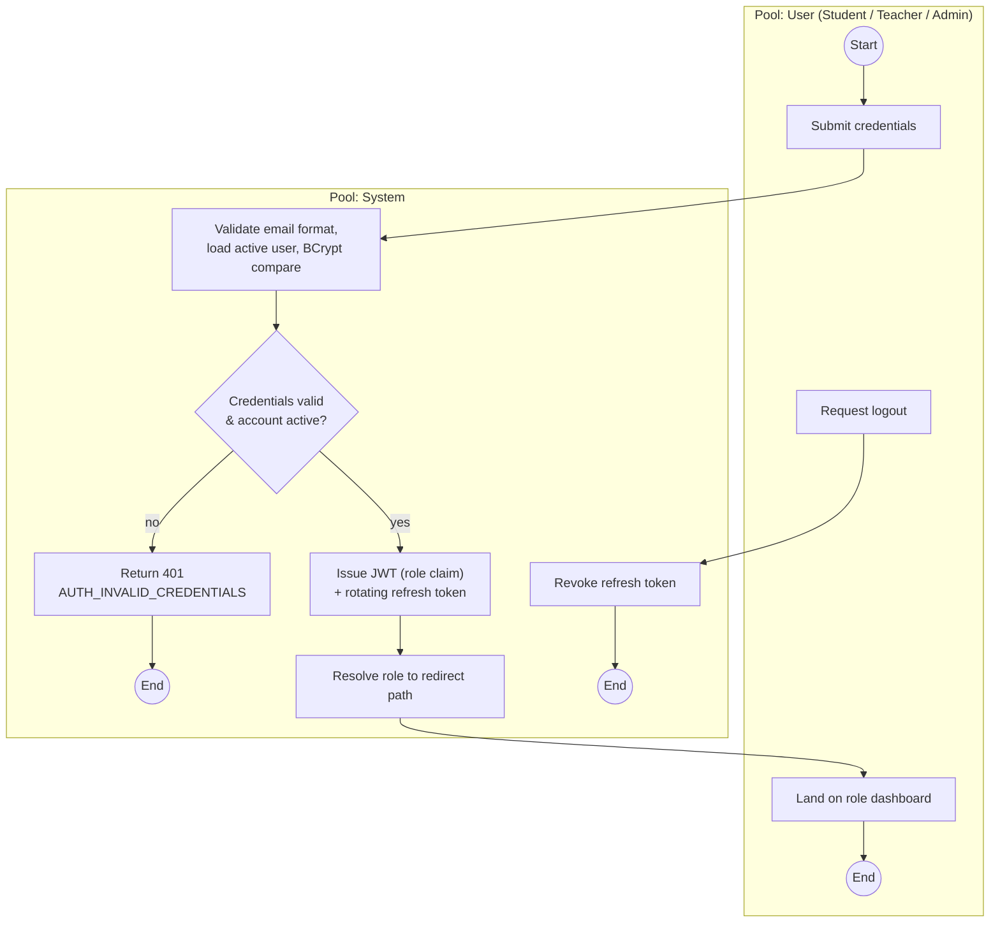
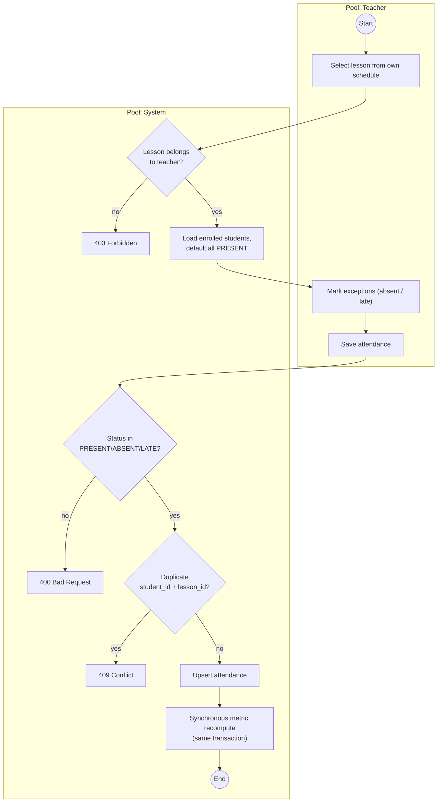
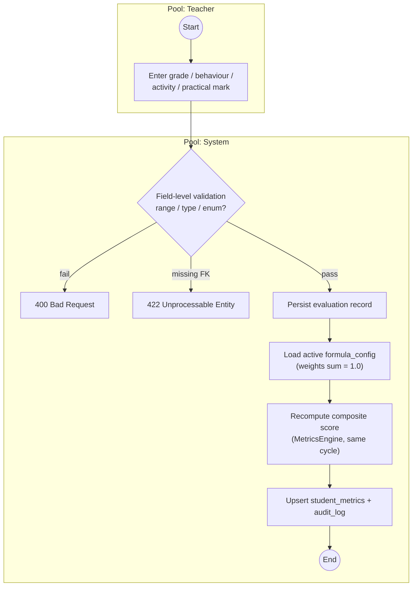
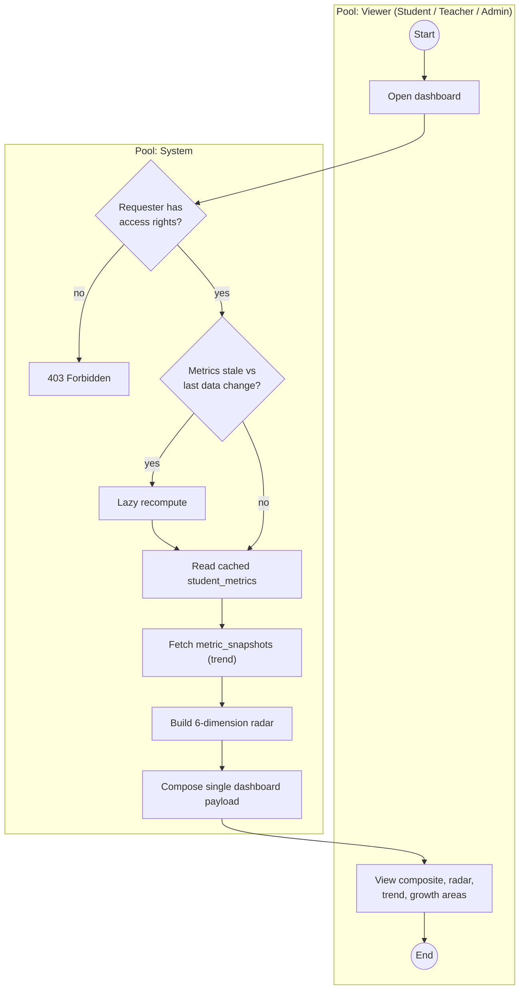
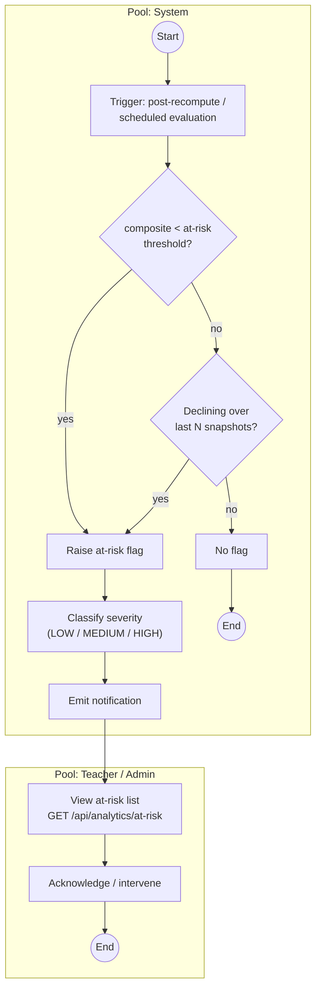
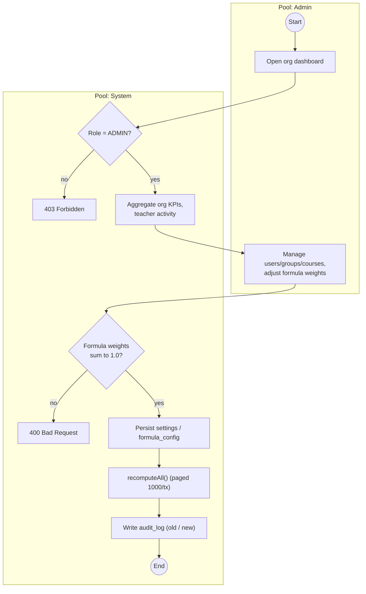

<!--
The six BPMN process models (Fig 4.6–4.11).
Each entry = (1) a formal BPMN 2.0 placeholder block for the student to draw in bpmn.io and export,
and (2) a Mermaid flowchart approximation (pools as subgraphs, real gateways/exceptions) so the
process is reviewable now. Phase 6 embeds these blocks verbatim into Chapter 4.
Grounded in FACTS.md §6 and the real controllers/services.
-->

## Fig 4.6 — P1 User Authentication

> 🟦 **[BPMN DIAGRAM — Figure 4.6: User Authentication]**
> **Pools:** User (Student/Teacher/Admin) · System
> **Happy path:** submit credentials → validate (load active user, BCrypt compare) → issue JWT (role claim) + rotating refresh token → resolve role → redirect to role dashboard → (later) logout → revoke refresh token
> **Gateways (real decisions):** *Credentials valid & account active?* (no → 401 `AUTH_INVALID_CREDENTIALS`; yes → issue token)
> **Exception paths:** invalid password / inactive account → 401; expired/invalid token on later requests → 401 (re-auth via refresh)
> **Maps to:** `auth/` (`AuthController`, `AuthService`) · `security/` (`JwtAuthenticationFilter`, `JwtTokenProvider`, `CustomUserDetailsService`) · `config/SecurityConfig` — entities `users`, `refresh_tokens` — endpoints `POST /api/auth/login`, `GET /api/auth/me`, `POST /api/auth/logout`, `POST /api/auth/refresh`
> **Draw in:** bpmn.io, export PNG to `_assets/figure-4-6.png`
> **Caption:** *Figure 4.6 — User Authentication (BPMN 2.0)*

---

## Fig 4.7 — P2 Attendance Management

> 🟦 **[BPMN DIAGRAM — Figure 4.7: Attendance Management]**
> **Pools:** Teacher · System
> **Happy path:** select lesson from own schedule → load enrolled students, default all PRESENT → mark exceptions (absent/late) → save → upsert (unique per student+lesson) → **synchronous metric recompute in the same transaction**
> **Gateways (real decisions):** *Lesson belongs to teacher?* (no → 403) · *Status in PRESENT/ABSENT/LATE?* (no → 400) · *Duplicate (student_id, lesson_id)?* (yes → 409)
> **Exception paths:** invalid status → 400; duplicate record → 409; not-own-lesson → 403
> **Maps to:** `attendance/` (`AttendanceController`, `AttendanceService`) · `lessons/` · `metrics/` (`MetricsService`) — entities `lessons`, `attendance` (UNIQUE `student_id,lesson_id`), `student_metrics` — endpoints `GET /api/lessons`, `GET /api/lessons/{id}/attendance`, `POST /api/attendance/bulk`
> **Draw in:** bpmn.io, export PNG to `_assets/figure-4-7.png`
> **Caption:** *Figure 4.7 — Attendance Management (BPMN 2.0)*

---

## Fig 4.8 — P3 Student Evaluation

> 🟦 **[BPMN DIAGRAM — Figure 4.8: Student Evaluation]**
> **Pools:** Teacher · System
> **Happy path:** enter grade / behaviour / activity / practical mark → field-level validation → persist → load active formula → recompute composite score (same cycle) → upsert `student_metrics` + audit
> **Gateways (real decisions):** *Field-level validation passes?* (range/type/enum) · *Foreign keys satisfied?*
> **Exception paths:** grade > 100 → 400; behaviour score outside 1–5 → 400; unknown activity type → 400; missing `student_id` / FK → 422
> **Maps to:** `grades/`, `behavior/`, `gradebook/`, `gradecategories/`, `rubrics/`, `metrics/` (`MetricsEngine`, `MetricsService`) — entities `assignments`, `grades`, `behavior_records`, `activity_records`, `formula_config`, `student_metrics` — endpoints `POST /api/grades`, `POST /api/grades/bulk`, `POST /api/behavior`, `POST /api/activity`
> **Draw in:** bpmn.io, export PNG to `_assets/figure-4-8.png`
> **Caption:** *Figure 4.8 — Student Evaluation (BPMN 2.0)*

---

## Fig 4.9 — P4 Student Analytics Generation

> 🟦 **[BPMN DIAGRAM — Figure 4.9: Student Analytics Generation]**
> **Pools:** Viewer (Student/Teacher/Admin) · System
> **Happy path:** open dashboard → check access → read cached `student_metrics` → fetch trend snapshots → build 6-dimension radar → compose single dashboard payload → render
> **Gateways (real decisions):** *Requester has access rights?* (no → 403) · *Metrics stale vs last data change?* (yes → lazy recompute)
> **Exception paths:** unauthorised viewer → 403; stale metrics → lazy recompute before read
> **Maps to:** `students/` (`StudentDashboardService` — the composed "wow endpoint"), `analytics/`, `metrics/` — entities `student_metrics` (denormalised cache), `metric_snapshots` (history) — endpoints `GET /api/students/{id}/dashboard`, `GET /api/students/{id}/metrics`, `GET /api/students/{id}/metrics/trend`
> **Draw in:** bpmn.io, export PNG to `_assets/figure-4-9.png`
> **Caption:** *Figure 4.9 — Student Analytics Generation (BPMN 2.0)*

---

## Fig 4.10 — P5 At-Risk Student Detection

> 🟦 **[BPMN DIAGRAM — Figure 4.10: At-Risk Student Detection]**
> **Pools:** System · Teacher/Admin
> **Happy path:** trigger (post-recompute / scheduled) → threshold check → growth-decline check → raise flag → classify severity → emit notification → teacher/admin views at-risk list → acknowledge/intervene
> **Gateways (real decisions):** *composite < at-risk threshold?* · *declining over last N snapshots?* · *severity level (LOW/MEDIUM/HIGH)?*
> **Exception paths:** declining trend even when above threshold → additional flag; no flag → end
> **Maps to:** `atrisk/` (`AtRiskRulesController`, `AtRiskRules`), `analytics/`, `notifications/`, `reminders/` — entities `at_risk_rules`, `notifications`, `metric_snapshots`, `student_metrics` (threshold in `institution_settings`) — endpoints `GET /api/analytics/at-risk`, `GET /api/at-risk-rules`, `PATCH /api/at-risk-rules`
> **Draw in:** bpmn.io, export PNG to `_assets/figure-4-10.png`
> **Caption:** *Figure 4.10 — At-Risk Student Detection (BPMN 2.0)*

---

## Fig 4.11 — P6 Admin Monitoring

> 🟦 **[BPMN DIAGRAM — Figure 4.11: Admin Monitoring]**
> **Pools:** Admin · System
> **Happy path:** open org dashboard → aggregate KPIs & teacher activity → manage users/groups/courses or adjust formula weights → validate → persist settings/`formula_config` → cascade `recomputeAll()` → write audit entry
> **Gateways (real decisions):** *Role = ADMIN?* (no → 403) · *Formula weights sum to 1.0?* (no → 400)
> **Exception paths:** non-admin caller → 403; weights not summing to 1.0 → 400; every admin write → audit_log entry (old/new)
> **Maps to:** `analytics/`, `organization/`, `settings/`, `audit/`, `users/`, `groups/`, `courses/` — entities `institution_settings`, `formula_config`, `audit_log`, `departments`, `academic_terms` — endpoints `GET /api/analytics/admin/dashboard`, `GET/PATCH /api/settings`, `PUT /api/metrics/formula`, `POST /api/metrics/recompute-all`, `/api/users` CRUD
> **Draw in:** bpmn.io, export PNG to `_assets/figure-4-11.png`
> **Caption:** *Figure 4.11 — Admin Monitoring (BPMN 2.0)*

